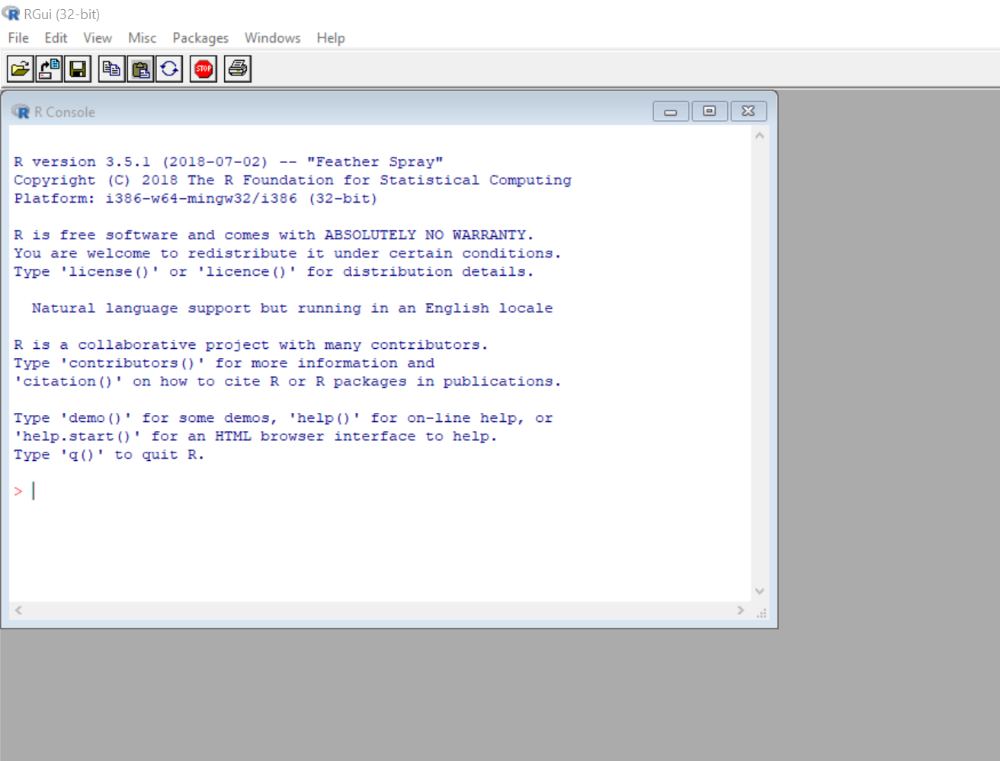
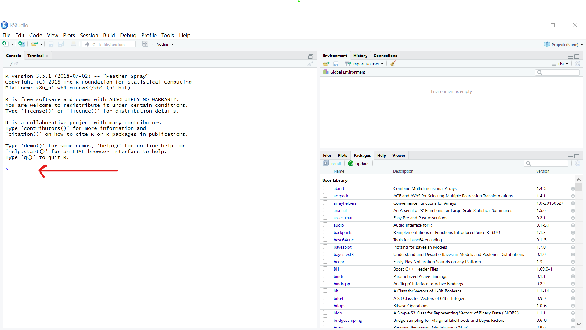
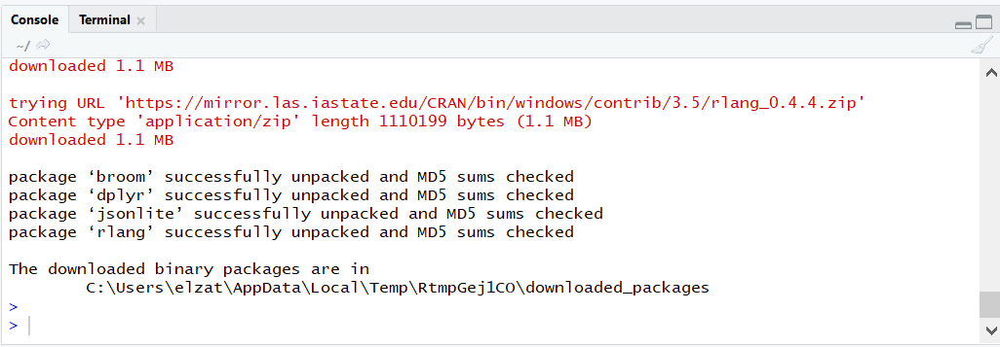

# Setting Up for Our First Day of Class (and the Rest of the Course!)

Before we can get started with the fun stuff we have to eat some technical vegetables (just kidding, vegetables are actually delicious - have you had sauteed brussels sprouts? so savory).

Some of the things I'm asking you to do right now might seem arbitrary, and I apologize for that. I'll explain it all when we get into the course itself. But for right now, here's what you need to know:

* You need two pieces of **free** software in this course: R and RStudio.
 
    + R is the actual programming language we'll be using. Your computer doesn't know it inherently (like it does some other languages), so we have to install it.
    
        - When you install "R," it also comes with an interface (a program) for writing code and conducting analyses in it. One tiny problem, though: that interface stinks. So, we're going to install another one.
 
    + RStudio is a much better interface for using R

So with that all in mind, I'm asking you to do 3 things:

1. Install R
2. Install RStudio
3. Install some extra "packages" (not as scary as it sounds, promise!)

Before we move on - you've already decided to take this class, but if you still need a good pitch for why you should learn R the [first part of Chapter 3 of Danielle Navarro's excellent book *Learning Statistics With R (LSR)*](https://learningstatisticswithr.com/book/introR.html) might convince you. The only thing I'd add is that you can *script* things in R, making them reproducible - a fancy word meaning you can always track exactly what you did historically, share it easily with others, and do it over and over again with minor modifications or updates very very quickly. Have you ever looked at an old Excel sheet and tried to remember what the heck you did to get some numbers? Or groaned because you had to spend hours re-doing a bunch of worksheets because you got some slightly updated data? Not going to be a problem in R :)

OK, ready? Let's go.

## Installing R

To install R: 

1. Click on one of the following links:

| Operating System |                     Link                    |
|:----------------:|:-------------------------------------------:|
|      Windows     | http://cran.r-project.org/bin/windows/base/ |
|        Mac       |    http://cran.r-project.org/bin/macosx/    |
|      Linux       |      https://cran.r-project.org/            |

2. If you're Windows, click on that big ol' "Download" link right at the top of the page. 

    If you're Mac, click the first `.pkg` link under "Latest Release." Note, though, that this will only work if your OS is at least OS X 10.11 (El Capitan) or higher - El Capitan was released in 2015, so hopefully most of you have upgraded by now. If not, though, you have two options: simply [upgrade your Mac OS](https://www.apple.com/macos/how-to-upgrade/) (my recommendation, should be free and fairly easy!), or install an older version of R. If you have to do this latter option, please email me.

    If you're using Linux, I trust you to figure out how to install R on your own because you probably know more about computers than I do, frankly.

3. When the file finishes downloading, double-click on it and an installer should open. Follow all the default prompts to install everything.

4. If you have any questions or get confused: 

    i) First try reading through the more detailed instructions in [the section for installing R in LSR (Section 3.1)](https://learningstatisticswithr.com/book/introR.html#gettingR).
  
        A. Use [Section 3.1.1 for Windows](https://learningstatisticswithr.com/book/introR.html#installing-r-on-a-windows-computer)
        
        B. Use [Section 3.1.2 for Mac](https://learningstatisticswithr.com/book/introR.html#installing-r-on-a-mac)
        
        C. Use [Section 3.1.3 for Linux](https://learningstatisticswithr.com/book/introR.html#installing-r-on-a-linux-computer)
  
    ii) Another option is the incredibly-detailed explanation (with screenshots!) from [Rafael Irizarry's data science book](https://rafalab.github.io/dsbook/installing-r-rstudio.html).
  
    iii) If you're still lost, [this 5-minute video](https://www.youtube.com/watch?v=cX532N_XLIs) might also help, especially for Mac users.
  
    iv) If you're still confused, try Googling around for any errors you're encountering or talking to a friend. Solving problems by searching for answers on your own is a key part of programming and a key skill I hope you'll develop in this course. Unfortunately, it's impossible to anticipate everything that might go wrong during the installation process and give you a pre-baked solution to all of them.
  
    v) However, if you have been working at this for about 30 minutes and still find yourself lost, please ask a question on the Canvas Discussions Board or shoot me an email and I'll see what I can do!
  

Now we need to check that everything went right by opening R. If you chose to put a shortcut on your desktop you can do this by double-clicking on the new R icon. If you didn't you can access it via your Start menu on Windows or the equivalent on your Mac. 

Once you open it, you should see something like this:

Do you see that? Bask in its hideousness for a moment. Great, now close it and let us *never speak of this again*.

## Installing RStudio

To install RStudio (a hopefully slightly-simpler process!), 

1. Go to https://rstudio.com/products/rstudio/download/#download

2. The website lists 2 steps there. You've already done step 1 (install R). Hooray! Time for step 2. You'll see that RStudio is trying to guess the right version you want by showing a big blue button under "Recommended for Your System." 

    i) If that looks like it matches your operating system (OS, like Windows 10 or Mac OS X 10.15), click it! 
  
    ii) If not, scroll down slightly to "All Installers" and choose the right one for your OS.

3. When the file finishes downloading, double-click on it and an installer should open. Follow all the default prompts to install everything.

4. If you have any questions or get confused: 

    i) First try reading through the more detailed instructions in [the section for installing RStudio in LSR (Section 3.1.4)](https://learningstatisticswithr.com/book/introR.html#installingrstudio).
    
    ii) Another option is the incredibly-detailed explanation (with screenshots!) from [Rafael Irizarry's data science book](https://rafalab.github.io/dsbook/installing-r-rstudio.html#installing-rstudio).
  
    iii) If you're still lost, [this 5-minute video (same as above)](https://www.youtube.com/watch?v=cX532N_XLIs) might also help, especially for Mac users.
  
    iv) If you're still confused, try Googling around for any errors you're encountering or talking to a friend. Solving problems by searching for answers on your own is a key part of programming and a key skill I hope you'll develop in this course. Unfortunately, it's impossible to anticipate everything that might go wrong during the installation process and give you a pre-baked solution to all of them.
  
    v) However, if you have been working at this for about 30 minutes and still find yourself lost, please ask a question on the Canvas Discussions Board or shoot me an email and I'll see what I can do!
  

Now we need to check that everything went right by opening RStudio. If you chose to put a shortcut on your desktop you can do this by double-clicking on the new RStudio icon. If you didn't you can access it via your Start menu on Windows or the equivalent on your Mac. 

Once you open it, you should see something like this:

OK, now let's make sure R and RStudio are working. At the blinky cursor in the Console (look at the red arrow above) type `30 + 7`. Does it return 37? If so, you're all set! But keep RStudio open for now.

Note that using the Console is just one way - and usually not the optimal way - of telling R to do something. This was just a brief test.

## Installing Some Packages

You are *almost* there. That should've been the worst of it. Now all I need you to do is install some "packages."

I can hear you thinking "What the heck is a package?" I have really good ears. In short, R (the language) can do a lot of things already when you first install it. Think of it like a baby - it can breathe, look around, poop - it's really impressive! But it's capable of so much more. Installing a "package" to R is kinda like teaching a baby (or an adult) a new skill or set of skills. Just like I could teach you "Carpentry" I could install a "caRpentry" package to R, and now you can both do something you couldn't before.

To do some cool things on our first day of class, I need you to teach your R-baby a couple new things. You'll do that by running some code in your RStudio console:

First,  run `install.packages("tidyverse")`. The tidyverse is actually a collection of a whole bunch of different packages, all of which should automatically install. This might take a few minutes.

You should see something *like* this (but not exactly this, as you'll have more and different packages installed) at the end:

If you have some **Warnings**, too, that's probably OK. Hopefully you won't have any **Errors**. If you see something that says error, maybe send me a screenshot.

Now, run `install.packages(c("DT", "rmarkdown", "unvotes", "devtools", "remotes", "learnr", "shiny", "tinytex"))`.

Finally, run `remotes::install_github("allisonhorst/palmerpenguins")`. Don't worry about what this code means for now.

We now need to make sure these installs ran OK. Try to *load* some of these the packages (I'll tell you what that means later) using the following code (again, enter it at the console):

`library(tidyverse)`

`library(DT)`

`library(unvotes)`

`library(rmarkdown)`

You'll probably see a lot of scary-looking red text and some "**Warning message**"s. These are (likely) fine! Just make sure you don't see anything that says "**Error**." If you don't, all is well.

Now just one last (brief) thing...

## Installing LaTeX

LaTeX is a typesetting language that's necessary to produce PDF documents in R (it's also very popular in economics and mathematics due to the ease of writing complex mathematical equations and formulas). To install it:

1. You've already installed the package we need to add LaTeX (`tinytex`).

2. So just run `tinytex::install_tinytex()`. This should install LaTeX onto your system.

Keep playing around if you want, but you're all set for our first day of class!

THANK YOU for investing this time ahead of our first day to make everything run more smoothly!
