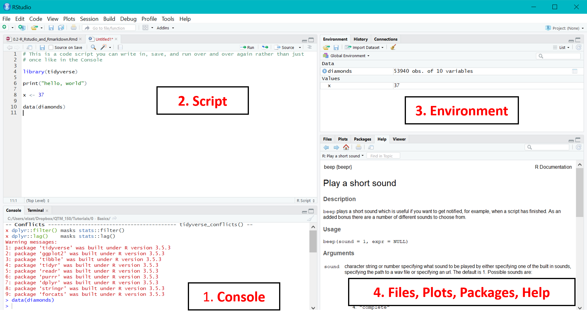
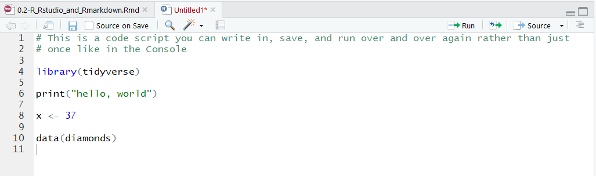
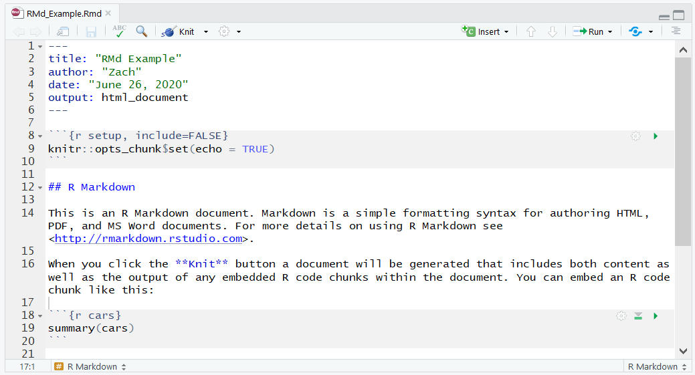
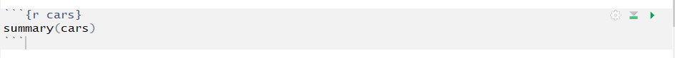
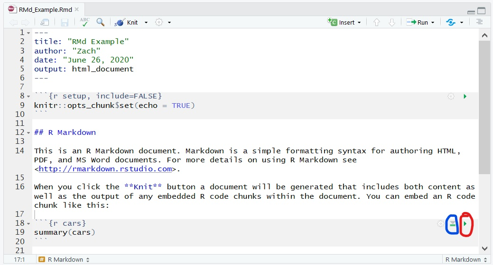
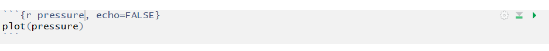
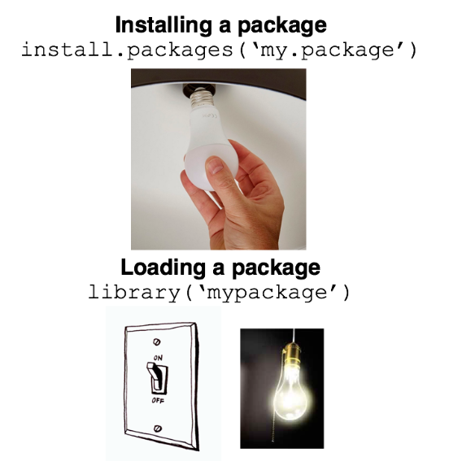

```{r setup, include=FALSE}
library(learnr)
#knitr::opts_chunk$set(fig.height=4)
```

## How to Read This Document

This document - and all the other future ones in this course - are interactive tutorials, built using RMarkdown the `learnr` **package** in R (we'll talk more about what RMarkdown and "package" mean in a moment). You have the opportunity to actually run R code in this document itself in "Exercises." There are also sometimes "Questions" for you to answer and test your knowledge.

On the left hand side you'll see a Table of Contents menu that lets you navigate from section to section. Within each section, there are *sub-sections* that are revealed one-by-one by clicking the "Continue" button at the bottom of the page. Make sure you keep going until you exhaust each section before moving on to the next one - you'll know you're done when "Continue" sends you to a new page - the next section on the left hand side - rather than just adding more text to the existing page (which indicates you've revealed a new sub-section).

Although you can run interactive code here, my advice is for you to also re-type the code over in your own R **script** - you'll learn what that means below - on the side. This helps for the same reason taking notes is better than just sitting there listening to me talk. Writing things down helps with memory and understanding.

You can walk away and come back to these documents as many times as you like - R magically saves your place and the work you've done, as long as you're using the same machine. No need to do it all in one sitting.


## R vs. RStudio vs. RMarkdown

### Intro

There are (at least) 3 confusingly named things in this course we should tease out right from the start:

* R is the actual programming language we'll be using. It was developed specifically for data analysis and statistics. Other languages you may be familiar with, like C++ or Java, are more "general purpose" languages that do a broader set of computer-y things but aren't as specialized or easy to work with for data analysis and statistics.

* RStudio is an interface for using R. It's made by a company called...you guessed it, RStudio, that also does a lot of education and promotion around the R language. It makes programming in R much more pleasant but isn't technically *necessary* to program in R.

* RMarkdown. This is probably the most confusing of the three. It's what I used to produce this cool interactive document. It's a way of using a language called "Markdown" alongside R code, in the RStudio interface, to create pretty reports, presentations, and other documents that interweave your code, graphics, and explanatory text. It's also how you will submit your homework.

    + You can just write R code with written comments in an R "script" (a file of code that ends `.R`). But RMarkdown creates a `.Rmd` file that lets you write and format (e.g. bolding and italicizing and bullets) text to explain your commented code and also show its output, and then share that as a website (HTML output), PDF document, or many other options.
  
Some analogies may help. Let's go to our first interactive question of the course!


```{r r-analogies, echo=FALSE}
  question("Which of the following might make for a good analogy for R, RStudio, and RMarkdown?",
    answer("Cars", message = "Sorry, try again!"),
    answer("Video Games", message = "Get off the couch and try again."),
    answer("Movies", correct = TRUE, message = "That'll work! Keep reading below."),
    answer("Taylor Swift", message = "I wish this were correct, but try again."),
    type = "learnr_radio",
    allow_retry = TRUE)
```

Once you have found the right answer above, type it between the quotation marks below.

```{r r-analogy-exercise, exercise=TRUE}
x <- ""
x
```

Now you can continue to the next sub-section, which I didn't want you to see until you finished this section. Isn't that neat? (Technically, because I didn't set any way to *check* this exercise all you had to do was click `Run`, but don't worry about that.) You can do all sorts of cool stuff with R, RStudio, and RMarkdown.

### A Movie Analogy
<div class="imggroup">
 <figure>
  
  <figcaption> R </figcaption>
  </figure>
  
  <figure>
  
  <figcaption> RStudio </figcaption>
  </figure>
  
  <figure>
  
  <figcaption> RMarkdown </figcaption>
  </figure>
</div>


<br clear="left">  
 
R itself (or more specifically, R code you write in the default R interface) is like a film strip - it has the movie (code) on it, and by sliding the filmstrip past your eyes you could technically sort of watch the movie, but it would be really unpleasant.

RStudio, then, is a prettier interface to work with and watch the movie - a projector you put the movie (code) in and display and edit using a beautiful, easy-to-watch screen.

RMarkdown is an alternative way of presenting your movie (code). It allows you to add more depth to your movie (code) by adding in extra information like a narrative discussion of what you did and why, or the output of the code. The movie (code) is still there, but now it has a bunch of extra features like what might come on a DVD. It allows an even richer movie-watching experience.
  


## Basic R Programming + Your First Visualization!


### What is R code?


"R code" - or any computer code - is basically text asking your computer to do something. It's a set of instructions. In the same way that I might ask you to stand up, walk over to the bathroom, and wash your hands, I could write some text in a very specific format to tell R "add 1 + 1, then assign that value to a variable called 'X,' and store that result somewhere." 

R, like any programming language, only understands how to do certain things; I can't make R wash its hands because that's a meaningless concept for it. In the same way, if I told you "Attach the gleebglorb to the funkanizer using a muchowallop," you would have no idea how to do that because you don't know what a gleebglorb, funkanizer, or muchowallop are, and you never will because they're fake words. 

R, because of how and for whom it was designed, "natively" knows how to do a lot of things important for data analysis and statistics but isn't great at some other things; we can teach it to be better at some things to an extent, though, and we'll discuss that below. Another language you may have heard of, Python, is great at a broader range of things but less specialized for data analysis.

Another point to consider as you start your programming journey is that computers, unlike humans, are incredibly literal and obedient. It will always do *exactly* what you tell it to. That may not be what you intended, though, and computers have funny ways of interpreting some things you type. For example, if I asked you to "run over to the store and get some milk," you would be able to interpret this in the context of the store being 10 miles away, leading you to drive there rather than literally run. A computer would try to sprout legs, put on shoes, and run 10 miles to the store to get the milk unless you gave it the important context that, actually, here "run" means "get in a car and drive." This can be a very frustrating experience for new programmers - you will make lots of errors, and that's OK, even good! Just keep that in mind throughout our journey.

### Some very basic R code examples

Below are some pieces of code that R understands. In RMarkdown, `R code is displayed in a grey box like this` (unless it's part of an exercise in this interactive tutorial), and R's answer after running that code appears in a box with a white background.

* Here's R doing some basic arithmetic that also illustrates the difference between how static code and an interactive exercise look in these tutorials.


```{r arithmetic}
#This is static code and output in RMarkdown.  This green text is a "Comment" that is not run as code.

2+7
```

This is an interactive exercise; once you click run, it will also show output below.
```{r arithmetic-ex, exercise = TRUE}
2+7
```

* Here's R evaluating a **function** (called `sum()`) with **arguments** (1, 2, 3, 4, and 5). We'll talk more about functions and arguments later, but what you do think the function `sum()` tells R to do? What will the answer be when you run this code?

```{r sum, exercise = TRUE}
sum(1,2,3,4,5)
```


* Here's R assigning a value to **objects** - the things you manipulate in R. For example, you can create an object called `x` that you give the value 2. The way you "give" an "object" a "value" is to use the **assignment operator** `<-`. The easiest way to translate the below code into English is "x gets 2" or "x receives 2":


```{r assignment, exercise = TRUE}
x <- 2

x
```


<mark>Challenge:</mark> Your turn! Make R assign 37 to an object called `randall`, and print it.
```{r assignment2, exercise = TRUE}

```


* Once you've assigned a value to an object, R will remember that and you can use that object for other actions later. For example, what do you think the below code will return? Run it and see if you're right!

```{r object-use, exercise = TRUE}
x <- 2

x + 35
```

<mark>Challenge:</mark> Now try changing the above code so x + 35 produces your favorite number. Congratulations, you're an R programmer!

### Your First Visualization!

Let's do something more interesting, though, both to show you the power of R and because your head is probably spinning a bit right now. I've adapted this exercise from <http://datascienceinabox.org>, a course developed by Dr. Mine Cetinkaya-Rundel and distributed under the [CC BY-SA 4.0 license](https://github.com/rstudio-education/datascience-box/blob/master/LICENSE.md).

Let's take a look at the voting history of countries in the United Nations  General Assembly. We will be using data from the `unvotes` package. Additionally, we will make use of the `tidyverse` and `lubridate` packages for the analysis, and the `DT` package for interactive display of tabular output. Note we (you) already *installed* these packages in tutorial 0.1, so now we just have to *load* them (we'll discuss this more below, but it basically means tell R "hey, we're about to use these packages so get ready").

```{r load-packages, warning=FALSE, message=FALSE}
library(unvotes)
library(tidyverse)
library(lubridate)
library(DT)
```

The unvotes package[^1] provides three **datasets** we can work with: `un_roll_calls`, `un_roll_call_issues`, and `un_votes`. Each of these datasets contains a **variable** called `rcid`, the roll call id, which indicates a specific voting topic and can be used as a unique identifier to join them with each other. 

[^1]: Erik Voeten "Data and Analyses of Voting in the UN General Assembly" Routledge Handbook of International Organization, edited by Bob Reinalda (published May 27, 2013)

* The `un_votes` dataset provides information on the voting history of the United Nations General Assembly. It contains one row for each country-vote pair. Here are the first 200 rows of that dataset. Make sure to try scrolling over to the right to see all the variables!

```{r view-un_votes}
head(un_votes, 200)
```

* The `un_roll_calls` dataset contains information on each roll call voting topic of the United Nations General Assembly. Here is the first 10 rows of that dataset. Can you figure out how to print the first 10 rows of this dataset?

```{r view-un_roll_calls}

```

* The `un_roll_call_issues` dataset contains (topic) classifications of rollcall votes of the United Nations General Assembly. Many votes had no topic, and some have more than one. Can you figure out how to print the first...oh, let's say 13 rows of this dataset?

```{r view-un_roll_call_issues}

```


First, let's take a look at how often each country voted "Yes" on a resolution 
in each year. We'll pick a few countries of interest, then visualize the results:

```{r country-list, exercise = TRUE, warning = FALSE}

#Pick some countries of interest
country_list <- c("United States of America", "Russian Federation", 
                  "Mexico", "Turkey")

#Plot a line graph of % yes votes by year
un_votes %>%
  filter(country %in% country_list) %>%
  inner_join(un_roll_calls, by = "rcid") %>%
  group_by(year = year(date), country) %>%
  summarize(
    votes = n(),
    percent_yes = mean(vote == "yes")
    ) %>%
  ggplot(mapping = aes(x = year, y = percent_yes, color = country)) +
    geom_line() +
    labs(
      title = "Percentage of 'Yes' votes in the UN General Assembly",
      subtitle = "1946 to 2015",
      y = "% Yes",
      x = "Year",
      color = "Country"
    )
```

Note you can change the list of countries above to any you're interested in. Can you figure out how? Go ahead, give it a try! Here is the list of countries from the `un_votes` dataset to choose from. Be sure to type them exactly as they're listed here, including with the correct capitalization, into the list above.

```{r list-countries, echo = FALSE}
un_votes %>% 
  select(country) %>%
  arrange(country) %>% 
  distinct() %>%
  datatable()
```

Did you figure it out? How cool is that?

Next, let's create a visualization that displays how the voting record of the United States changed over time on a variety of issues, and compare it to another country. The other country we'll display is India for starters, but you should explore the data a bit. 

<mark>Challenges:</mark>

1. Swap out one of the countries.

2. Add a third country.

3. Change the graph's subtitle to say "[Your Name] Was Here."

4. EXTRA CHALLENGE: Remove the **points** on the graph, leaving just the **smooth**ed lines (HINT: this requires deleting one line of code).

```{r plot-yearly-yes-issue, warning=FALSE, fig.width = 8, exercise = TRUE}
un_votes %>%
  filter(country %in% c("United States of America", "India")) %>%
  inner_join(un_roll_calls, by = "rcid") %>%
  inner_join(un_roll_call_issues, by = "rcid") %>%
  group_by(country, year = year(date), issue) %>%
  summarize(
    votes = n(),
    percent_yes = mean(vote == "yes")
    ) %>%
  filter(votes > 5) %>%  # only use records where there are more than 5 votes
  ggplot(mapping = aes(x = year, y = percent_yes, color = country)) +
    geom_point() +
    geom_smooth(method = "loess", se = FALSE) +
    facet_wrap(~ issue) +
    labs(
      title = "Percentage of 'Yes' votes in the UN General Assembly",
      subtitle = "1946 to 2015",
      y = "% Yes",
      x = "Year",
      color = "Country"
    ) +
  theme(legend.position = "bottom")
```

Hopefully this shows you the power of what R can do with just a few lines of code (even if they look like gibberish to you right now)!


## How and where can I run R code?

### RStudio Layout

It will be helpful to start with a map of what happens when you open a .R file (some code) in RStudio. Here's a tour of the basic areas:

```{r, echo = FALSE, out.width = "100%", fig.cap = "*RStudio when you open a code script.*"}

```

1. The **Console**. This is where you can type some code and, as soon as you press "Enter," it runs once. We'll talk more about its uses in a moment.

2. **Scripts**. These are .R files of code that you write and save, just like a Word document. You can run them over and over again. We'll talk more about this in a moment, too.

3. **Environment**. There are several **tabs** here, but the most relevant one is "Environment." This lists **objects** specific to your current R session - for example, datasets you've imported (e.g. `diamonds` in the image) or new objects you create and assign values to (like assigning the value "37" to `x`). Note objects like `x` could also contain a single **string** of text or a series of values (numbers, text, or other things) all bound together called, in R parlance, **vectors** or **lists**. We'll talk more about those another time.

4. A miscellaneous window. There are a few important things in this pane:

    i) **Files** - this lists the files and folders in your **working directory** (typically, where the script you're working in is located). I don't use it all that often to be honest.
    ii) **Plots** - when you create a plot by running code in a **script**, this is where it shows up (it will show up in-line in the RMarkdown document if you produce it there).
    iii) **Packages** - this is the list of R **packages** (bits of code that do extra stuff) you have installed on your machine. More on them below.
    iv) **Help** - I end up here all the time. When you need to look up details about how to do something in R, you can type `?[function_name]` in the **Console** and it will pull up information here. For example, try typing `?sum` into your **Console** and see what pops up.
    v) **Viewer** - sometimes the result of some code you run from a **script** will pop up here. It will happen automatically as necessary, so you don't need to know much more about it.
    
Now that you've got the lay of the land, let's talk about how you can run code in R.

### Option 1: Directly in the **Console** (Rare)

The **Console** is on the lower left hand corner of RStudio (though it will be the entire left hand side of the screen when you open RStudio without a **script** or RMarkdown file, such as the first time you turn it on).

* How to use it: Just type your R code in the Console after the `>` symbol and hit Enter.

* Pros: Quick and easy; don't have to open up, name, and save a **script**

* Cons: Nothing saves. You can't track your work, save it for later, or run the code again and again like you'll want to do most of the time.

* When to use it: for code you only want to write and run *once*. This can be a quick single line of code you're testing out or something like 'install.packages()' that you only need to run one time.

<mark>Challenge:</mark> Try asking R to perform some basic arithmetic operations through the Console.


### Option 2: R **Script** (Common)

An R script is basically a text file in which you write R code that you then submit to RStudio.

To open a new script, in the upper left hand corner click `File` > `New File` > `R Script`.

RStudio should now look more or less like the screenshot above, except with a blank script labeled `Untitled1`. The first thing you should do is save your script as another name, like `My_Analaysis.R` (except something more descriptive). You should also choose a sensible directory to put it in.

You can now write the code you *plan* on running in the script window.

```{r, echo = FALSE, out.width = "100%", fig.cap = "*R script.*"}

```

* How to use it: Type your R code in the script, and save frequently. Here's a picture of a basic script that doesn't do much but illustrates the basics.

    + RStudio does some automatic text formatting, for example putting numbers in blue and anything inside quotes in green.
    
    + You can only write two things in an R script: code and comments. **Comments** are text that explain to others (and future you) what some code is meant to do. You make them by typing `#` at the start of any line. Commenting code is *extremely* important - however many you think you need to write, write more.
    
        - **Pro-tip**: You can also "comment out" large blocks of code you don't actually want to run - like old code you're not quite ready to delete yet. To do this, you highlight the code and hit `Ctrl/Command + Shift + C`. Try it on some code you write. It turns the code into comments that R ignores.
        
    + You can run your code one of three main ways:
    
        1. If you just want to run a single line or block of code (such as the `ggplot()` blocks we'll encounter below), just put your cursor anywhere in the block and hit `Ctrl/Command + Enter`.
        
        2. If you want to run several lines or blocks of code, highlight them and click `Ctrl/Command + Enter`.
        
        3. If you want to run the whole script start to finish, click the little "Run" icon in the right hand side of the ribbon above the script.
        
    + The code output will show up in the Console, Plots, or Viewer pane, depending on what you ran.

* Pros: Saves your code so you can run it over and over again.

* Cons: If you share the script all you see is your code and comments, not all the pretty formatting and output you can include in an RMarkdown document.

* When to use it: most code, unless you want to share it with non-analysts, people who can't run it themselves, or you want to fold in output and graphs into a pretty PDF or HTML document that looks more like a report than a code script.

<mark>Challenge:</mark>: Create a script, save it, pre-type some R code, and run it through the three above methods. Try summing your five favorite numbers, or printing 2 x pi, or whatever else you can. Write a comment explaining what your code does. 


### Option 3: Rmarkdown Document (Most Common for This Class)

The R installation instructions you read through last week were the product of RMarkdown. This tutorial is also a product of it + the `learnr` package. RMarkdown files weave together explanatory text (beyond code comments), code, and the output from that code to make a readable report you can share with anyone, including non-programmers! You can create web pages (HTML), Word documents, PDFs, whole blogs, and even books. It's an incredibly flexible way to write code and present your findings and is much prettier and complete than a script.


* How to use it: You write text and code in a `.Rmd` file just like you would in a script, except you have a lot more options. You then **knit** this `.Rmd` file into your desired output, such as a web page (HTML) or PDF. More below.

* Pros: You can organize narrative text, code, and output (like tables and graphs) in a single document. To make an update or change all you have to do is change a bit of code (and text if necessary) and re-knit the document. Way easier than working in R and then, say, copying the plots over into a Word document.

* Cons: Slightly more complex than just writing a script.

* When to use it: any time you want to share your output with non-programmers (like a supervisor), have a report-style document that needs regular updating, or just want a prettier product!

### R Cheatsheets

Before we move on I want to introduce you to R [Cheatsheets](https://rstudio.com/resources/cheatsheets/). These are incredibly useful summaries of tips and tricks for various common topics in R. The easiest way to access them is going to `Help` > `Cheatsheets`. 

<mark>Challenge:</mark> Try opening the one for RMarkdown now!

### RMarkdown Overview

I can't show you the full capabilities of RMarkdown in an interactive tutorial. Instead, I want you to open up your own file. To do that while viewing this tutorial you need to:

1. Create a new **Session** (open a new RStudio window). Click `Session` > `New Session`.
    
2. Create a new Rmarkdown file. Click `File`, then `New file`, then `Rmarkdown...`. When a window pops up, just click "OK" for now.

You should now have something that looks like this in your script area:

```{r, echo = FALSE, out.width = "100%", fig.cap = "*New RMarkdown document.*"}

```

Let's walk through the document, top to bottom. But first...

<mark>Challenge:</mark> **Knit** your first RMarkdown document! Knit the default raw `.Rmd` file into an HTML document by hitting the `Knit` button on the top ribbon. It should pop up in a new window. Now you can start to compare parts of the raw RMarkdown with what it prints in a finished document!

* The **You Ain't a Markup Language (YAML) Header**. This is always the first thing in an RMarkdown document, and it'll look something like this:

    ```{r eval=F}
    ---
    title: "RMd Example"
    author: "Zach"
    date: "June 26, 2020"
    output: html_document
    ---
    ```

    + Title: the title on the final knitted document. Note what it looks like in your knitted document.
  
    + Author: the author on the final knitted document. Note what it looks like in your knitted document.
      
    + Output: the *default* format of knitted document when you click on the "Knit" button (you can always choose another format manually, or change the text here to change the default). In this case it produces an HTML document that you can open and view in any web browser. It'll look like a web page. Note this isn't explicitly printed anywhere in the finished document; it tells the finished document what format to take.
      
    + Date: hopefully self-explanatory at this point. Note what it looks like in your knitted document.
  
    + There are plenty of other things you can add to your header. SEE the RMarkdown cheat sheet for some examples, but most of them probably look like gibberish to you right now. And that's OK!

<mark>Challenge:</mark> Change the title and add an author name to your HTML document. Re-knit it to see the change reflected.

* A **setup chunk** that allows you to set certain **global options** (things that apply and will be used throughout the entire document). Don't worry about this for now. Note it doesn't appear in the finished document.

* A **Header** followed by some text. Compare how it's written in the raw RMarkdown to the finished document. We'll discuss this more below. 

* A **Code Chunk** that looks like this:

    ```{r, echo = FALSE, out.width = "100%", fig.cap = "*A code chunk.*"}
    
    ```
    
    + Notice how the chunk appears in the raw RMarkdown versus how it's rendered and printed in the final document. You see the code *and the output*. The output is identical to what you'd see in the **console** if you just ran the code there or in a script (try it if you don't believe me!). 
    
Below this is just another header, text, and code chunk that demonstrates how you can embed plots as well as the summary table from the first chunk.

#### Code Chunks
    
As we've already seen you can weave in chunks of R code between blocks of explanatory text.

To create a new chunk place the cursor where you want it and either: 

* Click on the `Insert` button in the ribbon menu then `R`, or

* Press `Ctrl + Alt + i` on a PC or `Command + Option + i` on a Mac.


To run code chunks, you can either:

* Run a *full single* chunk by clicking on the green triangle at the top-right of the chunk (red circle in the picture below).

* Run *part of a chunk* with `Ctrl/Command + Enter` just as you would in a normal script.

* Run *all chunks up to this point in the document* by clicking on triangle with the line below it (blue circle in the picture below)

```{r, echo = FALSE, out.width = "100%", fig.cap = "*Running code chunks.*"}

```

In any case, R's output appears right under the chunk in the raw RMarkdown `.Rmd` file.

To run *all chunks* in a document you simply **knit** the document. As you've already seen, this exports the text, code chunks, and output into a pretty and portable format like HTML or PDF.

<mark>Challenge:</mark> Try adding a new code chunk to the default RMarkdown document that adds your favorite five numbers and returns the sum. Add a new heading and some narrative text to explain what the chunk is doing, as well. Re-knit the document to see the results.

The last thing we need to talk about with chunks are the **chunk options**. An R chunk might look like this:

```{r, echo = FALSE, out.width = "100%", fig.cap = "*Another code chunk.*"}

```

Notice that first line. That tells us three things: 

1. RMarkdown should evaluate this block as `r` code (rather than, say, Python code, which it can also handle).

2. The name of this chunk (`cars`). This always appears after the language name and a single space. This helps with navigating between chunks in the document (otherwise it'll just be listed as something like "Unnamed Chunk 1" so it can be hard to find your way back to it quickly). Use descriptive names where possible.

3. Chunk options, which always appear after the language, the optional name, and a comma `,`. These serve as instructions for the knitting process around specific chunks of code. The most common options include:

    i) `{r [CHUNK-NAME], include=FALSE}`. This causes RMarkdown not to print the code *or* any output.
    
    ii) `{r [CHUNK-NAME], echo=FALSE}`. This causes RMarkdown not to print the code, but it will print any output.
    
    iii) `{r [CHUNK-NAME], eval=FALSE}`. This causes RMarkdown to print the code, but *not* any output.
    
You can list multiple options for a chunk, all separated by commas. The RMarkdown cheat sheet has a list of more chunk options.


<mark>Challenge:</mark> Suppress the code chunk you wrote above from being printed or showing its output when you re-knit the document.


#### Text Formatting in RMarkdown

There are many ways to format text in RMarkdown. You can also use LaTeX to expand this, but that's beyond the scope of this course so don't worry about it. Here are some of the more common formats you might want to have in a knitted document:

* `*Text surrounded by single asterisks*` will be *italicized*
  
* `**Text surrounded by double asterisks**` will be **bold**
  
* `[This is how you add a hyperlink to Google](www.google.com)`
  
* You create headers using between one `#` and six `######` pound signs (fun fact: they're technically called octothorps!). Fewer pound signs are bigger headings.


<mark>Challenge:</mark> Make some text of your choice italic, add a hyperlink, change one of the heading sizes, and re-knit the document.


#### Other RMarkdown Tips

Here's a [great post](https://ryanpeek.org/2020-02-20-10-tips-to-souping-up-rmarkdown/#S7) with some other tips on how to do some other cool, common things in RMarkdown.


## Packages


### What does R know when you install it?

R can do a lot of things already when you first install and open it. For example, ask R if it knows what the mathematical constant `pi` is - can you figure out how?

```{r what-is-pi, exercise = TRUE}

```

But it doesn't innately know, for example, what the mathematical constant `e` is: 

```{r know-e, error=TRUE, exercise = TRUE}
e
```

Nor does it know the function `beep()` for making...well, one of several kinds of beep noises:

```{r year-test, error=TRUE, exercise = TRUE}
beep(8)
```

This is because you have to teach R some new things. First, another analogy. Do you like babies or phones?

#### Baby Analogy {#baby}

Think of newly-installed R like a baby - it can breathe, look around, poop - it's really impressive! But it's capable of so much more. You just have to teach it new skills. We do that by installing **packages**, which is like teaching your R baby a new skill such as walking or talking.


#### Phone Analogy {#phone}
Think of newly-installed R like a new phone you just bought - it can make calls, send texts, access the internet - it's really impressive! But it's capable of so much more. So you install some apps like Instagram or one that lets you play the game backgammon. The R equivalent to installing apps is installing **packages**.


### Packages, Functions, and Objects


Packages are bits of standalone code, written by others, that when **installed** (and **loaded**) allow R to do different things it couldn't before. 

Most often these add one or more new **functions** to those R knew before. R **functions** are just like mathematical functions. Consider f(x) = 2x. The function, f(), takes one or more inputs (or in computer terms, **arguments**, in this case "x"), does something to those inputs, and returns an output. Note functions can, and often do, take more than one argument. 

Consider the `sum()` function in R - which is one that R just innately knows. It takes as its **arguments** any number of numbers and returns the sum of those numbers:

```{r sum2, exercise = TRUE}
sum(2,3,5,7,11)
```

Sometimes packages also add **objects** such as new datasets or color palettes - for example, the `unvotes` package added those datasets we played with above.

To make R learn and use new things from a package you have to do two things:

* **Install** the package. You only have to do this *once* on any computer you're using (though you do want to regularly **update** them to the latest version, too). It stays there forever unless you uninstall it. Since this is something you do infrequently you typically run this code in the **Console**. Here's code to install the `RColorBrewer` package, which adds some neat and accessible color palettes for graphs:

```{r install-pkg, eval=F}
install.packages("RColorBrewer") 
```

* **Load** packages. You have to do this every time you turn R on - when you leave or restart R it goes back to its innate functions only. This is code you have to run over and over, so it should be placed in a **script** or RMarkdown document rather than the console. 

```{r load-pkg, eval=F}
library(RColorBrewer)
```

A good analogy for all this is a lightbulb. To get light you have to do two things: screw in the bulb, and flip a switch on. Installing a package is like screwing in the bulb - you only have to do it once, and it's there for you in the future. Loading it is like flipping the lightswitch - you have to do this every time you want the light.



#### Now Forget `install.packages()` and `library()`. Use the `p_load()` Function from the `pacman` Package Instead!

An annoying thing about the `library()` function is that you can only load one package at a time. You have to write it over and over again to load more packages. Instead, I like the `p_load()` function from the `pacman` package. This function has two big benefits: it can load as many packages as you want, separated by commas; and it automatically installs any packages in that list it detects you're missing. Magical! We'll be using it from now on. Here's how you use it:

```{r p_load, eval = FALSE}
pacman::p_load(tidyverse, RColorBrewer, <OTHER PACKAGE NAMES HERE>)
```

NOTE: You'll often see functions from packages written like `pacman::p_load()`. You can read this as "p_load() from the pacman package." The bit before "::" is the package the function is part of, and the bit after is the function name itself. This is used for two main reasons. First, because sometimes two packages have functions with the same name. For example, just `filter()` could refer to a function from the native `stats` package (which comes with your basic R installation) or the `dplyr` package (part of the `tidyverse` you've already installed). So if you want the `filter()` from `dplyr` it's useful to specify `dplyr::filter()`. 

This is not only useful, but sometimes *necessary* because R has to choose one `filter()` function to be its default. When you load `tidyverse` it will override the `stats::filter()` to make `dplyr::filter()` the default. If you just write `filter()`, then, R will run `dplyr::filter()`. If you - more rarely - want `stats::filter()` you have to explicitly say so.

The other reason you use the `::` syntax is to avoid needing to load the package you're accessing first. We want to use `pacman` to load other packages - it would be annoying to have to use `library()` to first load `pacman`. So we bypass that by using the `::` syntax to tell R "Hey, no need to load the whole `pacman` package, just access it briefly to run the `p_load()` function to load some other packages."


#### Example + Help Pages

You already have some experience installing packages, but let's install one more while we're here: `beepr`.

Try running the below code in your R console *before* installing and loading the tidyverse package and see how R responds.

```{r beep1, error = T}
beep(1)
```

Oops! It doesn't know the function `beep()`. So let's:

* Install the `beepr` package by running this code in your Console: `install.packages("beepr")`

* Load `beepr` - that is, turn it on so R knows to access it. Can you figure out how to do that?

Now try running this code again in your Console or a script:

```{r beep2, eval = F}
beep(1)
```

<mark>Challenge:</mark>: If you want to know what a function does, look up its **Help** page using `?[Function Name]` in the Console. For example, try `?beep`. How many different sounds can you play with `beep()`? Try some and see which you like!

### Creating Objects

While you can add things using packages, often you'll also want to create your own **objects**, such as new datasets, that don't exist when you first start up R. As briefly discussed above, you do this using the **assignment operator** `<-`. For example: 

```{r love-class, exercise = TRUE}
#Try printing something called love_this_class. What happened?
love_this_class
```

```{r love-class2, exercise = TRUE}
#Complete this code to create a new object called love_this_class that's just the simple text string below
"Yeah, I know, this class is great"

#Now that the object exists, print it

```

**Pro-tip**: `<-` is a pain to type manually. Instead, use the shortcut Alt + Minus Sign.

<mark>Challenge:</mark> Add your own object to R, then ask R to return its value.

### Done

OK, you're finished! Phew. I know that was a long one. Others will be shorter, I promise.