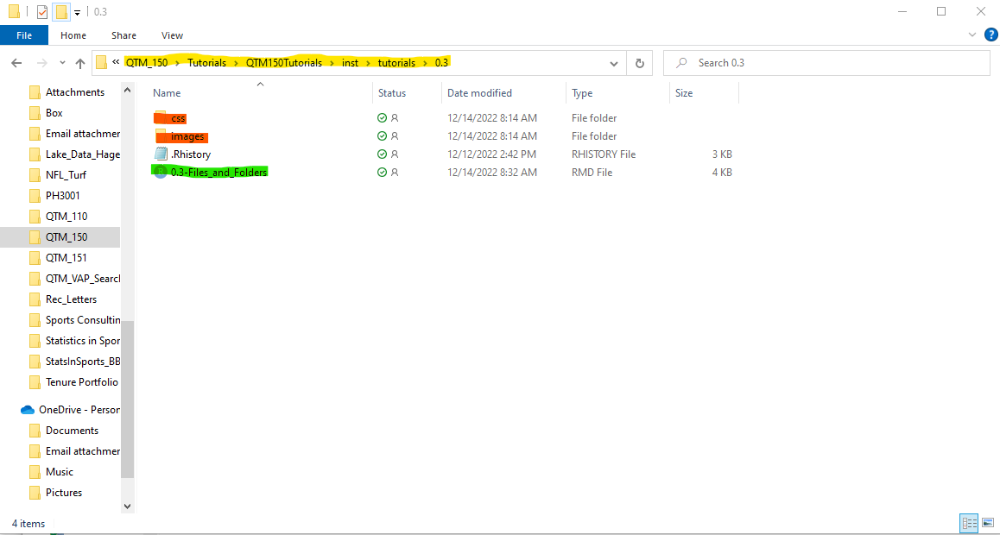
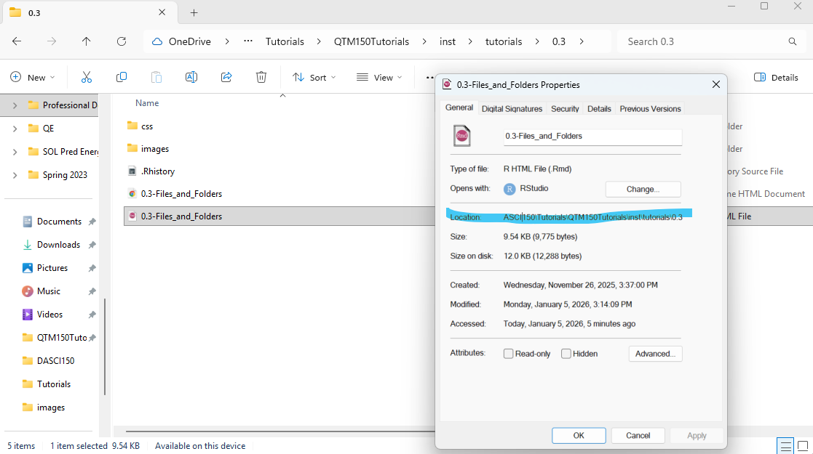

```{r setup, include=FALSE}
library(learnr)
#knitr::opts_chunk$set(fig.height=4)
```

## How Does Your Computer Store Files?

My apologies in advance if this Tutorial feels simple or remedial for some of you. But many of you in an era of phones and Google docs and iPads have never had to deal with computer folders and directories. Files just sort of appear where you need them, or you can navigate to them without understanding what a computer is doing under the hood. This brief (but admittedly kind of boring) Tutorial is designed to simply ensure everyone is on the same page. The fun stuff is coming *very* soon, I promise.

OK, let's get going!

To keep things organized, your computer has a system for storing data.

Every piece of data on a computer is stored in a **file**. A file could contain a program that runs, a spreadsheet with data, a written document with words - anything, really.

Each file is located in a **folder**, which is just a collection of files. Folders can contain several "sub-folders," and all except the highest main drive folder are themselves contained in a **parent folder**.

The location of those folders - and thus of any given file - is defined by a **directory** or **file path**. (This may not be the exact computer science definition, but it's accurate for our purposes.)

The easiest way to think of files and folders may be as an analog for your location in the physical world. Imagine your computer is the planet earth, and each person is a single file:

* There's a folder for each continent
* Then a sub-folder under every continent for each country
* Then a sub-sub-sub-folder for each city
* ...and each street
* ...and each house

Each house contains one or more people/files. You "live" inside the folder for your house, which is inside the folder for your street, which is inside the folder for your city, and so on.

### Directories/File Paths: How Your Computer Finds and Accesses a File

Now imagine you're a police detective, and you've been tasked with finding a particular person (file) - say, Homer Simpson after he stole a pig from Springfield A&M. How do you know where to look? It wouldn't be very efficient to just run around shouting for him. Nor would it be a very good idea to grab a random person and treat them as Homer Simpson. Instead, hopefully Homer has an address! You go to that address, and you find him.

Homer Simpson indeed has an address. You might write it on an envelope like this: 

Homer Simpson <br>
742 Evergreen Terrace <br>
Springfield (STATE UNKNOWN, it's a long-running joke from the show), USA

On a computer an address serves the same purpose, it would just look a little different. The file `Homer_Simpson.dude` might live at: `Earth:/North_America/USA/Springfield/Evergreen_Terrace/House_742/Homer_Simpson.dude`. Same idea!

Just like the detective looking for Homer Simpson, if you want your computer to look up and access a file - an R package it needs to run, for example, or some data you want to open - you can't (usually) just give it the file name and expect it to run it automatically. *You have to tell it where to look first.* 

An important thing to realize is computers are kind of dumb. Imagine we're sitting in the living room and you tell me "go get me the spoon." I instinctively know I have to go the kitchen first to get the spoon. A computer doesn't. If by dumb luck you're already in the kitchen with the computer it might successfully get you the spoon. But if you're in the living room it's going to spin around the room, burst into flames and scream in a tone that plumbs the darkest depths of cosmic horror and sends the most stouthearted men descending recklessly into madness "ERROR: SPOON NOT FOUND." You have to tell it something more like "go to the kitchen and get me the spoon" - then it will happily do so.

But instead of  the instructions I wrote above or an address like you might write on an envelope, though, it needs a **file path**.

For example, if I want to run this Tutorial I have to tell my laptop its location, which is: `C:\Users\zbinney\OneDrive - Emory University\QTM_150\Tutorials\QTM150Tutorials\inst\tutorials\0.3\0.3-Files_and_Folders.Rmd`.  Then it will go to that folder and open and run the file. Otherwise it'll get lost and angry. And then I'll be angry. No fun.


### File, Folder, and Directory Example

Here's a screenshot of what the **folder** for this Tutorial **file** looks like on my laptop:

```{r, echo = FALSE, out.width = "100%", fig.cap = "*Tutorial 0.3 file and folder.*"}

```

The **file** itself is highlighted in GREEN.

You can see some of the **file path** highlighted in YELLOW. You can see, for example, all the way at the right that the **folder** containing this file is named `0.3` - this is like the house number on an address. The folder above that, called the **parent folder**, is `tutorials` - this is like the street number. *Its* parent is `inst` - this is like the city. And so on and so on up the chain, all the way to my main drive folder `C:/`.

This folder also has two **sub-folders**, highlighted in orange - `css` and `images`. In our analogy maybe this would be like separate sub-folders for people and pets in the house. Or maybe the analogy is breaking down here. But you get the idea.

You can get more details on the location of a file in Windows by right-clicking on the file and selecting `Properties`. This is an example of what comes up, with the file's location highlighted in BLUE:

```{r, echo = FALSE, out.width = "100%", fig.cap = "*Tutorial 0.3 file and folder details via Properties.*"}

```

The equivalent on a Mac is to command-click on the file and then select `Get Info`.

If you're using Linux, you already know better than I how to do this.

### Where Does My File Go When I...

#### ...Save It?

If you select "Save As" for a file, you both give it a name *and* place it into a folder of your choosing.

A folder will likely be chosen by default (usually the last place you saved a file to when using that same program), but you can always change it to another folder or even create an entirely new folder or sub-folder in which to save the file. That file will then be located in that folder until it is removed and will always be accessible through that folder's file path.

#### ...Download It?

When you download a file, it will often go to a folder on your computer labeled "Downloads." The file will be accessible there through that folder's file path (for example, on my laptop that's `C:\Users\zbinney\Downloads`).

### Where Should I Store My Files: Best Practices for Staying Organized

You really should take the time (a couple hours at most) to create a sensible organization system for your files.

* For example, you might have one big folder on your desktop or (better and safer - it'll save your ass in case your computer crashes!) your Emory Shared Drive or another area that's automatically backed up for your `Personal` documents, and another for your `School` or `Class` or `Oxford` documents.

    + Inside that `School` or `Class` or `Oxford` folder, you could have sub-folders for each `Class`.
    
        - Inside each `Class` folder you could have a sub-folder for each assignment, like `HW1`. Or for each type of assignment, like `HW`, and then sub-folders within that for each assignment like `HW1`, `HW2`, etc. You simply create these sub-folders as needed.
        
This may seem like a lot of work to put in, and you'll be tempted to skip it with all the other demands on your time. But the cost is minimal - an hour or two at most upfront and a few thoughtful seconds each time you create or download a new file to decide where to put it. And I promise it will save you *many hours* of frustration later when you can't figure out where the hell you put the latest version of that assignment that you procrastinated on and have to upload in the next 4 minutes. Trust me.

#### The Last Temptation of the Downloads Folder

One temptation you'll need to avoid is just keeping everything you download in the Downloads folder in one huge pile. Sometimes keeping a file there is OK if it's a file you're only going to access once or a few times, like the takeout menu for a restaurant or some sort of form you need to sign and then forget about.

But for important files you'll want to access over and over again - like, say, THE FILES YOU DOWNLOAD FROM CANVAS FOR THIS COURSE - saving them separate from everything else in their own bespoke folder will save you hours of frustrated scrolling through your Downloads folder trying to find the right version of that homework to turn in, or the Tutorial where you filled out all the code rather an old version, or that handy cheatsheet of common R errors I sent you. You can either do this right when you download the file(s) by telling it to save to its proper folder, or just after by simply moving the file(s) (through copy-paste or drag-and-drop) from the Downloads folder to its new home.

OK, I think that's it for now. I hope this gets everyone on the same page with regards to how files are stored on a computer, how it looks for them when you ask it to, and some best practices for storing them on your own machines.
