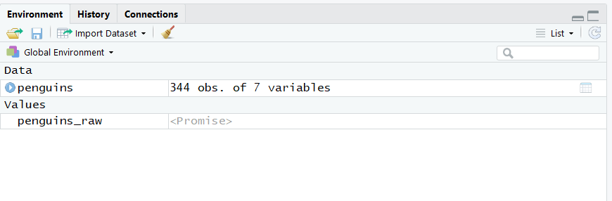
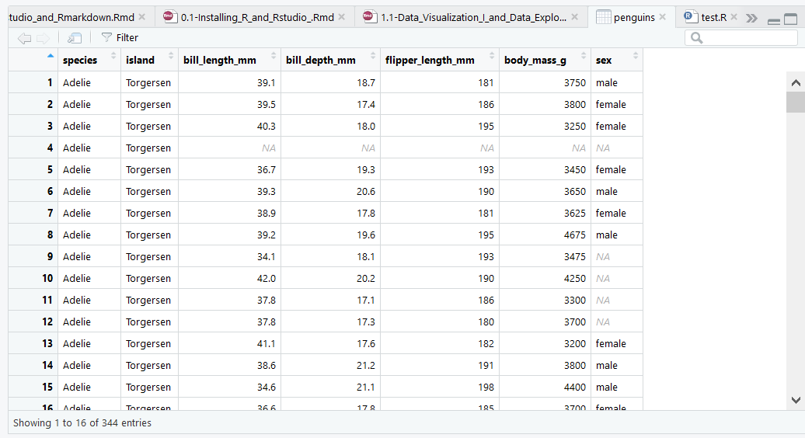

```{r hidden, include = FALSE}
pacman::p_load(learnr)

```

## Intro and Setup

First we need to load a few packages using the `p_load` function from the `pacman()` package. Recall this replaces `library()`. **Make sure to run this in your own script as you follow along!**

```{r setup}
pacman::p_load(tidyverse, palmerpenguins, knitr, skimr, summarytools)
```


## Opening and Exploring Datasets

There are a number of ways to get data into R, but the process can be a bit tedious so we're going to skip that for now. Instead we're going to make use of datasets that already exist in R or are part of R packages you already know how to load.

### Installing R Packages from Github

Many of the packages you'll use are somewhat-formally "vetted" and part of the formal CRAN (Comprehensive R Archive Network) repository, which is - among other things - the central storage spot for R packages. These are easy to install (you use `install.packages()`).

Sometimes, though, you'll want something that hasn't made its way to CRAN yet. Maybe it's a less formal package, or a cutting-edge analytical method someone just released a few weeks ago. A common place for these to be stored is Github - think of it as Facebook for coders. It's a very popular way to store and share code, including R packages. For example, [here's](https://github.com/allisonhorst/palmerpenguins) the Github page for the `palmerpenguins` package by Allison Horst, whose data we're going to use in this lesson. The data comes from Antarctic researcher Dr. Kristen Gorman at Palmer Station.

To install a package like this you'd use this code: `remotes::install_github("allisonhorst/palmerpenguins")`. **You shouldn't need to run this now because we already did back in tutorial 0.1.** The bit before the slash is the name of the user on Github, and the bit after is the actual package name.

You load these packages just like any other.

```{r package-names, echo=FALSE}
  
quiz(
  question("Which of the following is the name of the **function** we used to install our peguin package?",
      answer("remotes"),
      answer("install_github", correct = TRUE),
      answer("allisonhorst"),
      answer("palmerpenguins"),
      type = "learnr_radio",
      allow_retry = TRUE),
  
  question("Which package contains the `install_github()` function?",
      answer("remotes", correct = TRUE),
      answer("install_github"),
      answer("allisonhorst"),
      answer("palmerpenguins"),
      type = "learnr_radio",
      allow_retry = TRUE),
 
   question("How would you explicitly indicate you want to run the `p_load` function from the `pacman` package?",
      answer("pacman::p_load()", correct = TRUE),
      answer("pacman:p_load()"),
      answer("pacman_p_load()"),
      answer("p_load(pacman)()"),
      type = "learnr_radio",
      allow_retry = TRUE)
)  
```

You should always use anything open-source - like all R materials - with caution, as there may be errors that are being constantly discovered and fixed. This goes doubly for packages you download outside of CRAN. The `palmerpenguins` package, though, is both from a reputable source and mostly just contains fun data to play with, so it's fine.

### Opening Datasets From a Package

To open datasets that are part of a package simply use the `data()` function. You can then print the dataset by typing its name. Try it in your own script now. Make sure you've loaded the `palmerpenguins` package first!

```{r open-df}
data(penguins)
penguins
```

Look at your **Environment** pane. This particular command identified two datasets: `penguins` and `penguins_raw`. The former dataset is a smaller one we can use to get started, and the latter has a few more columns of data.

The `penguins_raw` dataset *may* still appear as a "Promise" object - that will change as soon as you do anything to it (like print it). The `penguins` dataset, on the other hand, appears under the "Data" heading. Perfect.

```{r img1, echo = FALSE, out.width = "100%", fig.cap = "*Results of loading data.*"}

```

Notice you already know a little bit about `penguins`. For example:

```{r dims, echo=FALSE}
quiz(
  question("What are the dimensions of the `penguins` dataset?",
      answer("344 rows x 7 columns", correct = TRUE, message = "That's right! This dataset has 344 observations (i.e. rows, or penguins) and 7 variables (i.e. columns) of data about each one."),
      answer("7 rows x 344 columns"),
      answer("7 rows x 7 columns"),
      answer("We don't know?"),
      type = "learnr_radio",
      allow_retry = TRUE)
)  
```

### Introduction to Datasets, Data Frames, and Tibbles

The datasets you'll encounter in this course are all **rectangular data** - meaning you have data arranged in two dimensions, rows and columns. Each **row** corresponds to a single observation (a penguin, a car, a diamond, etc.) while each **column** corresponds to a variable about that observations (the flipper length of a penguin, weight of a car, clarity of a diamond, etc.). If you've ever looked at an Excel spreadsheet you know rectangular data.

Well, because it loves to be *special*, R calls these **data frames**. That's how we'll refer to them moving forward to get you used to it.

So what about a **tibble**? Well, in the `tidyverse` - the collection of packages we're using that, in my opinion, makes R much more intuitive for data analysis - it's just a **data frame** that has some slightly better default behaviors. For example, the tidyverse developers didn't like how **data frames** printed every observation to the Console by default because that can be overwhelming, so **tibbles** only print the first 10 rows and add some additional useful contextual information as we'll see below.

Sidenote: why is it called a "tibble?" Try pronouncing "table" (as in, a data table) without the vowels: "tbl." You'll often see this shortened version, and it always means a tibble. In fact, you use the `as_tibble()` function to convert a traditional **data frame** to a **tibble** (though you use `tibble()` to create a tibble from scratch).

Check out the differences in printing behavior by running the below code in your script. `cars` is a data frame 

```{r tbls, eval = FALSE}

data(cars)

#Print as data frame
cars

#Print as tbl
as_tibble(cars)
```

See how tibbles are a bit nicer? But just remember: tibbles are essentially data frames with a few minor tweaks. I'll use the terms more or less interchangeably.

### R vs. Excel

Speaking of Excel - if you've used it in the past, you may think many of the things we talk about doing in R in this course you can just do in Excel. And you'd be right! I'll never shame anybody for using Excel if it's what they're comfortable with.

But R, despite its learning curve, offers several advantages. The biggest one is that you can **script** everything you're doing - meaning you can keep track of it and reproduce it over and over and over again for anyone who asks with just the click of a button. Ever tried to track what you're doing in Excel? Figure out how you created that particular dataset or analysis and find you've completely forgotten? Never a problem in R!

R also makes it *very* easy to update an analysis if you get more data. Instead of having to copy-paste new data into a spreadsheet and manually update a bunch of cells, in R you should simply be able to import the updated data and re-run your code. No problem.

Finally, while we may not cover them in this course I promise you R can do *far* more analyses than Excel can. Plus its plots and graphics are super pretty! Can you do [animated graphs of football plays](https://raw.githubusercontent.com/statsbylopez/mlopez/master/public/img/kc_ne.gif) in Excel? You can in R!

So, Excel is fine for quick, simple analyses. Don't listen to people who shame you or make you feel "lesser" for using it. I hate that. I used Excel for *years*. It's accessible and used for analysis worldwide. 

You should learn R because it will make your life easier and expand what you can do. Not because someone told you it makes you "smarter" or a "real analyst" or whatever. That's a really toxic idea in computer science and data science, and it annoys me to no end. Learn and use R because it's awesome! OK, rant over.


### Exploring New Datasets

How can we start exploring a data frame in R? I have four recommendations:

#### Printing
First, we could **print** the data frame (or tibble) as we did above. By default R will print the first 10 rows of a tibble in the **Console**, though in our tutorial here you're able to flip through all observations 10 at a time. You can change that with the `head()` and `tail()` functions, which print some number of rows from the top or bottom of the data frame. 

Try running the below code in your own script. (NOTE: the output looks slightly different than what `RMarkdown` prints below.)

```{r printing}
#Print top 10 rows
penguins

#Print top 6 rows
head(penguins, n = 6)

#Print bottom 6 rows
tail(penguins, n = 6)
```

Look at the output in your Console. What can you learn about the data just from this?

* This data is stored as a **tibble**.

* The **dimensions** are 344 rows x 7 columns...unless you used the `head()` or `tail()` function, in which case R truncates the dataset behind the scenes and now treats `penguins` as having only 6 rows.

* **Variable names**. These are the names of the columns in the tibble. For example, "species" and "bill_length_mm" (penguin bill lenth in millimeters).

* Some uninterpretable-seeming things in angle brackets. These are **data types** that indicate the kind of data in each column.

    + `dbl` is short for **double**, which basically means any number. It's a bit of computer science jargon that comes from the amount of memory needed to store a decimal number. Sometimes this is also displayed as `num`, short for **numeric**.
    
    + `int` is short for **integer**, which is just what it sounds like - for integer numbers.
    
    + `fct` is short for **factor**, which just means a categorical variable. For example, there are three species of penguin in our data (Adelie, Chinstrap, and Gentoo) - each is a **level** of the **factor** "species."
    
        - In some datasets you'll encounter `ord`, which means an **ordered factor** where the order of the levels have meaning. When we start working with the `diamonds` dataset, for example, the `cut` of the diamond is an ordered factor: "Fair" < "Good" < "Very Good" < "Premium" < "Ideal". 
        
            With `species` in `penguins`, though, there's no inherent ordering that makes sense. Are Gentoo penguins > Adelie penguins? You may have your own opinion (Chinstrap penguins 4 Lyfe!), but there's no inherent ordering.
    
    + The biggest one we don't see here is `chr`, which is short for **character**. This means data that is just stored as a raw text **string** (a string is computer science jargon for a bit of text). If you print `penguins_raw` (as we do below) you'll see several examples. Note that `chr` is treated different from `fct` - factors have explicit levels that are grouped together (we'll take advantage of this in a minute), character data do not.
    
        - We are also missing `lgl`, which is short for **logical**. This is data that can only take on one of two values: `TRUE` or `FALSE`
    
        - We are also missing `date` for dates and `dttms` for datetimes (e.g. October 4th 1988 10:00pm). There is a date column in `penguins_raw`, as well.
    
```{r print_raw}
    head(penguins_raw, n = 6)
```
    
* Finally, we see the data itself, with row numbers followed by the actual values of the data. Notice some penguins have some measurements/data missing - this is represented in this data as `NA`.

<mark>Challenge:</mark> Modify the code below to print the first *8* rows of `penguins`.

```{r printing_8, exercise = TRUE}
head(penguins, n = 6)
```


#### Viewing

Second, another way to view the dataset is to simply click on it in your **Environment**. It will open up a new window in your **script** area.

```{r img2, echo = FALSE, out.width = "100%", fig.cap = "*Opening a dataset by clicking on it.*"}

```

This can be more intuitive for those of you just transitioning over from Excel. If you hover over each column name it will tell you whether the data is numeric, character, or factor. You can also run `View(penguins)` in the Console to get the same result.

#### Help Pages and Data Dictionaries

Since this data is part of a package in R, run `?penguins` to get to the help page for the data frame while looking at everything else. This provides a sort of **Data Dictionary** to help you decode what you're seeing and what each variable means. 

(Note if the data you're using isn't part of a package you may need some other external data dictionary to explain what you're seeing.)

#### Structure

Third, you can use `str()`, short for structure.

```{r structure, exercise = TRUE}
str(penguins) 
```

What do we see here?

* The **classes** of `penguins`. Notice it has three class **attributes**: `tbl_df`, `tbl`, and `data.frame`. This is case for all **tibbles** - these attributes are important to make various different functions, some of which are in the `tidyverse` and some of which aren't, do the right thing with this data.

* The **dimensions** again.

* One row listing each variable, telling you its type, the **levels** (values) of a **factor** if applicable, and printing the values for the first few observations of each variable.

    + One strange thing you may notice is the values of the **factors** are numeric - what!? Aren't they supposed to be categorical? We'll get into this more later, but they are. R, however, treats them as integers "under the hood." Basically, R knows that 1 = Adelie, 2 = Chinstrap, and 3 = Gentoo, and will use this knowledge when appropriate.

#### Summary

Let's learn one more new function: `summary()`.

```{r summarizing, exercise = TRUE}
summary(penguins)
```

For each variable, `summary()` prints some useful information. For **numeric** variables (doubles and integers) it will print a 6-number summary (minimum, maximum, 1st and 3rd quartiles, median, and mean). For **categorical** variables (factors) it will print the levels of the factor and the number of observations in each.

``` {r summary_quiz, echo = FALSE}

quiz(
  question("What's the most common penguin species in this data frame?",
      answer("Adelie", correct = TRUE, message = "There are 152 Adelie penguins vs. 124 Gentoo and 68 Chinstraps."),
      answer("Chinstrap"),
      answer("Gentoo"),
      type = "learnr_radio",
      allow_retry = TRUE),

 
   question("What is the mean bill length of all penguins in this data frame?",
      answer("17.15 mm"),
      answer("44.45 mm"),
      answer("32.10 mm"),
      answer("43.92 mm", correct = TRUE),
      type = "learnr_radio",
      allow_retry = TRUE)
)  
```

For all variables it will also print the number with missing values (that is, `NA`s).

So, to summarize, a good process for starting to explore a data frame is: 

1. Use `str()`, and/or

2. Use `summary()`, then

3. Print to your Console or View by clicking on the data frame name

#### The `skimr` Package

The native functions for data exploration we worked through above (`head()`, `tail()`, `str()`, `summary()`) in R are *OK*. But many people have developed better, more comprehensive solutions. 

One such solution I like is the `skimr` package, though there many others (often split by discipline - psychologists have some they like, economists others, etc.).

`skimr`'s `skim()` function mixes some of the elements from both `str()` and `summary()`, renders beautifully in RMarkdown, and provides a small histogram next to the numerical summaries of continuous variables, allowing you to immediately see its distribution visually (normal, skewed, bimodal, etc.).

```{r skimr, exercise = TRUE}
skim(penguins) 
```

You don't have to use `skimr::skim()`. There are tons of other options out there. Find one you like and work with it!


### My Process

I usually go with some combination of `head()`, `str()`, and the help page or an external data dictionary when I meet an unfamiliar data frame. I also usually "View" it by clicking on it in my Environment pane. Then I may use `summary()` if I want to know more about the values in the data frame.

I find this combination helps me get oriented to most new data frames.

But even with this process...just looking at tables of numbers and data types, it can be hard to really get a good feel for your data. What if we tried creating some pretty graphs and looking at things visually? That often tells us a lot more.

But first, we should discuss...

## Common Pitfalls in R Coding

### Capitalization and Equalities

Before we go any further, though, a reminder: R is very literal and unforgiving. It demands perfection. If you misspell something, it won't run it. But perhaps most confoundingly, it differentiates based on **capitalization**. "A" and "a" are completely different things as far as R is concerned. Try asking R if the two are equal or not.

Note, however, that in R `=` is an alternative assignment operator, like `<-`. It is typically used to specify the value for an argument to a function (e.g. `n = 8` in `head()`). To ask if two values or objects are equal to each other, you have to use `==`. This is another thing you will screw up *all the time*.

```{r caps, exercise = TRUE}

#Test if these are equal, then if they aren't make them equal to each other
"A" == "a"

```

Another example: R recognizes `head()` as a function, but `Head()` is meaningless to it. Try it!

```{r capitalization, exercise = TRUE}

#Correct this code to print the first 6 rows of our data
Head(Penguins)

```

Note that `head()` printed the first 6 rows without you having to explicitly provide the **argument** `n = 6`. This is because the **default** value for the **argument** `n` is 6, so if you don't specify anything R helpfully fills that in for you behind the scenes. If you want anything *other* than 6 rows, you have to specify `n = [NUMBER]`. We'll talk more about arguments and default values later. 

Anyway, the lesson here is make sure you use correct capitalization, every time, and `==` for checking equality. You'll undoubtedly make mistakes - I certainly have - but always look to these as two possible reasons when R throws you an error. 

``` {r capit_quiz, echo = FALSE}

quiz(
  question("Which of the following will print the first 6 rows of a dataset called `diamonds`? Check ALL that apply.",
      answer("head(diamonds, n = 6)", correct = TRUE, message = "Either one will work!"),
      answer("head(diamonds)", correct = TRUE),
      answer("head(Diamonds, n = 6)"),
      answer("Head(diamonds)"),
      type = "learnr_checkbox",
      allow_retry = TRUE)
)  
```

<mark>Challenge:</mark> write some code to test if 1 + 1 equals 3. HINT: your code should return `FALSE`.
```{r prof_frink, exercise = TRUE}


```

### Unmatching Parentheses and Quotes

As noted above, R is extremely picky. RStudio, however, tries to help you with some common issues. Go to a script in RStudio (or any exercise window above!) and start typing `head(`. Notice what happens. RStudio filled in that second parentheses for you!

Now start typing out your favorite quotation, with quotation marks. What happened? RStudio filled in the closing quotation marks. RStudio also helpfully makes text enclosed in quotation marks green, just like it does comments. If you see a big chunk of your code in green that shouldn't be, you're probably missing a closing quotation mark.

Missing an opening or closing parenthesis is a common source of an error in R, as is missing closing quotation marks. RStudio tries to help by always writing these in matched pairs, but you'll still screw it up. It's OK.

One last neat trick: what if you forgot to put quotes around something you wanted to? Just highlight that text and type a quotation mark. Rather than replacing that text with a single quotation mark, RStudio helpfully encloses it in quotes instead!

### Error Messages

When you first start with R error messages are going to be hard to interpret. That's natural. They're still hard for me, too! I have two pieces of advice for debugging them:

* Use the help page for the function that's throwing the error. Type `?[FUNCTION NAME]` in the Console. What may be especially helpful is to scroll down that page to see if there's a code example for what you're trying to do, and match it up with what you wrote to see where the problem might be.

* Google the error message.

If those both fail, ask someone more experienced for help.

OK, now we can get back to the fun stuff.


## Data Visualization (Part I)

We're going to be creating data visualizations with the `ggplot2` package, part of the `tidyverse` (and loaded along with it).

`gg` stands for "Grammar of Graphics." It's a common framework - or a set of instructions - that with minor tweaks can be used to create virtually *any* graph you want. Does that sound too good to be true? Let me prove it to you in the next few weeks.

It consists of 7 elements:

```{r gg, eval = FALSE}

ggplot(data = <DATA>) + # 1. A dataset
  
  <GEOM_FUNCTION>( #2. A "geometric object", or geom - basically a chart type!
    
     mapping = aes(<MAPPINGS>), # 3. Aesthetic mappings - specifying X and Y variables, colors, sizes, and fonts, and so on
     
     stat = <STAT>, # 4. A statistical transformation, or "stat" - often unnecessary because the default is fine
     
     position = <POSITION> # 5. Positional adjustments - for example, do you want bar charts stacked or side-by-side?
       
  ) +
  <COORDINATE_FUNCTION> + # 6. Coordinate system - most often Cartesian (2-dimensional X-Y axes, but can also do polar, or maps for spatial data!)
  
  <FACET_FUNCTION> # 7. Facetting - split one plot into many sub-plots, for example one frame/sub-plot for each species of penguin
  
```

Does this all seem a bit overwhelming? It's OK, we're going to build up our knowledge slowly, step-by-step, introducing new chart types and example code along the way. Today, we're just doing 1-2.5 - data, "**geoms**", and a partial introduction to "**aesthetic mappings (aesthetics)**".

Speaking of step-by-step, an easy way to think of the `ggplot()` function is as if it's painting in **layers**.

The first thing it lays down is a default (Cartesian) coordinate system. Try running this somewhat-useless code.

```{r gg1, exercise = TRUE}

ggplot()

```

That's not very useful, but let's add some data and a simple **geom** - a histogram.

```{r gg2, exercise = TRUE}
#Histogram of flipper length
ggplot(data = penguins) +
  geom_histogram(mapping = aes(x = flipper_length_mm))

```

Notice how `ggplot()` sort of *layered* the histogram on top of the blank coordinate system it laid out before. 

Also notice the `+` at the end of the first line. That's standard `ggplot()` syntax - end each line *except the last* with a `+` to tell `ggplot()` more layers or other information is coming. Forgetting the `+` is an extremely common error and source of `ggplot()` frustration.

### Data

This is our first grammar of graphics parameter, and it's the easiest. 

Notice in the above histogram code that you simply specify the data frame name as the first argument to `ggplot()`. The first line of the code above says, essentially "Hey, `ggplot()`, use the `penguins` data." The next lines tell it what to *do* with that data. Speaking of which...

### Geometric Objects (Geoms)

**Geoms** are most easily thought of as a chart type: scatterplot, line graph, bar chart, etc. You've already seen `geom_histogram()`, but there are so many more - you can look at the [ggplot2 cheat sheet](https://rstudio.com/wp-content/uploads/2016/11/ggplot2-cheatsheet-2.1.pdf) for an overview, but we'll cover many in this course.

Below is some code for a **histogram** and a **density plot**, displaying the use of different geoms. 

A density plot is basically a smoothed histogram. The advantage is that it doesn't rely on choosing a bin width like a histogram, but the disadvantage is you don't get an interpretable count of observations in any given range - just an overall picture of how the data is distributed. They're both useful in different circumstances

```{r geoms1, exercise = TRUE}
#Histogram of flipper length
ggplot(data = penguins) +
  geom_histogram(mapping = aes(x = flipper_length_mm))

#Density plot of species counts
ggplot(data = penguins) +
  geom_density(mapping = aes(x = flipper_length_mm))

```


<mark>Challenge:</mark> What the hell are those annoying warnings we keep getting with this code? `Removed 2 rows containing non-finite values (stat_bin)`. What does that mean!? Take a look at the data and see if you can figure it out. Once you have, click below to see if you're right.

``` {r warning_quiz, echo = FALSE}
quiz(
  question("Do you have a guess for the above challenge?",
      answer("Yes", correct = TRUE, message = "Hopefully you guessed that there are two penguins with missing (`NA`) values for flipper length!"),
      answer("No", message = "OK, keep thinking."),
      type = "learnr_radio")
)  


```

I'm going to suppress these warnings for the rest of this lesson just to keep things cleaner.

No single chart type is perfect. Wouldn't it be nice if you could use *two* geoms to complement each other's strengths and weaknesses? Well in `ggplot2` you totally can! For example, here's code for a **raincloud plot** for continuous variables - it displays the density curve, and below it a dot for each penguin showing their actual value of `flipper_length_mm`.

```{r geoms2, exercise = TRUE, warning = FALSE}

#Raincloud of flipper length
ggplot(data = penguins) +
  geom_density(mapping = aes(x = flipper_length_mm)) +
  # geom_jitter() is one option for plotting points
  geom_jitter(mapping = aes(x = flipper_length_mm, y = 0), height = 0.001, width = 0)

```

That code is starting to look pretty complicated, isn't it? Let's take a step back and talk about what some of the above code means.

### Aesthetic Mappings (Aesthetics)

Each **geom** takes a set of **aesthetic mappings**, which we'll hereafter refer to as aesthetics. **Aesthetics** are any visual property of the objects in a plot. That sounds confusing, but let's look at some examples:

* The x and y position of objects such as data points, horizontal or vertical lines, or bits of text

* The color of a point of line

* The "fill" color of a shape

* The size or shape of a point

And on and on and on.

The first argument of a **geom** is always `mapping`, which tells the **geom** layer which **aesthetics** to associate with which values of the data. Let's revisit our histogram from earlier: 

```{r aes1, exercise = TRUE, warning = FALSE}
#Histogram of flipper length
ggplot(data = penguins) +
  geom_histogram(mapping = aes(x = flipper_length_mm))

```

Translating this code into English, we're telling R to:

1. Run the `ggplot()` function on the dataset `penguins`

2. Plot a histogram...

3. ...where you put the data points into bins based on the value of `flipper_length_mm`. This aesthetic is called `x` because you can think of it as dropping each data point into a bin along the horizontal x-axis.

Let's try some more complex code and interesting aesthetics. That default gray for the histogram is kind of ugly, isn't it? What if we wanted to make it a beautiful <span style="color: blue;">blue</span> instead?

```{r aes2, exercise = TRUE, warning = FALSE}
#Histogram of flipper length, but blue
ggplot(data = penguins) +
  geom_histogram(mapping = aes(x = flipper_length_mm), fill = "blue")

```

Why did we specify this **aesthetic** as a separate argument outside of `mapping = aes()`? There are basically two different ways to specify an aesthetic:

1. Inside `mapping = aes()`. This is used for aesthetics that map to a specific variable in your data. For example, we wanted `x` to map to `flipper_length_mm`.

2. Outside `mapping = aes()`. This is used for **manually-defined aesthetics**. For example, we want the histogram to be <span style="color: blue;">blue</span>. "Blue" doesn't mean anything in the context of our data. It's just a color we like.

Here is a useful [cheat sheet](https://twitter.com/ChBurkhart/status/1287462411667152897?s=20) for which aesthetics go with which **geoms**, as well as which are used inside `aes()`, outside it, or either depending on the situation.

<mark>Challenge:</mark> Write some code below to print a histogram for a different variable in the data in your favorite color.

```{r aesex1, exercise = TRUE, warning = FALSE}
#Histogram of some other variable, your color of choice

```

So now we've learned the "fill" aesthetic. But isn't it a little annoying that the bars of the histogram all bleed together without any outlines separating them? Let's specify another aesthetic! Take the code you wrote for a histogram above and fill in the code shell here.

```{r aes3, exercise = TRUE, warning = FALSE}
#Histogram of flipper length with outlines
ggplot(data = penguins) +
  geom_histogram(mapping = aes(x = flipper_length_mm), fill = "blue", color = "black")

```

The `color` aesthetic defines the color of a point, line, or outline of a shape. We use `fill` instead for the color of a bigger shape or area. This will confuse you, and I am genuinely sorry.

We can also map some of these new aesthetics to a variable in our data to add information to our plot. Take a look at the histogram above. Does it look like what you'd expect? You might think a normal distribution of flipper lengths would make sense for penguins, but here we see a bimodal (two-peaked) distribution instead. What could cause that?

Oh, maybe it's that there are several different species, some of which tend to have long flippers and some short? Let's test our hypothesis by assigning a different color in the histogram to each species using the `fill` aesthetic.

```{r aes4, exercise = TRUE, warning = FALSE}
#Histogram of flipper length, with different fills for each species
ggplot(data = penguins) +
  geom_histogram(mapping = aes(x = flipper_length_mm, fill = species))

```

Note this is now *inside* `mapping = aes()` because we want to map `fill` to the value of the variable `species`! But this graph isn't really ideal, is it? Because the species have some overlap they kind of draw over each other. 

Also look at the area around 210 mm where there's overlap between red, blue, and green - what do you think is happening here? Are there slightly more green and red penguins than blue at those flipper lengths? Or is it more likely there are lots of blues and just a few reds and greens, and these numbers are getting stacked on top of each other? 

Turns out because of the default settings of `geom_histogram()` it's the latter, and that's not really ideal, is it? Let's fix that with two new aesthetics: `position` and `alpha` (transparency). Note that this **positional adjustment** is technically our first introduction to element #5 in the **grammar of graphics**.

```{r aes5, exercise = TRUE, warning = FALSE}
#Histogram of flipper length, with different fills for each species, improved
ggplot(data = penguins) +
  geom_histogram(mapping = aes(x = flipper_length_mm, fill = species),
                 position = "identity", # Don't stack the histograms, just print them where they are ("identity")
                 alpha = 0.5) # Make the fill 50% transparent

```

Ah, that's much better, isn't it? That tells the whole story. There's some overlap, but you can see clearly the bimodal histogram comes from the fact that we're mixing three different penguin species, two of which have relatively short flippers and one of which has long flippers!

Note that `position` and `alpha` are both *outside* `mapping = aes()` because they're not mapping to values in the data. They are, instead, settings we are changing or defining manually.

#### Global vs. Local Aesthetics

If you define an aesthetic within a `geom_xx()` line it will only apply to that one geom/layer. You could think of this as a **local** aesthetic. If instead you define it in the `ggplot()` line it will be applied to all layers as a **global** aesthetic. This often creates shorter/more efficient code.

You can always use a mix of global and local aesthetics. You can also *overwrite* global aesthetics in an individual `geom_xx()` layer by just specifying a different value for that one layer.

Let's revisit our raincloud plot.

```{r raincloud_local, exercise = TRUE, warning = FALSE}

#Raincloud of flipper length, local aesthetics only
ggplot(data = penguins) +
  geom_density(mapping = aes(x = flipper_length_mm)) +
  geom_jitter(mapping = aes(x = flipper_length_mm, y = 0), height = 0.001, width = 0)

```
               
Notice this is a bit inefficient because we repeat the `x` aesthetic for both `geom_density()` (which plots the density curve) and `geom_jitter()` (which plots points). Let's re-write this code with a **global** aesthetic for `x`.

```{r raincloud_global, exercise = TRUE, warning = FALSE}

#Raincloud of flipper length, mix of global and local aesthetics
ggplot(data = penguins, mapping = aes(x = flipper_length_mm)) +
  geom_density() +
  geom_jitter(mapping = aes(y = 0), height = 0.001, width = 0)

```

Notice how that code with a mix of global aesthetics (for `x`) and local aesthetics (`y`, `height`, and `width` for `geom_jitter()` only) is a bit easier to read? `ggplot` basically automatically passes the fact that `x` should map to `flipper_length_mm` to both geoms, but we only had to write it once!

### Visualizing Single Variables

#### Continuous Variables

##### **Histograms, Density Plots, and Frequency Polygons**

You have good examples of histograms and density plots above, so we won't revisit those here.

A frequency polygon is like a histogram, except instead of side-by-side bars it uses a single line to connect the tops of the bars. Compare the two below.

```{r fp, exercise = TRUE}
#Basic Histogram
ggplot(data = penguins) +
  geom_histogram(mapping = aes(x = flipper_length_mm))

#Basic Frequency Polygon
ggplot(data = penguins) +
  geom_freqpoly(mapping = aes(x = flipper_length_mm))

```

Frequency polygons may be better if you want to compare the distribution of a continuous variable over multiple categories of a categorical variable because it's easier to avoid stacked or overlapping bars. Try writing some code that `color`s each frequency polygon by `species`:

```{r fp2, exercise = TRUE}
#Basic Frequency Polygon, colored by species


```

Easier than all of that fussing we did with `geom_histogram()` up above, right?

##### **Boxplots**

If you've ever taken an introductory stats class you've seen these. You can do them in R, too:

```{r boxplot, exercise = TRUE}
#Basic Boxplot
ggplot(data = penguins) +
  geom_boxplot(mapping = aes(y = flipper_length_mm))

```

Notice the one weird thing is you have to put the variable you want distributed as `y`, not `x`, since by default `ggplot()` produces vertical boxplots.

Much like a standard boxplot, the box runs from the 1st to 3rd quartiles (25th-75th percentiles). The line in the middle is the median. The whiskers extend to either the minimum/maximum value *or* 1.5 x the interquartile range (IQR), whichever is shorter. Data points more extreme are plotted as dots (but we don't have any here). 

##### **Raincloud Plots**

I *love* raincloud plots because they show a ton of information, mitigate the disadvantages of both histograms and density plots, and yet don't overwhelm the viewer. The code below (and given above) is for a quick and dirty version of one of these plots, but there are also [much more detailed (and complex) examples](https://micahallen.org/2018/03/15/introducing-raincloud-plots/). Let's break it down line-by-line: 

```{r raincloud_1var, exercise = TRUE, warning = FALSE}

#Raincloud of flipper length
ggplot(data = penguins, mapping = aes(x = flipper_length_mm)) +
  geom_density() +
  geom_jitter(mapping = aes(y = 0), height = 0.001, width = 0)

```

* First we tell `ggplot()` the data and a global aesthetic (`x = flipper_length_mm`).

* Next we ask it to put down a layer with a density plot using `geom_density()`. We already specified the `x` aesthetic above, so no need to do it again here.

* Then we ask for a layer of dots using `geom_jitter()`. This is a variant of `geom_point()`, which is used to produce scatterplots like this:

    ```{r scatter, exercise = TRUE, warning = FALSE}
    
    #Raincloud of flipper length
    ggplot(data = penguins) +
      geom_point(mapping = aes(x = flipper_length_mm, y = body_mass_g))
    
    ```
    
    + Just like in this scatterplot, in our raincloud plot we also specified a `y` aesthetic. Instead of tying it to a variable, though, we made it `0` for all observations. If we used `geom_point()` this would print all the dots perfectly along the line y = 0, meaning some dots would be right on top of each other and hard to differentiate. 
    
        So instead we used `geom_jitter()` to add a little bit of random noise (or "jitter") to our points to space them out a little bit. It's not enough noise to mess up our interpretations, just enough to ease visualization. We specified the amount of "jitter" using two arguments:
    
        - `height`: the amount of vertical jitter. I had to play around a little bit to find a value that worked to produce a nice plot that didn't overwhelm the density curve but provided enough room for the dots to split out. How did I determine this? It's not scientific. I looked at the density and said, well, I think 0.01 will be too much because the dots will be up so high, let me try 0.001.
        
        - `width`: the amount of horizontal jitter. I set this to zero because I didn't want the dots to be jittered left or right. There was no need. I just wanted to be able to see how many dots were at each point, and that just required a little vertical jitter.
        
To learn more about how jittering works, delete the `height` and `width` aesthetics to let R use the default values. *Usually* the default jittering values work great and you don't have to worry about specifying the height and width aesthetics, but here it's a disaster.

Then try replacing you new default `geom_jitter()` with `geom_point()` and see what happens.

```{r raincloud_bad, exercise = TRUE, warning = FALSE}

#Raincloud of flipper length
ggplot(data = penguins, mapping = aes(x = flipper_length_mm)) +
  geom_density() +
  geom_jitter(mapping = aes(y = 0), height = 0.001, width = 0)

```

#### Categorical Variables: Bar Charts

Bar charts are relatively simple (at least with data organized as we have it here - we'll see a more complex example later). They use `geom_bar()` They are also a decent way to visualize categorical data. Here's an example:

```{r bar1, exercise = TRUE, warning = FALSE}
#Bar chart of species
ggplot(data = penguins) +
  geom_bar(mapping = aes(x = species))

```


## Summary

Let's recap the major things we learned:

* How to open and explore datasets already loaded in R

    + Data frames and tibbles
    + Native tools, `skimr` and `summarytools` packages
    
* Data visualization using `ggplot()`

    + Geoms/Chart types for single variables:
    
        - Histograms using `geom_histogram()`
        - Density plots using `geom_density()`
        - Raincloud plots using `geom_density()` and `geom_jitter()`
        - Bar charts using `geom_bar()`
        
    + Aesthetics/Visual properties of the plot type:
    
        - `x` and `y`: the position of objects on a Cartesian coordinate system
        - `fill`: the color of shapes
        - `color`: the color of points, lines, and outlines
        
    + How to specify aesthetics tied to variables vs. single manual values
    
    + Global vs. local aesthetics
    
The next tutorial will get into more detail on tweaking the aesthetics of plots, discuss how to add more information to charts with groups, and introduce the rest of our **grammar of graphics** elements.
