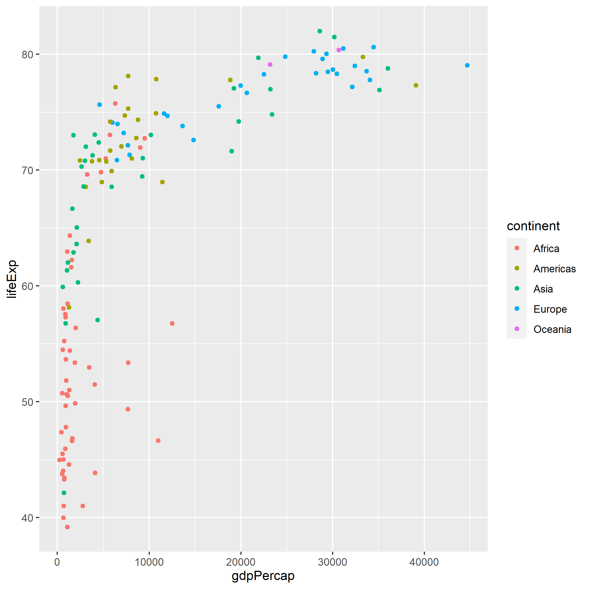
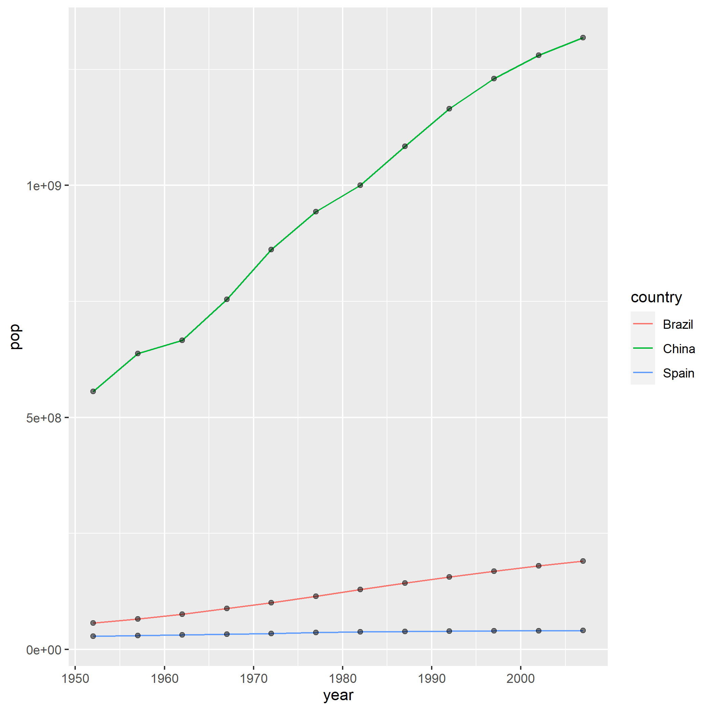
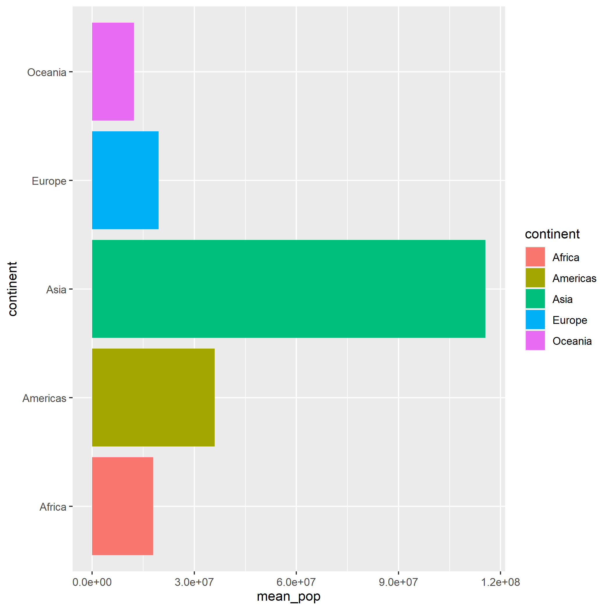

```{r hidden, include = FALSE}
pacman::p_load(learnr)

```


## Intro

Welcome to QTM 151! We're going to start off with a review of QTM 150. Even though most of you likely took it recently, QTM 151 relies *heavily* on the concepts from 150. So you need to have mastered them. Hopefully this brief review will help with that - and serve as a diagnostic to find anything you're *not* comfortable with and may want to review.

We won't review everything or all the details, but you should be comfortable with the basic concepts. In other words, you should be able to pretty quickly read all the code in this Tutorial, understand what it's doing, and replicate it. If you don't, or there's a particular area or two you're having difficulty with, please either:

* Review the relevant QTM 150 Tutorials (mostly 2.1-3.3)

* Check out the starred intro resources in the Other_R_Resources list I provide on Canvas

* Send me an email with what's confusing you, or come by office hours

## Packages

Remember R is like a newborn baby. It knows how to do a few things natively, but you have to teach it to do a lot of other common tasks. You do this by loading **packages** each time you open R.

Do you recall what each one below does or provides? If not, take a minute to go back to the Tutorials or do a quick Google search to see if you can figure it out. (NOTE: If you took QTM 150 in Fall 2020 you were not introduced to `skimr`, so I'll tell you here it provides several functions for quickly exploring and descriptively summarizing data sets.)

```{r pkgs, message = FALSE}
# Load (and, if necessary, first install) packages
pacman::p_load(tidyverse, ggridges, skimr, palmerpenguins, gapminder, nycflights13)

```

If you're following along in your own script, **remember to run this code in your own script before proceeding.**

``` {r rev_quiz1, echo = FALSE}

quiz(
  question("What does the `tidyverse` package do? Check all that apply.",
      answer("Loads multiple other packages", correct = TRUE, message = "`tidyverse` is actually a 'wrapper' that simply loads a bunch of packages that are part of the tidyverse family such as ggplot2 and dplyr."),
      answer("Loads a major data visualization package for R", correct = TRUE, message = "One of the packages calling `tidyverse` loads is ggplot2. While R does have native plotting capabilities from the moment you open it, most people use ggplot2 (in combination with other packages) to do data visualization."),
      answer("Loads common packages extending your ability to manipulate and transform data", correct = TRUE, message = "Calling `tidyverse` loads dplyr, which contains all the data transformation verbs you learned in QTM 150 such as filter, select, mutate, group_by, and summarize. It also loads packages like tidyr, lubridate, stringr, and forcats - which you'll learn about this semester!"),
      answer("Loads one or more new functions", correct = TRUE, message = "All the other packages it loads contain key functions (that don't exist natively in R) that allow you to accomplish many of the tasks we learned how to do in QTM 150."),
      answer("Loads one or more data sets", correct = TRUE, message = "Calling `tidyverse` also loads several pre-cleaned data sets we worked with in QTM 150, including `mpg` and `diamonds`."),
      type = "learnr_checkbox",
      allow_retry = TRUE),

 
   question("What does the `ggridges` package primarily do?",
      answer("Loads multiple other packges"),
      answer("Loads one or more data sets useful for exploration, plotting, and descriptive analysis"),
      answer("Loads a set of relational data sets that can be used for the above plus linked together using keys for more complex analyses"),
      answer("Expands R's plotting abilities", correct = TRUE, message = "This adds the ability to do ridge or joy plots in ggplot2 by adding the geom_ridgeline() and geom_density_ridges() family of geoms."),
      type = "learnr_radio",
      allow_retry = TRUE),
  
   question("What does the `palmerpenguins` package primarily do?",
      answer("Loads multiple other packges"),
      answer("Loads one or more data sets useful for exploration, plotting, and descriptive analysis", correct = TRUE, message = "Yes! This loads the `penguins` and `penguins_raw` data frames on Antarctic penguins observations."),
      answer("Loads a set of relational data sets that can be used for the above plus linked together using keys for more complex analyses"),
      answer("Expands R's plotting abilities"),
      type = "learnr_radio",
      allow_retry = TRUE),
  
  question("What does the `gapminder` package primarily do?",
      answer("Loads multiple other packges"),
      answer("Loads one or more data sets useful for exploration, plotting, and descriptive analysis", correct = TRUE, message = "Yes! This loads the `gapminder` data frame on GDP and life expectancy data for countries around the world from 1952-2007."),
      answer("Loads a set of relational data sets that can be used for the above plus linked together using keys for more complex analyses"),
      answer("Expands R's plotting abilities"),
      type = "learnr_radio",
      allow_retry = TRUE),
  
  question("What does the `nycflights13` package primarily do?",
      answer("Loads multiple other packges"),
      answer("Loads one or more data sets useful for exploration, plotting, and descriptive analysis"),
      answer("Loads a set of relational data sets that can be used for the above plus linked together using keys for more complex analyses", correct = TRUE, message = "Yes! This loads the several data frames about flights departing NYC airports in 2013. The main data set `flights` contains a list of flights, but there are others with additional data on airports, individual planes, airlines, and so on."),
      answer("Expands R's plotting abilities"),
      type = "learnr_radio",
      allow_retry = TRUE)
)  
```

## Importing, Opening, and Exploring Data Frames

### Data Import and Opening

Data frames that come from packages are very easy to open. You simply load the package and then call the data frame:

```{r import_easy, eval = FALSE}
# Assuming `palmerpenguins` is already loaded as it was above
data(penguins)
penguins

```

Other data frames can be imported from your local computer or a shared cloud folder such as OneDrive or Dropbox (or downloaded or scraped directly from the web, but we didn't cover that in detail and won't go over it here). The most common data files you'll probably import will be comma-separated value `.csv` files or Excel files ending in `.xls` or `.xlsx`.  Here are some examples using the diabetes and obesity data you worked with in Tutorial 2.1 in QTM 150:

```{r import_work, eval = FALSE}
#Importing a CSV
diabobes <- read_csv("./obesity-diabetes.csv")

#Importing an Excel file
diabobes_trend <- read_excel("./obesity-diabetes-excel.xlsx", sheet = "diabobes_trends")


```

Remember the `.` stands in for your **working directory**, which is where R will try and look for or write files to by default. You can check your working directory with `getwd()` and change it with `setwd()`. You can run `setwd(dirname(rstudioapi::getActiveDocumentContext()$path))` to make your working directory the same as that of the script you're working in.

<mark>Challenge</mark>: Try importing a data frame on your own - for example the slave ship data from QTM 150 HW 3 or an external data frame from your project (if you used one).

### Exploring Data Frames

We learned several techniques for initially exploring data frames:

```{r explore}

#Print the entire data frame
penguins

#Print the first or last few observations
head(penguins, n = 8)
tail(penguins, n = 4)

#Look at the structure of the data frame
str(penguins)

#Get a summary of each variable of the data frame
summary(penguins)

#skim() the data frame
skim(penguins)
```
Try some or all of these methods on the `gapminder` data to remind you what it contains:

```{r explore_gap, exercise = TRUE}

#Print the entire data frame


#Print the first or last few observations


#Look at the structure of the data frame


#Get a summary of each variable of the data frame


#skim() the data frame

```

## Data Visualization

The main package we used to visualize data was `ggplot2`, part of the `tidyverse`. The "gg" stands for "Grammar of Graphics," a unified framework consisting of 7 elements, some combination of which can be used to create essentially *any* (static) graph. Those 7 elements are:

```{r gg, eval = FALSE}

ggplot(data = <DATA>) + # 1. A dataset
  
  <GEOM_FUNCTION>( #2. A "geometric object", or geom - basically a chart type! You can use one or more in a single plot
    
     mapping = aes(<MAPPINGS>), # 3. Aesthetic mappings - specifying X and Y variables, colors, sizes, and fonts, and so on
     
     stat = <STAT>, # 4. A statistical transformation, or "stat" - often unnecessary because the default is fine
     
     position = <POSITION> # 5. Positional adjustments - for example, do you want bar charts stacked or side-by-side?
       
  ) +
  <COORDINATE_FUNCTION> + # 6. Coordinate system - most often Cartesian (2-dimensional X-Y axes, but can also do polar, or maps for spatial data!)
  
  <FACET_FUNCTION> # 7. Facetting - split one plot into many sub-plots, for example one frame/sub-plot for each species of penguin
  
```

The most important ones we need to review here are **geoms** and **aesthetics (aesthetic mappings)**. These are relevant for all plots. The others are only relevant for certain ones, and I'll leave you to mostly review those on your own from Tutorial 1.2 if you don't recall how we used them.

`ggplot()` works by essentially "painting" a plot in layers. It starts with a blank canvas:

```{r gg1, exercise = TRUE}

ggplot()

```

That's not very useful, but let's add some data and a simple **geom** - a scatterplot of highway vs. city gas mileage from the `mpg` data frame. Let's also do two **aesthetic mappings**. These "map" certain values from each observation in the data to certain "aesthetic" characteristics of the plot. For example, below we'll map the values of `hwy` to the x-axis, and `cty` to the y-axis.

```{r gg2, exercise = TRUE}
ggplot(data = mpg) +
  geom_point(mapping =
               # Each point is one observation in the data
               # The x-coordinate of every point should map to (take its value from) that observation's value of hwy, 
               # and the y-coordinate should map to cty
               aes(x = hwy, y = cty))

```
Remember you can add extra information to a plot using **grouping aesthetics** like color and fill. You can also have multiple geoms on a single plot, layered one on top of the other:

```{r gg3, exercise = TRUE}
ggplot(data = mpg, 
       # Use global aesthetics for X and Y for efficiency rather than copy-pasting into two geoms below
       mapping = aes(x = hwy, y = cty)) +
  geom_point(mapping = aes(color = class)) + #Use color here only so we don't get different smoothed lines for each class
  geom_smooth() # Add one smoothed line of the relationship between hwy and cty for all cars together

```
There are many more ways to customize plots (titles, legends, rotating plots, etc.), but I'll leave you to review QTM 150 Tutorials 1.2-3 for those should you wish to get a refresher on them. Really you can probably just refer back to those Tutorials (or [this cheatsheet](https://rstudio.com/wp-content/uploads/2015/03/ggplot2-cheatsheet.pdf)) as needed if you forget how to do something specific!

## Data Transformation

We also learned several techniques for manipulation and transforming data. Let's review using the `flights` data frame from the `nycflights13` package.

### Filtering

Filtering lets you select a subset of rows based on one or more criteria using Boolean logic (the operators `&` (for AND), `|` (for OR), `!` (for NOT)) and comparison opeators (`==`, `!=`, `>=`, `<=`, `>`, `<`, `%in%`, etc.). For example:

```{r filter, exercise = TRUE}
# All Delta flights in January
flights %>% 
  filter(month == 1 & carrier == "DL")

# All flights in January from Delta OR going to Atlanta
flights %>% 
  filter(month == 1 & (carrier == "DL" | dest == "ATL"))

# All Delta flights in January or February NOT going to Atlanta or Albuquerque
flights %>% 
  filter(month == 1 & carrier == "DL" & !(dest %in% c("ATL", "ABQ")))

```
### Selecting

Selecting lets you choose a subset of columns or reorder some or all columns. For example:

```{r select, exercise = TRUE}
#Select all 5 columns from year to sched_dep_time, plus arr_time for 6 total columns
flights %>% 
  head(100) %>% 
  select(year:sched_dep_time, arr_time) 

#Select all columns EXCEPT arr_time
flights %>% 
  head(100) %>% 
  select(-arr_time) 

#Simply Reorder columns to put arr_time at the front
flights %>% 
  head(100) %>% 
  select(arr_time, everything())

```

### Sorting (`arrange()`)

To sort you use the `arrange()` function. This will by default sort one or more columns in "ascending" (low-to-high) order, but you can use the `desc` option to go high-to-low.

```{r sort, exercise = TRUE}
#Sort earliest to latest scheduled departure time, with ties broken by actual departure time (latest to earliest)
flights_arranged <- flights %>% 
  arrange(sched_dep_time, desc(dep_time))

head(flights_arranged, 20)

```

### Creating New Variables (`mutate()`)

You use `mutate()` to create new columns, which are typically (but don't *have* to be) based off one or more existing columns in the data. For example:

```{r mutate1, exercise = TRUE}
# Create a new variable called "gain" for time made up in the air
flights %>% 
  head(100) %>% 
  mutate(gain = dep_delay - arr_delay)

# Use case-when to create new variables based off the conditions of other variables
flights %>% 
  head(100) %>% 
  # Categorize departure delays as on-time if within 5 minutes of schedule, or early or late
  mutate(dep_cat = case_when(dep_delay < -5 ~ "Early",
                             dep_delay <= 5 ~ "On Time",
                             TRUE ~ "Late"))

```

### Grouped Summaries

You'll often want to calculate grouped summaries, and you do this using `group_by()` and `summarize()`. Grouped summaries basically give you a summary number (count, mean, sum, maximum, minimum) for the subgroups you specify in the data. 

For example, say you wanted to get the number of flights departing and the mean departure delay for flights leaving each NYC airport (so maybe you can choose the one with the lowest delay to fly out of):

```{r grouped_sum, exercise = TRUE}
flights %>% 
  group_by(origin) %>% 
  summarize(mean_dep_delay = mean(dep_delay, na.rm = TRUE), #Calculate mean departure delay by airport
          
          #Also give me the number of flights by airport
          n_flights = n(),
          
          #And the number of flights with non-missing departure delays (actually included in our summary) by airport
          n_flights_in_summary = sum(!is.na(dep_delay)))

```
For more on grouped summaries please review the appropriate sections of QTM Tutorial 3.2.

### The Pipe

Note all of these above used the pipe to create clean and readable code. What is a pipe?

```{r img0, echo = FALSE, out.width = "70%", fig.align = "center", fig.cap = "*Not this, though if you have an opportunity to visit the Magritte museum in Brussels I recommend it.*"}
knitr::include_graphics("images/not_a_pipe.jpg")
```

```{r img1, echo = FALSE, out.width = "70%", fig.align = "center", fig.cap = "*This is why it's called the pipe.*"}
knitr::include_graphics("images/the_pipe.jpg")
```

The pipe is basically an operator that takes a result of whatever code you wrote before it and pipes it as the first argument to the next function after it. This is especially useful for `dplyr` data transformation verbs and other functions in the tidyverse like `ggplot`. If this remains unclear to you and you need a refresher on how the pipe works please see QTM 150 Tutorial 3.2.

## Practice Transformation-Visualization Pipelines

Those are the basics you need to remember! Now I just want to give you a little more practice with transformation and visualization to help refresh your memories. We'll use the `gapminder` data. You should accomplish each of the following below using a single code block and pipes. Note the quiz is partially based on the answers to these questions.

**Challenge 1**: Produce a scatterplot with 2002 per capita GDP on the x-axis, life expectancy on the y-axis, and each point colored by continent.

```{r challenge1, exercise = TRUE}


```
HINT: Your plot should look like the below.

```{r img2, echo = FALSE, out.width = "70%", fig.align = "center"}

```

**Challenge 2**: Construct a line plot showing the evolution of population through time (1952-2007) for three countries of your choice. The line should also have a point for each year. The lines should be colored by country, but each point should be black and partially transparent.

```{r challenge2, exercise = TRUE}

```
HINT: Your plot should look like the below.

```{r img3, echo = FALSE, out.width = "70%", fig.align = "center"}

```

**Challenge #3a**: Calculate the *total* (not per capita!) GDP for each country for 2007, then print a table with just the country, continent, population, and total 2007 GDP, ordered from highest to lowest GDP. 

HINTS: Think about how many observations you have for each country for 2007, and whether that necessitates a grouped summary or not. Also, you should end up with a table with 142 rows and the top value for GDP starting with "129...".

```{r challenge3a, exercise = TRUE}


```

**Challenge 3b**: Modify the above code to produce a table of the mean country population for each continent in 2007.

HINT: You should have a table with 5 rows, and the top value starts with "178..."

```{r challenge3b, exercise = TRUE}


```

**Challenge 3c**: Finally, use the table from 3b to make a bar chart of the mean country population for each continent.  Remember bar charts can be a little tricky - you may need to alter the default **stat**. Also make the bars horizontal so the labels are easier to read. You *may* color the bars by continent. 

```{r challenge3c, exercise = TRUE}


```
HINT: Your plot should look like the below, except maybe without the colors.

```{r img4, echo = FALSE, out.width = "70%", fig.align = "center"}

```

## Summary

Congratulations on finishing your QTM 150 review! There are basically three ways you may be feeling right now (+ any variation in between):

* This was easy!
    + Great! You're good to go.

* Not completely lost, but still not confident with everything you just did...

    + You may need to work a little more on reviewing QTM150. Consider going back through the QTM 150 Tutorials for the specific things that confused you, *or* check out the starred intro resources in the Other_R_Resources list I provide on Canvas 
    
* What the heck is going on?

    + Don’t panic, but come talk to me during office hours. You’ll just need to put more work on reviewing material from QTM 150 - or, perhaps better, try getting the material from another perspective using the starred intro resources in the Other_R_Resources list I provide on campus. I would especially recommend the RStudio primers or Coursera courses from Johns Hopkins.