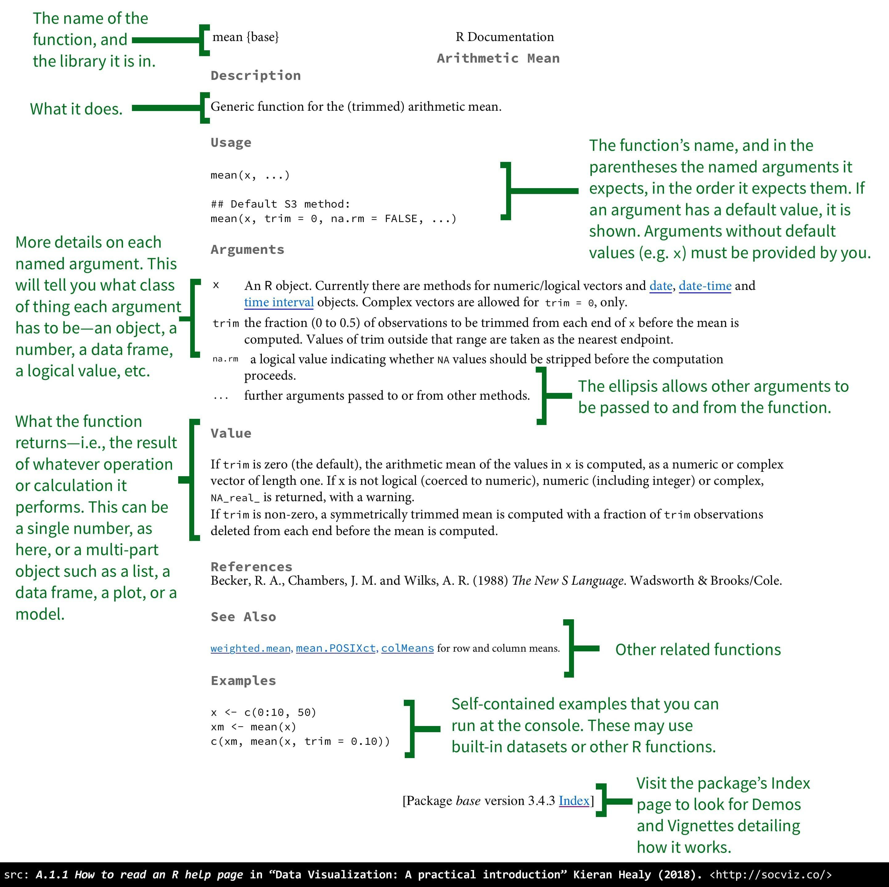

```{r hidden, include = FALSE}
pacman::p_load(learnr)

```


## Intro and Setup

We have to start with some more vegetables this week, but near the end and next week we'll get into some entrees, I promise!

We need to load a few packages today, as usual. If any of them need to also be installed, remember `p_load()` should take care of that for you. **Just remember to run this code in your own script before proceeding.**

```{r setup}
pacman::p_load(tidyverse, palmerpenguins, nycflights13)

```


## Functions

The meat of what you do in R is running functions. You've already run many functions, from `p_load()` to `summary()` to `ggplot()`. But let's dive a bit deeper on what they are and some intricacies of how they work.

### Arguments and Values

R **functions** are just like mathematical functions. Consider f(x) = 2x. The function, f(), takes one or more inputs (or in computer terms, **arguments**, in this case "x"), does something to those inputs, and returns an output. Each **argument** needs a **value** in order for the function to evaluate. For example, if I tell you x is 2 then f(x) can successfully return 4.

Let's consider an extremely simple function: `mean()`. Check for details about it using `?mean`. 

### An Aside: How to Read an R Help Page

Kieran J. Healy has a wonderful guide to how to read R help pages that you will find very helpful during this tutorial. It's [section A.1.1 in the Appendix of his *Data Visualization: A Practical Introduction* book](https://socviz.co/appendix.html#a-little-more-about-r) and is reproduced below. It tells you, among other things, where to find a **function**'s **arguments** and **default values**.

```{r img0, echo = FALSE, out.width = "100%", fig.cap = "*How to read an R help page.*"}

```

### Back to Arguments and Values

`mean()`, by default, takes only one **argument** named `x` - though it can accept others as indicated by the `...`, but ignore that for now.

```{r mean, exercise = TRUE}
#Create a "vector" of numbers to pass to mean()
numbers <- c(2, 3, 5, 7, 11)

#Calculate the mean of the 5 numbers
mean(x = numbers)
```

Notice we passed a **vector** of 5 numbers as a single **argument**. **Vectors**, which we'll talk about more later, are a key data type in R. For now you can think of them as a sequence of data points, all lashed together. You create them using the function `c()`, which is short for "combine" - you combine multiple elements into a single object.

<mark>Challenge:</mark> Try running the first line of the above code block in your own script. Then notice you've created a new object, `numbers`, in the Environment pane on the upper right in RStudio. It's a numeric **vector** with five **elements** (in this case, numbers).

In general, functions have the following structure:

```{r eval=F}
  <NAME OF FUNCTION>(
    <NAME OF ARGUMENT 1> = <VALUE 1>,
    <NAME OF ARGUMENT 2> = <VALUE 2>,
    ...,
    <NAME OF LAST ARGUMENT> = <VALUE FOR LAST ARGUMENT>)
```

In our above example, the **function** was named `mean()`... 

...the **argument** was named `x`...

...and the **value** for the **argument** was `numbers`.

Note functions can, and often do, take more than one argument. Let's consider a more complex function you've already been using a lot and are somewhat comfortable with: `ggplot()`.

You can figure out what **arguments** a **function** takes by going to its help page. Go to `?ggplot` in your Console.

```{r quiz1, echo=FALSE}
quiz(
  question("What are the first two **arguments** `ggplot()` takes?",
      answer("data, then mapping", correct = TRUE),
      answer("mapping, then data"),
      answer("data, then aes()"),
      answer("We don't know"),
      type = "learnr_radio",
      allow_retry = TRUE)
)  
```

Hopefully these two arguments look familiar. You used them over and over again in the Data Visualization tutorials!

Consider this relatively simple `ggplot()` code:

```{r scatter_func, exercise = TRUE}
#Scatterplot of body mass and flipper length
ggplot(data = penguins, mapping = aes(x = body_mass_g, y = flipper_length_mm)) +
  geom_point()
```

Notice the above code actually has *three* functions: `ggplot()` itself... 

...and `aes()`, which is fed as the **value** to another **argument** within `ggplot()`! **Functions** can be **values** to other **functions**, as well...

...and `geom_point()`, which - as is always the case in `ggplot()` - *inherits* the global **arguments** provided to the main `ggplot()` call. This is an added complexity, but because you've seen it before I hope it doesn't cause too much trouble.

This is a lot of new vocabulary. Let's try to make it more concrete with two examples:

1. The `ggplot()` function takes the argument `data =`, which has the value `penguins`.

2. The `aes()` function takes the arguments `x =` and `y =`, which have as their values `body_mass_g` and `flipper_length_mm`, respectively.
 
Let's test your knowledge so far:

```{r quiz2, echo=FALSE}
quiz(
  question("Which of the following are **functions** in the above code?",
      answer("ggplot()", correct = TRUE),
      answer("data ="),
      answer("penguins"),
      answer("mapping ="),
      answer("aes()", correct = TRUE),
      answer("x ="),
      answer("body_mass_g"),
      answer("y ="),
      answer("flipper_length_mm"),
      answer("geom_point()", correct = TRUE),
      type = "learnr_checkbox",
      allow_retry = TRUE),
  
  question("Which of the following are **arguments** to **functions** in the above code?",
      answer("ggplot()"),
      answer("data =", correct = TRUE),
      answer("penguins"),
      answer("mapping =", correct = TRUE),
      answer("aes()"),
      answer("x =", correct = TRUE),
      answer("body_mass_g"),
      answer("y =", correct = TRUE),
      answer("flipper_length_mm"),
      answer("geom_point()"),
      type = "learnr_checkbox",
      allow_retry = TRUE),
  
  question("Which of the following are **values** to **arguments** in the above code?",
      answer("ggplot()"),
      answer("data ="),
      answer("penguins", correct = TRUE),
      answer("mapping ="),
      answer("aes()"),
      answer("x ="),
      answer("body_mass_g", correct = TRUE),
      answer("y ="),
      answer("flipper_length_mm", correct = TRUE),
      answer("geom_point()"),
      type = "learnr_checkbox",
      allow_retry = TRUE)
)  
```

### Named Arguments

So far we've been working with what are called **named** arguments. These are arguments that we specify explicitly with `<ARGUMENT NAME> = <VALUE>`. This is the safest way to write code, as you'll never accidentally provide one **argument** when you mean another, or mix up **argument**-**value** pairs.

Another big upside is that the *order* in which you provide your arguments doesn't matter when using named arguments. The two following bits of code produce the same plot:

```{r order_irrelevant, exercise = TRUE}
#Scatterplot of body mass and flipper length
ggplot(data = penguins, mapping = aes(x = body_mass_g, y = flipper_length_mm)) +
  geom_point()

#Also scatterplot of body mass and flipper length
ggplot(mapping = aes(y = flipper_length_mm, x = body_mass_g), data = penguins) +
  geom_point()
```

The only downside is it can get a bit wordy, especially with complex **function** calls like `ggplot()` with a bunch of layers and customizations.

### Unnamed Arguments and Argument Order

Most functions have the **order** of the first few arguments they expect pre-specified. How can we know what order that order is? **Consult the function's help pages!** For example, look at the help page for `ggplot()`. Under "Usage" you can see, as we discussed above, the first two arguments it takes are `data =` and `mapping =`. As long as the first two **values** you provide correspond to those **arguments**, R will happily (helpfully?) sort of fill in the argument name for you behind the scenes.

```{r quiz3, echo=FALSE}
quiz(
  question("What are the first two **arguments** `aes()` expects?",
      answer("y =, then x ="),
      answer("x =, then y =", correct = TRUE, message = "That's right! When you provide values to `aes()`, R will happily (helpfully?) assign the first one to `x =`, and the second one to `y =`."),
      answer("x =, then fill ="),
      answer("We don't know"),
      type = "learnr_radio",
      allow_retry = TRUE)
)  
```

That's why both these code bits work and produce the same plot:

```{r order_relevant1, exercise = TRUE}
#Scatterplot of body mass and flipper length with named arguments
ggplot(data = penguins, mapping = aes(x = body_mass_g, y = flipper_length_mm)) +
  geom_point()

#Scatterplot of body mass and flipped length with unnamed arguments - still works, more compact
ggplot(penguins, aes(body_mass_g, flipper_length_mm)) +
  geom_point()
```

But these next two don't:

```{r order_relevant2, exercise = TRUE}
#Also scatterplot of body mass and flipper length - will give us unexpected plot!
ggplot(penguins, aes(flipper_length_mm, body_mass_g)) +
  geom_point()
```

```{r order_relevant3, exercise = TRUE}
#Also scatterplot of body mass and flipper length - will throw error!
ggplot(aes(body_mass_g, flipper_length_mm), penguins) +
  geom_point()
```

The big benefit of unnamed arguments is it makes our code more compact. But the big downside is if our arguments are out of the *order* `ggplot()` and `aes()` expect we could run into big problems.

`ggplot()` *always* takes `data =` as its first argument - this is the data frame or tibble you want it to use for plotting. This is why the third plot above throws an error - it thinks you want to tell it `aes(flipper_length_mm, body_mass_g)` is the **value** of the `data =` **argument**, but it has no idea what to do with that because it's not a data frame or tibble! So it vomits and ragequits.

`aes()` always takes as its first two arguments `x =`, then `y =`. This is why the second plot above gives you something you didn't expect - R successfully assigned `penguins` to the `data =` argument, but in `aes()` you inadvertently told it to put `flipper_length_mm` on the x-axis and `body_mass_g` on the y-axis because it forces the first value you provide to correspond to the default fist argument, `x =`, and the second one to the default second argument, `y =`.

Notice also on its help page that after `x =` and `y =`, `aes()` doesn't have a specified order of arguments. At that point you *must* use named arguments, because R won't be able to fill in what you mean on its own. Consider the following two code options:

```{r order_relevant4, exercise = TRUE}
#Scatterplot of body mass and flipper length - works! R fills in data =, mapping =, x =, and y= in the appropriate places
ggplot(penguins, aes(body_mass_g, flipper_length_mm, color = species)) +
  geom_point()

#Won't include color because R doesn't know to fill in color = by default
ggplot(penguins, aes(body_mass_g, flipper_length_mm, species)) +
  geom_point()

```

Unnamed arguments are nice for writing more compact code, but they're also less explicit. Here's some advice on when to use them: 

* For the first 1-3 arguments of a function
* For common functions you and others use over and over again where the order of the arguments feels almost second-nature to you, such as:

    + `ggplot()` and `geom_xx()` calls
    + Read and write functions for data import and export, as well as `ggsave()` for exporting plots
    + Common data transformation functions like `filter()`, `select()`, `arrange()`, and `mutate()`, which we'll learn soon
    + Some other common functions like `head()`, `tail()`, `str()`, and `summary()`
    + Functions that create statistical models, once you learn about those
    
* Before you use any named arguments. *Once you name an argument, name every subsequent argument.*

You also can't use unnamed arguments if you want to skip any arguments. For example, say I want to export a plot using `ggsave()`. Try running this code in your own script:

```{r, eval = FALSE}
#Create plot
penguin_plot <- ggplot(penguins, aes(body_mass_g, flipper_length_mm, color = species)) +
  geom_point()

#Save it, and change the scale
ggsave("./penguin_plot.png",
       penguin_plot, scale = 1.5)

```

I left the first two arguments in `ggsave()` unnamed because the first argument, `filename =`, is supposed to be where I want the plot to export to, and the second argument, `plot =`, is the plot I want exported. But I also want to tell it to change the scale. `scale =` is the 5th ordered argument, though, so if I didn't want to use its name I would have to specify the 3rd (`device =`) and 4th (`path =`) arguments, first. That's annoying. Far easier to just say "OK, in the 3rd spot I want you to take the `scale =` argument" by naming the argument I want.

### Default Values

Some arguments come with a default value pre-set. If you don't want to change that value, you don't have to specify that argument at all!

You can find the default argument values on the function's help pages. When there's a default value, even if that value is `NULL`, the help page specifies it by showing `<ARGUMENT> = <DEFAULT-VALUE>`

Consider a simple example: `head()`.

```{r default1, exercise = TRUE}
#This will print the first 6 rows of data
head(penguins, n = 6)

#But so will this
head(penguins)

```

The second code works because behind the scenes R is saying "OK, you didn't tell me a value for the argument `n =`, so I'm using `n = 6` by default" (the `6L` on the help page is a bit opaque, but it just means the *number* 6).

If you want a non-default value, of course, you have to specify it in a named or unnamed argument.

```{r non-default, exercise = TRUE}
#This will print the first 10 rows of data
head(penguins, 10) #Notice we left x = and n = unnamed for compactness

```

```{r quiz4, echo=FALSE}
quiz(
  question("What is the default value for the `scale =` argument in `ggsave()`?",
      answer("0"),
      answer("1", correct = TRUE),
      answer("1.5"),
      answer("It doesn't have one"),
      type = "learnr_radio",
      allow_retry = TRUE)
)  
```

## Introduction to Data Transformation

It may not feel like it, but I've actually been very limited in what I can ask you to do in homeworks so far because we've had to more or less work with the data as it came to us. But very often you'll find you want to manipulate it in some way to get what you actually want to analyze or plot.

Consider this (somewhat annoying) bar plot from HW2:

```{r hw2_bar}
pacman::p_load(nycflights13)

#Reproduce the bar graph
ggplot(flights) +
    geom_bar(aes(x = carrier, fill = origin))
```

Wouldn't it have been great to be able to dump some of the airlines with just a handful of flights to make our histogram a bit more readable?

```{r hw2_bar_better, exercise = TRUE}
#Produce a histogram for only a subset of the carriers
ggplot(filter(flights, carrier %in% c("9E", "AA", "B6", "DL", "EV", "MQ", "UA", "US", "WN"))) +
    geom_bar(aes(x = carrier, fill = origin))
```

Or what if we wanted to plot the distribution of time made up in the air rather than just calculate the average?

```{r average_time_made_up, exercise = TRUE}
#Create a new variable of time made up in the air
temp <- mutate(flights, time_made_up = dep_delay - arr_delay)

#Plot its distribution, excluding a handful of implausible values
ggplot(filter(temp, time_made_up > -60)) +
    geom_density(aes(x = time_made_up))
```

This is where the `dplyr` package - part of the `tidyverse`, and loaded along with it - comes in. The major **functions** - also known as **verbs** - that we'll use to accomplish some key tasks are:

* Choose a subset of rows using `filter()`
* Choose a subset of variables using `select()`
* Reorder the rows of a data frame using `arrange()`
* Create new variables based on existing ones using `mutate()`
* Compute summary statistics using `summarise()`
* Apply any of the above functions to a bunch of sub-groups of the data using `group_by()`

Every "verb" we're working with has a similar structure, so to speak:

* Their first argument is a data frame or tibble to operate on
* Their subsequent arguments tell R what to do to the data frame using variable names (columns) with no quotation marks
* They produce a new data frame

These similarities allow us to chain these together into incredibly powerful combinations...but that's for the next tutorial. For now let's introduce just the first three of these verbs.

## Filtering with `filter()` 

In a nutshell, `filter()` lets you choose a subset of rows of the data based on column criteria. For example, let's filter `flights` to contain just the flights out of NYC in 2013 headed to Albuquerque, New Mexico:

```{r, filter1}
#Choose flights headed to Albuquerque, NM
abq_flights <- filter(flights, dest == "ABQ")

abq_flights
```

The way to read this code in English is basically: "Take `flights`, filter it down to only flights with dest (destination) == "ABQ" (Albuquerque), and assign that new data frame to the object `abq_flights`. Then print `abq_flights`.

Notice a few things:

1. We now only have 254 rows from the flights to Albuquerque instead of 336,776 to all destinations.

2. They all have a `dest` value of "ABQ". We use `==` to check for equality, rather than a single `=`, which is an assignment operator used to, for example, tell R what the value of an argument is.

3. We used an unnamed argument first since all these functions/verbs have `.data =` as their first argument.

4. The next argument doesn't have a name; it's just a sequence of actions to take on certain variables to filter the dataset down to the desired subset.

#### **Doing Something, Saving it to an Object, *and* Printing the Result Compactly**

This is a bit of a sidenote, but wrapping a newly created object in parentheses `()` is a quick, compact way to both create *and* print something without a new line to order the printing. This is incredibly useful for plots you want to both save and display at once.

```{r, print_fast, exercise = TRUE}
#Try this as-is, then wrap the entire thing in parentheses (that is, "(" before bday and ")" at the end of the line)
abq_flights <- filter(flights, dest == "ABQ")
```

### Comparison Operators

The simplest way to filter is based on a single variable using comparison operators:

* `==` means "is equal to". Above, we asked for observations where the `dest` variable was equal to "ABQ."

    + Be careful not to mix up `=` and `==`. Fortunately, RStudio tends to throw somewhat helpful errors here.
    
```{r equals, error = TRUE}
filter(flights, dest = "ABQ")
```

*`!=`, pronounced "bang-equal" (seriously!), means "is NOT equal to."

* `>`, `<`, `>=`, and `<=` mean greater than, less than, greater than or equal to, and less than or equal to, respectively. You do not need the double-equals here.

Note you can use `==` and `!=` for character, categorical or numeric data! 

The greater and less than operators can also be used for character or categorical data, but only with caution. We don't have time to get into the details here, unfortunately - but it's less common, anyway.

#### **Floating Point Arithmetic**

This is getting *very* computer science-y but I want to scratch the surface of one issue you might face at some point. Check out the following code:

```{r equal}
#Does 2 equal 2?
2 == 2

#Does 1 plus 1 equal 2?
1+1 == 2
```
`TRUE` and `TRUE`. Thank the gods. Now to take a big sip of water and...

```{r notequal}
#Does 49 times 1/49 equal 1?
1/49*49 == 1

#Does the square root of 2, squared, equal 2?
sqrt(2)^2 == 2
```
`FALSE`!? What is this witchcraft?

A computer can't store infinite digits of a number. So if you have an irrational number with infinite decimal points - like, say, `1/49`, or `sqrt(2)` - R is forced to round it behind the scenes. It rounds after a *lot* of digits, mind you, but it's still rounded from its true value. R doesn't store `1/49` as *exactly* `1/49`...so when you multiply it by 49 it's not exactly 1. What a nightmare.

You can often solve this by using the `near()` function instead:

```{r nearequal}
#Does 49 times 1/49 equal 1?
near(1/49*49, 1)

```
You won't have to worry about this again in this course. Just making you aware of a seemingly trivial but actually very, very real problem in computer science.

### Filtering on Multiple Criteria, and Boolean Operators

What if I wanted to see the flights on my birthday, August 29?

```{r, boolean1, exercise = TRUE}
#Try this as-is, then wrap the entire thing in parentheses (that is, "(" before bday and ")" at the end of the line)
(bday_flights <- filter(flights, month == 8 & day == 29))
```

Here I wanted only flights with *both* `month == 8` *and* `day == 29`. To specify this I used the **boolean operator** `&` (an ampersand, meaning "AND"). The major operators are:

* `&` means **AND**. 

    + You can also use commas `,` between criteria in place of `&`, but I find that a bit confusing because it looks like you're moving on to another argument.
    
* `|` is called the "pipe." It means **OR**
    
    + Soon we're going to learn about another thing called a pipe, which is totally different. Here pipe just refers to the name for the grammatical mark above.

* `!` is an exclamation point but is often read as "bang." It means **NOT**

The easiest way to understand how these all combine is Figure 5.1 from *R for Data Science*:

```{r img1, echo = FALSE, out.width = "100%", fig.cap = "*Complete set of boolean operations. x is the left-hand circle, y is the right-hand circle, and the shaded region show which parts each operator selects.*"}
knitr::include_graphics("images/boolean_operators.png")
```


Let's get some practice in. Say I want the flights that took off in August OR September.

```{r boolean2, exercise = TRUE}
#Departed in August or September
flights_filtered <- filter(flights, month == 8 | month == 9)

str(flights_filtered)
```
I checked the results using `str()` because that will quickly show me how many observations I'm left with *and* the fact that at least the first few flights all appear to depart in the month of August rather than January as before.

There's a more compact way to write this, though. If you have a long list of values you want to check a variable against, use the `%in%` operator:

```{r boolean3, exercise = TRUE}
#Departed in August or September - identical results
flights_filtered <- filter(flights, month %in% c(8, 9))

str(flights_filtered)
```

The way to read this is it's telling R "Take `flights` and filter to observations where `month` is in the vector of values {8, 9}." Remember, you always create vectors (groups of data points) with `c()`, which "combines" the values 8 and 9 into a single object R can evaluate your request against.

But even this would get clunky if you wanted all flights in, say, the first 6 months. Instead, try this even *more* compact notation:

```{r super_compact}
#Departed in January-June
flights_filtered <- filter(flights, month %in% c(1:6))

str(flights_filtered)
```
The colon notation `c(1:6)` creates a sequence of integers from 1 to 6, resulting in the code choosing any flight with a `month` value from 1 through 6.


What if I wanted all the flights NOT in (August OR September)? Here are two identical methods:

```{r boolean4, exercise = TRUE}
#One way
flights_filtered <- filter(flights, month != 8 & month != 9) # "Month is NOT 8 AND month is NOT 9"

str(flights_filtered)

#Not departed in August or September - identical results
flights_filtered <- filter(flights, !(month %in% c(8, 9))) # "Month is NOT in the vector {8,9}"

str(flights_filtered)
```
Note that saying "NOT (x OR y)" is equivalent to saying "NOT x AND NOT y." This definitely requires some practice. I still sometimes have to write these a few times to get them right, and I *always* put in some kind of quality check to make sure the result makes sense. Here are some challenges to practice, along with the answers to make sure you get them right:

```{r boolean_practice, exercise = TRUE}
#1. Filter to all flights with departure AND arrival delays over 2 hrs (120 minutes)

  #Your result should have 8,482 flights

#2. Arrived over 2 hours (120 minutes) late, but did not leave late (think about this one...)

  #Your result should have 29 flights

#3. Filter to all flights to Atlanta (ATL) OR Albuquerque (ABQ)

  #Your result should have 17,469 flights

#4. Filter to all flights to Atlanta (ATL) AND NOT operated by Delta (carrier DL)

  #Your result should have 6,644 flights

#5. Filter to all flights to Atlanta (ATL) OR Albuquerque (ABQ) that are ("AND") NOT operated by United (carrier UA)

  #Your result should have 17,366 flights

```

Number 5 is a little bit tricky. Don't read below until you've tried it, but here's an issue when using three or more criteria:

```{r boolean_practice2, exercise = TRUE}
#5. Filter to all flights to Atlanta (ATL) OR Albuquerque (ABQ) that are ("AND") NOT operated by United (carrier UA)

#This works fine because it only uses two criteria, really (dest in the provided list, carrier not UA)
flights_filtered <- filter(flights, dest %in% c("ATL", "ABQ") & carrier != "UA") 

str(flights_filtered)

#This doesn't because it uses three criteria (dest ATL, dest ABQ, carrier not UA) but doesn't properly group them
flights_filtered <- filter(flights, dest == "ATL" | dest == "ABQ" & carrier != "UA") 
  #This actually says "give me flights to Atlanta, OR (to Albuquerque AND not by United)

str(flights_filtered)

#This works fine because it uses three criteria (dest ATL, dest ABQ, carrier not UA) but properly groups them using parentheses
flights_filtered <- filter(flights, (dest == "ATL" | dest == "ABQ") & carrier != "UA") 
  #This actually says "give me flights (to Atlanta OR Albuquerque), AND not by United

str(flights_filtered)

```

These are subtle differences, but be sure if you're using three or more criteria you group them properly using parentheses so they evaluate properly.

One last example: What if instead of only looking for flights to Atlanta or Albuquerque not operated by United, I wanted to *exclude* those flights (I know this is a weird request, but bear with me). In other words, I want flights NOT (to Atlanta or Albuquerque AND NOT operated by United). You can negate an entire sequence of other criteria by using `!` and parentheses:

```{r boolean_practice3, exercise = TRUE}
#5. Filter to all flights NOT (to Atlanta (ATL) OR Albuquerque (ABQ) AND NOT operated by United (carrier UA))

flights_filtered <- filter(flights, !(dest %in% c("ATL", "ABQ") & carrier != "UA")) 

str(flights_filtered)
```
This grabs the 319,410 flights *not* meeting these criteria rather than the 17,366 that do.

### Missing Values: An Introduction

One last thing we need to cover while we're talking about making comparisons (either using comparison or boolean operators): **missing values**. There are several types of missing values in R, but we'll focus on `NA` for now.

`NA` is its own thing, and if any part of any operation is done on an `NA` value, it will return `NA`.

```{r miss1}
NA > 5
```
```{r miss2}
NA + 10

```

```{r miss3}
NA == 37

```

```{r miss4}
NA/2

```

This extends to "aggregation" functions like `mean()` and `sum()`:
```{r miss5}
mean(c(2, 3, 5, 7, 11, NA))
sum(c(2, 3, 5, 7, 11, NA))

```

Many of these functions, though, come with an argument `na.rm =` (the rm is short for "remove") that can be set to make them ignore `NA` values. Note the default value is `na.rm = FALSE`, which means it *won't* simply ignore `NA`s unless you explicitly tell it to.

```{r miss6, exercise = TRUE}
#Ignore the NAs when doing these calculations
mean(c(2, 3, 5, 7, 11, NA), na.rm = TRUE)
sum(c(2, 3, 5, 7, 11, NA), na.rm = TRUE)

```
Here's a bit of a weird one:

```{r miss7}
#Why does this return NA?
NA == NA

```

Think about it a bit. Let's say we have two variables, and we don't know the value of either:

```{r miss8}
#Don't know U.S. GDP in 2030
gdp_2030 <- NA

#Don't know U.S. GDP in 2040
gdp_2040 <- NA

#Does U.S. GDP in 2030 equal U.S. GDP in 2040? We can't say TRUE or FALSE. We don't know! So, NA.
gdp_2030 == gdp_2040

```

This has important consequences when you're filtering or doing other data manipulation. Say you want to identify flights with an unknown departure delay:

```{r NAs1, exercise = TRUE}
#This won't work because it will, essentially, return NA
flights_filtered <- filter(flights, dep_delay == NA)

str(flights_filtered)

```
To understand why this breaks we have to think a bit more about how `filter()` works. Basically, `filter()` goes through each row and asks, "Does this row meet the criteria the programmer laid out?"

* If so, it returns `TRUE` and keeps that row
* If not, it returns `FALSE` and discards that row
* If it doesn't know...it returns `NA` and discards that row

The code above, because it's an operation on `NA`, leads `filter()` to return `NA` for every row...even those where `dep_delay` is `NA`. So, no rows are returned. I know, I know, it's a pain.

There's a simple solution, though. Always use the `is.na()` function instead.

```{r NAs2, exercise = TRUE}
#This will work!
flights_filtered <- filter(flights, is.na(dep_delay))

str(flights_filtered)

```
This causes `filter()` (and many other functions) to return `TRUE` or `FALSE` for all rows, rather than `NA`. So if you're looking for missing `NA` values, use `is.na()`.


### A Brief Proof Filtering is Useful

Let's look at the distribution of departure times by airline and origin airport in `flights`:

```{r hideous, exercise = TRUE}
#A hideous graph, needs filtering
ggplot(flights) +
  geom_density(aes(x = dep_time, color = carrier)) +
  facet_wrap(~ origin, nrow = 3)

```
Oook. Some tiny carriers with weird departure patterns are completely skewing the graph. It turns out they're "HA" and "OO". Let's get rid of them.

```{r better, exercise = TRUE}
#A more readable graph
ggplot(filter(flights, !(carrier %in% c("HA", "OO")))) +
  geom_density(aes(x = dep_time, color = carrier)) +
  facet_wrap(~ origin, nrow = 3)

```
That's still a lot of lines and carriers, though. Let's zoom in on two major ones: Delta and United.

```{r better2, exercise = TRUE}
#A more readable graph
ggplot(filter(flights, carrier %in% c("DL", "UA"))) +
  geom_density(aes(x = dep_time, color = carrier)) +
  facet_wrap(~ origin, nrow = 3)

```
Substantially more readable, no? I really wanted to make this a question on HW2 but I couldn't do it without you knowing `filter()` :)

## Selecting Variables With `select()`

You use `filter()` to choose a subset of *rows*, but you use `select()` to choose (or move, or manipulate) a subset of *columns*. Say you wanted a new data frame of just the scheduled and actual departure date and time of all flights. You could do that like so:

```{r select1, exercise = TRUE}
#Select just a few columns describing departure data for flights
flights_selected <- select(flights, year, month, day, dep_time, sched_dep_time)

str(flights_selected)
```
The code above says take the data frame from the first argument (`flights`) and *select* all the columns in the subsequent arguments. Notice you now have a data frame with the same number of observations as before but only 5 columns!

#### **Selecting Multiple Adjacent Columns**

Since these columns are adjacent to one another, here's a more compact way to write the code to select adjacent columns:

```{r select2, exercise = TRUE}
#Select adjacent columns
flights_selected <- select(flights, year:sched_dep_time) #This says select all columns FROM year TO sched_dep_time

str(flights_selected)
```
You can, of course, combine the `:` trick with specifying other individual columns:

```{r select3, exercise = TRUE}
#Select adjacent columns, plus one more for 6 total columns
flights_selected <- select(flights, year:sched_dep_time, arr_time) 

str(flights_selected)
```
#### **Tell R What NOT to Select**

You can tell R to *drop* rather than *choose* columns by adding a `-` to your `select()` call:

```{r select4, exercise = TRUE}
#Select everything EXCEPT the columns above
flights_selected <- select(flights, -(year:sched_dep_time), -arr_time) #Select all BUT these columns

str(flights_selected)
```
Notice to negate/drop a group of adjacent columns you need parentheses around the group and a `-` outside the parentheses.

#### **Selecting Columns on Name Patterns**

Let's say we wanted just data on the date of the flight plus all information about *scheduled* times. `select()` can do that, too, with a little helper function `starts_with()`: 

```{r select5, exercise = TRUE}
#Select date info + scheduled time info
flights_selected <- select(flights, year:day, starts_with("sched")) #Select date information AND all variables whose names begin with "sched"

str(flights_selected)
```
What if we want all the information about departures instead of the scheduled times? We have a problem: `dep_time` and `dep_delay` start with "dep", but `sched_dep_time` doesn't! Actually, no problem at all:

```{r select6, exercise = TRUE}
#Select date info + departure info
flights_selected <- select(flights, year:day, contains("dep")) #Select date information AND all variables whose names contain "dep"

str(flights_selected)
```

You can also select on the last characters of variable names. Can you guess how without reading below?

I bet you got it. Just use `ends_with()` instead!

You can also select column names much more flexibly based on whether they match [regular expressions](https://xkcd.com/208/), but you all aren't ready for that nightmare yet.

### Reordering Columns With `select()`

One last trick. `select()` always gives you the columns in the order you specify. You can use this to your advantage. 

Sometimes you may want to bring just a few columns, like a newly created unique ID, to the "front" of a data frame. Say we want the carrier and flight number as our first two columns. We just `select()` them...then ask for `everything()` else after:

```{r select7, exercise = TRUE}
#Move carrier and tail number to be first two columns
flights_selected <- select(flights, carrier, tailnum, everything())

str(flights_selected)
```

`select()` is usually much more useful with larger data frames (hundreds or thousands of columns when you only want a few, or those with a particular pattern in their names), but hopefully this gives you an idea of how it's used.

#### **Test Your `select()` Knowledge**

Make the first two columns the origin and destination airports, and only include that plus the actual arrival and departure times:

```{r select8, exercise = TRUE}
#Challenge for you

  #Note your result should have 4 variables, with the first two characters and the second two integers
```

## Sorting Data Frames With `arrange()`

While `filter()` chooses a subset of rows, `arrange()` simply...well, re-arranges (or sorts) the rows based on the columns you specify. By default it sorts them in **ascending** order (lowest-to-highest). For example, let's sort flights from earliest to latest scheduled departure time:

```{r arrange1, exercise = TRUE}
#Sort from earliest to latest scheduled departure time
flights_arranged <- arrange(flights, sched_dep_time)

#Let's compare the results we get here with the original data frame. Observe the difference.
head(flights, 20)
head(flights_arranged, 20)

```

### Sort High-to-Low

What if you wanted to order the flights from latest to earliest scheduled departure? No problem, just use the helper function `desc()` (short for **descending** order):

```{r arrange2, exercise = TRUE}
#Sort from latest to earliest scheduled departure time
flights_arranged <- arrange(flights, desc(sched_dep_time))

head(flights_arranged, 20)

```

### Sort on Multiple Columns

You can sort by multiple columns. `arrange()` will do the sorting in *reverse* order, from the last column you specify back to the first. This sounds weird and bad but is actually cool and good. It means that you will end up with data sorted on the first column you specify (your second argument, after the data!), with ties broken by the second column you specify. In case of a tie in the first *and* second column, the third column will be used, and so on.

```{r arrange3, exercise = TRUE}
#Sort earliest to latest scheduled departure time, with ties broken by actual departure time
flights_arranged <- arrange(flights, sched_dep_time, dep_time)

head(flights_arranged, 20)

```

Notice unlike earlier when we only sorted on `sched_dep_time`, our data is now ordered by `sched_dep_time` and - within each level of that - also by `dep_time`. [Pretty cool](https://www.youtube.com/watch?v=GSZoshxXSlg).

### Sorting Missing Values

One tricky thing is no matter *what* order you specify - ascending or descending - `NA`s will always be placed last. So just be aware of that. Here's one hacky solution if you really want your `NA`s first:

```{r arrange4, exercise = TRUE}
#Put missing values of departure time first
flights_arranged <- arrange(flights, desc(is.na(dep_time)))

head(flights_arranged, 20)

```

You need a little more R knowledge before *really* getting how this works, but basically it tells R to return whether each row is `NA` for `dep_time`: `TRUE` (coded as 1) or `FALSE` (coded as 0). You then ask it to sort in descending (high-to-low) order on *these* results, so the `TRUE`s go first, then the `FALSE`s.


## Summary

We covered a lot of ground this week:

* A more in-depth discussion of functions, arguments (named, unnamed, and default), and values, as well as when to use named and unnamed arguments

* How to choose subsets of rows of data with `filter()`

* How to choose subsets of columns using `select()`

* How to sort data frames using `arrange()`

Next up is a week where we build up a couple more data transformation skills and learn how to string the individual verbs we're learning together into truly powerful workflows.


