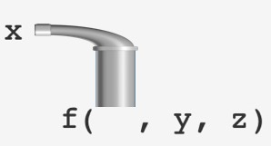

```{r hidden, include = FALSE}
pacman::p_load(learnr)

```


## Intro and Setup

This week is some more entrees. We've learned various been sampling various ingredients of the data transformation meal, but this week we put it all together into a main course.

We need to load a few packages today, as usual. If any of them need to also be installed, remember `p_load()` should take care of that for you. **Just remember to run this code in your own script before proceeding.**

```{r setup, message = FALSE}
pacman::p_load(tidyverse, gapminder, nycflights13, janitor)

#Creation of a couple more datasets for later use - ignore
rush <- read_csv("datasets/rush.csv")

flights_small <- select(flights, year:day, ends_with("delay"), distance, air_time, dep_time)

```


## Creating New Variables with `mutate()`

The `mutate()` function allows you to create new variables based off data in existing columns/variables.

We're going to continue working with the `flights` data today since there's quite a bit we still haven't explored! To make it a bit easier to work with we're going to create a smaller data frame with just some of the columns of the original. 

```{r quiz1, echo=FALSE}
quiz(
  question("What `dplyr` verb will we use to do this?",
      answer("filter()" ),
      answer("select()", correct = TRUE),
      answer("arrange()"),
      answer("None of these"),
      type = "learnr_checkbox",
      allow_retry = TRUE)
)
```

Good. So let's go ahead and do that.

```{r selected}
# Choose 8 variables: date of flight, delay info, distance, air time, and departure time
flights_small <- select(flights, year:day, ends_with("delay"), distance, air_time, dep_time)

```

We're also going to work with the international development `gapminder()` data you encountered several weeks ago, but we'll leave that as it is for now. Still, go ahead and briefly explore that data using the techniques you know on your own to remind yourself what it looks like.

### Basic New Variable Creation - Artithmetic Operations

The simplest way to create a new variable is probably to do arithmetic operations on existing variables/columns. What if, for example, we wanted to calculate the time made up in the air on every individual flight (this may have been useful for HW1)?

```{r mutate1, exercise = TRUE}
# Create a new variable for time made up in the air
flights_mutate <- mutate(
  
  # First data argument
  flights_small, 
  
  #Subsequent arguments: new variable = [OPERATIONS ON OLD VARIBALE(S)]
  gain = dep_delay - arr_delay)

flights_mutate

```

Check out the last column - it's your new variable! `mutate()` always adds new variables onto the end of a data frame.

In addition to the basics - `+`, `-`, `*`, and `/` - you can also calculate logarithms. To get the natural (base e) log of a variable, for example, use `log()`. You can also use `log2()` or `log10()` for base 2 and base 10 logs, respectively. This is very useful if you have data over many orders of magnitude, which can be hard to otherwise plot clearly, or if you want to model logarithmic or exponential relationships.

In order to see the utility let's take a brief detour back to the `gapminder` international development data:

```{r mutate_log1, exercise = TRUE}
#Plot normal GDP per capita vs. life expectancy
ggplot(gapminder) +
  geom_point(aes(x = gdpPercap, y = lifeExp))

```

When we just plot regular non-transformed `gdpPercap` on the x-axis, a few outliers drag the graph out to the right and make it harder to see the association in the rest of the data points.

```{r mutate_log2, exercise = TRUE}
#Create new variable of log(GDP per capita)
gapminder_mutate <- mutate(gapminder,
                           log_gdpPercap = log10(gdpPercap))

#Plot log of GDP per capita vs. life expectancy
ggplot(gapminder_mutate, aes(x = log_gdpPercap, y = lifeExp)) +
  geom_point() +
  geom_smooth(method = "lm")
```
The log transformation helped "unbunch" the graph. The big drawback is it's harder to interpret what's happening along the x-axis. Because we used `log10()`, a 1-unit change in `log_gdpPercap` is not a "1-unit" change in per capita GDP, but rather than 10x increase! On the x-axis, 3 corresponds to a per capita GDP of 10^3 = 1,000; 4 corresponds to a per capita GDP of 10^4 = 10,000; and so on.

As a result, what might look like a linear increase is actually a logarithmic change. Raising per capita GDP *10x* seems to be associated with about a 20-year increase in life expectation (although the right side of the graph clearly shows diminishing returns in the highest-income countries due to natural limitations on the human lifespan, so a simple straight line model here probably isn't the best choice as it's unlikely to extrapolate).


#### **Fancier Arithmetic With Aggregate Functions**

Basic arithmetic can be powerfully combined with aggregate functions to calculate things like proportions of a column total or the difference from a column mean.

For example, what if we wanted to know whether and how far each flight's departure delay was above the mean?

```{r mutate2, exercise = TRUE}
# Create a new variable for how far above or below the mean departure delay each flight is
flights_mutate <- mutate(flights_small,
                         relative_delay = dep_delay - mean(dep_delay, na.rm = TRUE))

flights_mutate

```

The code above creates a new variable, `relative_delay`, that is the difference between each observation's (flight's) `dep_delay` and the mean of all observations of `dep_delay`, excluding those with an unknown `NA` value of that variable. 

<mark>Challenge:</mark> Do you remember why was it necessary to explicitly exclude the `NA`s? See what happens if you delete that bit in the above code.

<mark>Challenge:</mark> Another common use of this is to calculate the **proportion** of each column an observation represents. Consider the revenue from a bunch of different product lines. Can you figure out how you would calculate the percentage of revenue each one accounts for? You already know every function you need to make it happen.

```{r mutate3, exercise = TRUE}
(biz <- tibble(product_line = c("Widgets", "Gizmos", "Doohickys"),
              revenue = c(1000, 1000, 2000)))

# Create a new variable for the percentage of revenue from each product line. Do NOT just manually calculate and put the values in yourself; use mutate()

  ##<YOUR CODE HERE>

# Check yourself: you should end up with a new column that lists the proportion of revenues as:
  # 0.25
  # 0.25
  # 0.50

```

#### **Modular Arithmetic**

Addition, subtraction, and multiplication are straightforward, but division offers a couple additional options. 

Consider the operation 442/100. 100 goes into 442 4 times, with 42 as a remainder. Turns out you can get those parts separately in R, if you want. This seems useless at first, but consider our `dep_time` variable - what if you wanted to separate it into hours and minutes?

```{r mutate4, exercise = TRUE}
flights_mutate <- mutate(flights_small,
                         
                         # Get the number of times 100 goes fully into dep_time using %/%
                         dep_hour = dep_time %/% 100,
                         
                         #Get the remainder using %%
                         dep_min = dep_time %% 100) 
  
flights_mutate

```

### You can `mutate()` Variables You Just Created

You can create chains of new variables in a single `mutate()` step. For example:

```{r mutate5, exercise = TRUE}
flights_mutate <- mutate(flights_small,
                         gain = dep_delay - arr_delay,
                         
                         #You just created gain, and now you can use it again to create new variables here
                         gain_per_hour_in_air = gain/(air_time/60)) 
  
flights_mutate

```

### Leading and Lagging Variables With `lead()` and `lag()`

Sometimes you may want to create a new variable that takes the value of a variable from the *next* (leading, using `lead()`) or *previous* (lagged, using `lag()`) observation. Say, for example, you wanted to create a new column in `gapminder` with a country's population 5 years after or before the indicated year (i.e. at the time of the next or prior observation):

```{r mutate6, exercise = TRUE}
# Using lead() and lag() with mutate()
gapminder_mutate <- mutate(gapminder,
                         
                           #Get population from the next row in the data frame
                           pop_lead = lead(pop),
                           
                           #Get population from the previous row in the data frame
                           pop_lagged = lag(pop))
  
gapminder_mutate

```

This can be quite dangerous if you're not careful! Before doing `lead()` or `lag()`, consider these three points:

1. Is your data frame sorted properly? These functions simply take the next or previous value in the data, regardless of whether it's one that makes sense. In this case your data should be sorted by `country` and `year` to ensure you get the next or previous population measure for that country.

2. Deal with first observations. The first observation in the data will get an `NA` for a `lag()` function because there's no data before it, so you may need to deal with that.

    But you have to be extra careful when there are relevant groups in the data, like countries. Notice in row 13, `pop_lag` for Albania in 1952 isn't Albania from 1947 because that information isn't in our data; instead it's Afghanistan from 2007 because that's the prior value in the data. That doesn't make sense, so you need to account for that somehow. `case_when()` and **grouped mutates** can help here. You'll learn more about those below. 
    
3. Deal with last observations. This is very similar to point 2, except the *last* observation in the data will get an `NA`, so you have to deal with that.

    And you have to be extra careful when there are relevant groups. Look at row 12 - `pop_lead` for Afghanistan in 2007 doesn't get the data from Afghanistan in 2012, but from Albania in 1952.


### Cumulative Functions

Sometimes you'll want to create a new variable that moves down another column and keeps a running (**cumulative**) sum, mean, product, minimum, or maximum. For example, maybe you want to keep track of the total departure delays suffered by flights out of NYC in 2013:

```{r mutate7, exercise = TRUE}
flights_mutate <- mutate(flights_small,
                         
                         #Cumulative total departure delays across all flights in the data so far
                         dep_delays_tot = cumsum(dep_delay),
                         
                         #Cumulative mean departure delay across all flights in the data so far
                         dep_delays_cummean = cummean(dep_delay))
  
flights_mutate

```

Note if you're doing this the observations should be organized in some kind of sensible order so you get meaningful results. For example, here you could order the flights by actual departure date and time so you can see how delays "stack up" over the course of a year.

### If-Else Functions with `case_when()` and Logical Comparisons

The last major way to use `mutate()` - and one I use all the time - is to create new variables using if-else conditions. Rather than the `if_else()` function provided in R, I strongly prefer `case_when()`. Let's talk through an example of how it's used.

Say I want to classify each flight as early (departed 5+ minutes early), on-time (departed within 5 minutes of scheduled time), or late (departed 5+ minutes late). Here's how to do that:

```{r mutate8, exercise = TRUE}
#Categorize each flight's departure as early, on-time, or late
flights_mutate <- mutate(flights_small,
                         
                         #Create new categorical variable for departure depending on values of dep_delay
                         dep_cat = case_when(dep_delay < -5 ~ "Early",
                                             dep_delay <= 5 ~ "On Time",
                                             TRUE ~ "Late"))
  
flights_mutate

```

The way to read the `case_when()` code is as follows:

* First, check if `dep_delay` meets the first condition we set: is it <-5? 

    + This will return `TRUE` or `FALSE` (or `NA` if the data is missing) for each observation.
    
    + If `TRUE` is returned, set `dep_cat` to be `"Early"`
    
    + Otherwise (else), move on to the next condition
    
* *If the first check was `FALSE`*, check if `dep_delay` meets the second condition: is it <=5?. Note that this will *only* capture observations with `dep_delay` >= -5 and <= 5 because we already dealt with those <-5.

    + This will return `TRUE` or `FALSE` (or `NA` if the data is missing) for each observation that wasn't `TRUE` before.
    
    + If `TRUE` is returned, set `dep_cat` to be `"On Time"`
    
    + Otherwise (else), move on to the next condition
    
* Finally, *for any remaining observations* just set their evaluation results to `TRUE`, and assign our remaining value `"Late"`

Scan through the first 30 observations to see what this code returns and convince yourself it did what you wanted.

### Knowledge Check

Let's test your `mutate()`ing skills by creating a few new variables. Do the following in the code block below:

1. Re-express `air_time` in hours rather than minutes.

2. Calculate average air speed in miles per hour using `air_time` and `distance`.

3. Create a new categorical distance variable for "Short" (<=500 mile), "Middle" (501-1500 mile), and "Long" (1501+ mile) flights.

```{r mutate9, exercise = TRUE}
#Create the new variables assigned above
## YOUR CODE HERE

#Check your work by printing the data. Your first observation should have:
  #air_hrs = 3.783333333
  #air_speed = 370.0441
#And your first 10 flights should have 8 middles, 1 long (the 4th flight), and 1 short (the 8th flight)
  
```

## Introducing the Pipe for Data Transformation Chains

If we have to use multiple functions together to accomplish the transformation we want our code can start to look pretty ugly. What if you want to, say, `filter()`, `mutate()`, *and* `arrange()` a data frame? You have basically three options:

1. Write one messy nested block of code - BAD!

2. Write several smaller and clearer blocks of code with a bunch of intermediate data frames created after each individual action on the data frame - BAD!

3. Use **pipes** 

What is a pipe?

```{r img0, echo = FALSE, out.width = "70%", fig.align = "center", fig.cap = "*Not this, though if you have an opportunity to visit the Magritte museum in Brussels I recommend it.*"}
knitr::include_graphics("images/not_a_pipe.jpg")
```

```{r img1, echo = FALSE, out.width = "70%", fig.align = "center", fig.cap = "*This is why it's called the pipe.*"}

```

The pipe is basically an operator that takes a result of whatever code you wrote before it and pipes it as the first argument to the next function after it. This may not *sound* terribly useful or sensible at first, but Oh My God it is.

I can't explain it any better than Hadley Wickham in *R for Data Science*, so why try? Go now and read [chapter 5.6.1](https://r4ds.had.co.nz/transform.html#combining-multiple-operations-with-the-pipe) and [chapter 18](https://r4ds.had.co.nz/pipes.html). They're pretty brief, I promise! Return to this tutorial once you have.

I'll just also remind you here that there's a useful shortcut for typing the pipe in RStudio: **CTRL/COMMAND + M**.

### Knowledge Check

Re-write the following code sequences into a single operation/block using the pipe. Make sure you get the same answer as the original code. It may help to read the pipe as the word "**then**" - for example filter this data frame, **then** mutate the result, **then** sort the result.

```{r pipe1, exercise = TRUE}

flight1 <- filter(flights, dep_delay > 2)
flight2 <- mutate(flight1, hours = air_time / 60)
arrange(flight2, desc(hours))

## YOUR CODE GOES BELOW

```

```{r pipe2, exercise = TRUE}

gap_filt <- filter(gapminder, year == 2007)
mutate(gap_filt, 
       LE_minus_mean_2007 = lifeExp - mean(lifeExp))

## YOUR CODE GOES BELOW

```


## Summarizing and Grouped Summaries Using `summarize()` and `group_by()`

The last verb we need to introduce is `summarize()`, which quite simply collapses a whole bunch of rows of data to one or more summary measures. For example, say we wanted to know the total number of flights and the mean departure delay in `flights`. One way we could accomplish it is:

```{r sum1, exercise = TRUE}
#Calculate mean departure delay
summarize(flights_small, 
                               
          #Calculate mean departure delay across all flights using the mean() function on the dep_delay variable
          #Note you need na.rm = TRUE or you'll get NA returned. Do you understand why?
          mean_dep_delay = mean(dep_delay, na.rm = TRUE),

          #Also give me the total number of flights
          n_flights = n(),
          
          #And the number of flights with non-missing departure delays (only those actually included in our summary)
          n_flights_in_summary = sum(!is.na(dep_delay)))

```
In the code above we asked for the number of observations using `n()`, and the number of observations *with non-missing `dep_delay`* using some slightly more complicated code. The latter is actually more important as it's the number of observations we used to calculate our summary mean. I strongly recommend you do this whenever you calculate summary statistics. Why? You want to know how many data points your summary is based off of. This is especially useful for helping diagnose why you might see a very weird summary value, like an extremely high or low average. Maybe it's only based off a couple data points, but you wouldn't know that unless you also print the number of observations used to compute your summary!

That's not really all that useful, though. Let's look at a case where it is: combining `summarize()` with `group_by()` to get grouped summaries.


### Grouped Summaries

What if we wanted the number of flights and mean departure delay for each of the three NYC airports? That's not something we know how to do yet, but it's pretty easy with `summarize()` and `group_by()`!

```{r sum2, exercise = TRUE}
summarize(group_by(flights, origin),
          #Calculate mean departure delay by airport
          mean_dep_delay = mean(dep_delay, na.rm = TRUE),
          
          #Also give me the number of flights by airport
          n_flights = n(),
          
          #And the number of flights with non-missing departure delays (actually included in our summary) by airport
          n_flights_in_summary = sum(!is.na(dep_delay)))

```

Notice we had to use `na.rm = TRUE` to get the right answers. That means we're only getting the average departure delay *for flights that actually departed* - that is, that weren't just canceled. That has a big impact on how we interpret the answer we get! For example, would what we've done lead to an underestimate or overestimate of the time people actually had to sit around waiting for flights? 

Also notice the first argument to `summarize()` is now not just `flights`, but `flights` *grouped by* origin. With grouped data, `summarize()` will automatically calculate the requested summary figures for each group.

But this makes our code a little messy, with the `group_by()` function nested within the `summarize()` function. But also...didn't we just learn a method for passing a modified data frame as the first argument to another function? Let's talk about how to clean up our code using that.

### Grouped Summaries With the Pipe

One of the most common uses of the pipe is grouped summaries. Without pipes, getting grouped summaries with `group_by()` and `summarize()` was a bit messy and hard to read, but with pipes it's a breeze! 

Let's re-write our code above using pipes:

```{r sum2_pipe, exercise = TRUE}
flights %>% 
  group_by(origin) %>% 
  summarize(mean_dep_delay = mean(dep_delay, na.rm = TRUE), #Calculate mean departure delay by airport
          
          #Also give me the number of flights by airport
          n_flights = n(),
          
          #And the number of flights with non-missing departure delays (actually included in our summary) by airport
          n_flights_in_summary = sum(!is.na(dep_delay)))

```
That's a bit cleaner - and is also the typical way you'll see grouped summaries done in the wild.

You can also group by multiple variables! Say we wanted the mean departure delay for each airport for each month:

```{r sum3_pipe, exercise = TRUE}
flights %>% 
  group_by(origin, month) %>% #Group by airport AND month 
  summarize(mean_dep_delay = mean(dep_delay, na.rm = TRUE),

          n_flights = n(),
   
          n_flights_in_summary = sum(!is.na(dep_delay)))

```

It's also trivial to add in more steps in a pipe. For example, what if we want to get the number of flights, average distance of flight, and total arrival delays by airport for all NYC flights departing in January? We just add in a `filter()` step before doing a grouped summary.

```{r grouped_summ_pipe, exercise = TRUE}

# Get number of flights, mean distance, and total arrival delays in January by origin airport
flights %>% 
  filter(month == 1) %>% 
  group_by(origin) %>% 
  summarize(count = n(),
            dist = mean(distance, na.rm = TRUE),
            arrival_delay_mins = sum(arr_delay, na.rm = TRUE))


```

### Counting Observations by Group, Faster: `count()`

The desire to simply count the number of observations by groups of one or more variables is so common that there's actually a standalone function for it: `count()`. The two bits of code below are equivalent:

```{r sum4_pipe, exercise = TRUE}
flights %>% 
  group_by(origin, month) %>% #Group by airport AND month 
  summarize(n_flights = n())

flights %>% 
  count(origin, month, name = "n_flights")

```

### Other Ways to Use `summarze()` and `group_by()`

Means and counts are probably the most common reasons you'll use `summarze()` and `group_by()`, but there are lots of other things you can do.

* Grouped medians and other quantiles using `median()` or `quantile()` in place of `mean()`
    
    + Quantiles, such as percentiles (when you divide the data into 100 groups), are a generalization of the median. The median, or 50th percentile, is the value where 50% of the data is above and 50% below that value. `quantile(dep_delay, 0.25)` instead would find the 25th percentile departure delay where 75% of the data is above and 25% below that value. `quantile(dep_delay, 0.879)` would find the 87.9th percentile, and so on.
    
* Measures of the spread of a variable such as standard deviation `sd()`, interquartile range `IQR()`, and mean absolute deviation `mad()`

* The number of *distinct* variable values in a group using `n_distinct()`. As an example, you could ask for the number of airlines (distinct values of `carrier`) that have flights to each `dest` airport in `flights`.

* Getting counts and proportions of **logical** (`TRUE` or `FALSE` values). This one requires a bit more explanation. 

    + Say you wanted to get the total count and percent of flights that depart late from each airport. You could do the following:
    
```{r sum4, exercise = TRUE}
#Calculate percent of flights delayed by airport
flights %>% 
  group_by(origin) %>% 
summarize(count_delayed = sum(dep_delay > 0, na.rm = TRUE),
          prop_delayed = mean(dep_delay > 0, na.rm = TRUE))

```
Hey, Laguardia doesn't stink!

This code probably looks a little confusing to you. Let's break it down. The argument `dep_delay > 0` basically goes through `dep_delay` and creates a new temporary column behind the scenes of whether the condition is `TRUE` or `FALSE` for each observation. 

As we've already mentioned, R stores `FALSE` as `0` and `TRUE` as `1`.

So when you ask R to `sum()` those logical values, you get a *count* of `TRUE`s! And when you ask it for the `mean()`, you get the proportion that are true! Cool, right?!

There's more, of course, but these are the basic-to-intermediate uses you'll most commonly encounter.

### Using `group_by()` with Other Functions

The `group_by()` function will make *any* function, including all `dplyr` verbs, operate once on each group in your data frame rather than once overall.

#### **Grouped `filter()`**

For example, what if we wanted to find the most delayed (but not canceled!) flight in each month?

```{r sum5, exercise = TRUE}
#Most delayed flight each month
flights_small %>% 
  group_by(month) %>% 
  
  #Find the max non-NA value of `dep_delay`, which will be applied to each month
  filter(dep_delay == max(dep_delay, na.rm = TRUE))

```

There's much more you can do with these, but we're not going to dig into it for now.

### Ungrouping With `ungroup()`

If you save a grouped data frame, I find it's good practice to always use `ungroup()` when I use `group_by()` to remove the groupings in my data. This is so any future functions don't apply to sub-groups in my data unless I want to explicitly ask them to again. It may be a bit clunkier, but I find it to be safer as not doing this has caused me problems in the past.

```{r sum6, exercise = TRUE}
# Create a data frame grouped by airport and month for future operations like summarize()...
flights_notgrouped <- group_by(flights, origin, month) %>% 
  
  # Add in a column with the maximum departure delay for each airport and month
  mutate(max_dep_delay = max(dep_delay, na.rm = TRUE)) %>% 

  # Manually remove any groupings so the next time you run an operation on this data it's not grouped unexpectedly  
  ungroup()


```


### Knowledge Check

Let's test your `summarize()` and `group_by()`ing skills.

Recreate the categorical distance variable from a previous exercise, and find the mean `air_time` for each category, all in a single code chunk with pipes: 

```{r sum7, exercise = TRUE}
#Do the work assigned above
## YOUR CODE HERE


#Check your work by printing your summary. The value for short flights should be 53.10216 minutes


```


## Data Transformation and Visualization Workflows With the Pipe

Hopefully the above sections gave you a feel for how you use the pipe. I want to close today with just a few more examples of how useful it can be in day-to-day data analysis.

Here's another relatively simple one. What if we wanted to calculate and plot the log of per capita GDP for all countries in 1952 from `gapminder`?

```{r pipe_ex1, exercise = TRUE}
#Take your data and pass it as the first argument to...
gapminder %>%
  
  #Filter to only data from 1952...
  filter(year == 1952) %>%
  
  #Within that dataset, create a new variable for log of per capita GDP
  mutate(log_gdpPercap = log(gdpPercap)) %>% 
  
  #And feed this transformed dataset as the first argument to ggplot() for a scatterplot, all in one block!
  ggplot() +
  geom_point(aes(x = log_gdpPercap, y = lifeExp))

```
Another example: have you ever watched sports on TV and seen a graphic with a weirdly specific fact? 

```{r img2, echo = FALSE, out.width = "70%", fig.align = "center", fig.cap = "*This is an oddly specific record.*"}

```

Somebody - a data scientist, like some of you might become! - has to be producing those, and they might be doing it with R!

Using a dataset I just sneakily imported without you knowing, let's find the top NFL (American football) rushers who...

1. Rushed for the most yards in a single year
2. Post-2000
3. And attempted <5 rushes per game on average

```{r pipe_ex2, exercise = TRUE}
rush %>%
  filter(Year >= 2000 &
        `Rushing Attempts Per Game` <= 5) %>%
  select(Name, Team, Year,`Rushing Yards`) %>% 
  arrange(desc(as.numeric(`Rushing Yards`)))

```

If you had **domain knowledge** about the subject you're studying - in this case football - you might look at this list and notice some interesting things. Like, for example, that many (though not all) of these players are quarterbacks (e.g. Bortles, Kaepernick, Garcia). Tavon Austin is a wide receiver who is sometimes asked to run the ball on trick plays, which helps explain why he has few rushes (<5 per game) but many yards. 

Without **domain knowledge** you might not know what to make of this list. Consider this an important lesson in not thinking *just* knowing the data science or math or programming is enough. Work with subject-matter experts to get the most out of your data.

As a sidenote, we had to use backticks (``) around variable names that are written as multiple words with spaces in between. **Try not to use variables with spaces so we don't have to do this.** Use snake_case, camelCase, or hyphenated-variable-names.

One final example. What if we wanted to plot each country's average years of life expectancy above or below the world average in 2007?

```{r pipe_ex3, exercise = TRUE}
gapminder %>% 
  filter(year == 2007) %>% 
  mutate(LE_minus_mean_2007 = lifeExp - weighted.mean(lifeExp, pop)) %>% 
  ggplot() +
  geom_point(aes(x = continent, y = LE_minus_mean_2007))

```

Notice we used a new function here - `weighted.mean()`. Why didn't we just use mean? Can you figure it out?

The issue is each observation in `gapminder` is a single country (after we filter for only 2007). So just taking `mean()` of those observations isn't really meaningful - it doesn't give us worldwide life expectancy. To get that we have to weight each country's life expectancy by its population, which is what `weighted.mean(lifeExp, pop)` does.

To show you the difference, here's the mean calculated both ways:

```{r pipe_ex4}
#Unweighted mean, acting as if each country has the same population
mean(gapminder$lifeExp)

#Weighted mean accounting for population
weighted.mean(gapminder$lifeExp, gapminder$pop)
```
The weighted mean is a bit higher because some of the countries with the largest populations also have the highest life expectancies.

## A Word on Data Cleaning

So far in this course I've handed you mostly **clean** datasets to work with. **Data cleaning** is what happens after you get data from a source and you go through to check for and possibly correct:

* Incorrect data: Weird values that *might* be errors
* Incomplete data: missing values
* Mis-formatted data: for example, something that is mostly numbers or dates but with a few character values you have to deal with before converting everything to the proper format
* Duplicate data

And more. Usually data you get will be a messy mix of formats (is it "10/17/20", "17/10/20", "October 17 2020", "October 17th, 2020"...), riddled with possible or clear errors, implausible values, and potentially lots of missing data. I've skipped all of this by providing you data that people have already spent hours and hours and hours cleaning to be ready for your immediate analysis.

We spend a lot of time teaching you statistics and programming, but a *lot* - [likely even a majority!](https://twitter.com/kjhealy/status/1317163345514987531?s=20) - of your time as a data scientist will be spent on figuring out how to *get* and then *clean* data. Most businesses, for example, still don't know how to properly store data. When I work for sports teams their data is usually a mess - sometimes on paper (!), sometimes in messy 30-sheet Excel workbooks with data coded by colors (colors aren't readable by computers!). Did you see the UK government's delay in reporting COVID cases because they stored one per column in an Excel sheet and literally ran out of space without knowing it? There are hundreds of stories like that every day we don't hear about.

In fact there's a whole specialty of data scientists, called "data engineers," who just specialize in helping organizations store and organize their data so others can actually analyze it.

As a data scientist, clean and easily-updated data you can work with over and over again for a bunch of analyses is worth its weight in platinum. It requires a huge upfront investment in time but will pay off easily in the long run. Just be prepared to spend quite a bit of your time doing it.

Many of these techniques that we're learned so far - particularly exploring data sets and manipulating and transforming data, are useful for data cleaning, though to try to keep the examples more interesting I haven't assigned you a lot of these sorts of tasks. But you *will* experience them in the real world, and hopefully you'll be able to apply these techniques to help!

The `janitor()` package has [a lot of really useful tools](https://cran.r-project.org/web/packages/janitor/vignettes/janitor.html) for the more tedious but critical data cleaning tasks, like fixing variable names. I'd like to briefly talk through just one in more detail...


### Identifying Duplicate Observations

Often real-world messy data contains duplicate observations/records/rows. R actually doesn't have any easy abilities natively to identify these observations, and it can be a real tedious process. Unless you know `janitor`'s `get_dupes()` function, that is! Consider the following contrived example below, where someone accidentally entered the widgets row twice. 

```{r get_dupes, exercise = TRUE}
(biz <- tibble(product_line = c("Widgets", "Gizmos", "Doohickys", "Widgets"),
              revenue = c(1000, 1000, 2000, 1000)))

biz %>%
  get_dupes(product_line)

```

`get_dupes()` returned all potentially duplicate records based on the variable `product_line`, *and* the number of duplicates for each duplicated value. You can then quickly scan the duplicates, determine if they're a problem, and - if so - what to do about them (e.g. delete, merge, etc.). You may not appreciate this now, but when you get out into the real world you'll quickly realize how useful this is.

Note `get_dupes()` chooses columns like `select()`. If you want to check for duplicates on *every* column, for example, simply use `get_dupes(everything())`.

`get_dupes()` may feel like overkill. After all, our duplicate was easy to just see above. But what if instead of 4 rows you actually had 4,000 and this duplicate was buried around row 2,500? Now it sounds pretty good, right?

## Summary

This week we covered our last two `dplyr` verbs:

* `mutate()` for creating new variables

* `summarize()` (with `group_by()`) for grouped summaries

As well as how to string all these verbs together using the pipe for incredibly powerful data transformation, analysis, and visualization workflows, and a bit about data cleaning more generally.

Next up we're going to work with multiple data frames at once for the first time, and talk about how to link and share data between them.


