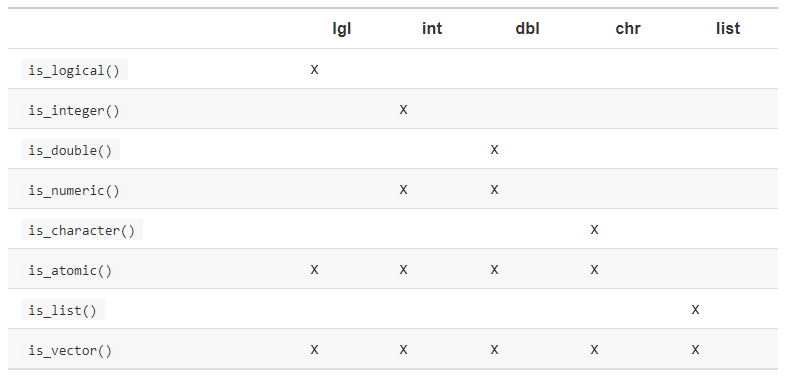

```{r hidden, include = FALSE}
pacman::p_load(learnr)

```


## Intro and Setup

Today we go back to our vegetables, I'm sorry to say. But it's necessary, so please stick with it.

So far I've been a bit limited in what I can teach you to do, and how I can teach you to do it, because we've just been working with **data frames/tibbles** and the `tidyverse`. By returning to some fundamentals we've skipped over that underlie them I'll give you a.) a better understanding of how R does things and why it behaves as it does, and b.) a firmer foundation to broaden your skill set and learn how to do lots of other things in R beyond this course.

Briefly, we're going to be talking about how R stores and manipulates **objects** - bits of data, functions, statistical models, tibbles, and other things - moving from the simplest structures up to the most complex. Even the most complex structures are just modifications of the simplest, which is why we have to start there. 

We don't need much from packages today. Since we're discussing the fundamentals of R, most of what we're discussing are things innate or "native" to base R when you install it. We'll load the `tidyverse` anyway, though, just because we'll use it once or twice to illustrate some concepts. **Just remember to run this code in your own script before proceeding.**

```{r setup, message = FALSE}
pacman::p_load(tidyverse)

```


## Scalars, or Elements

The most basic data type we'll start with is single bits of data, called **scalars**. You can also think of them as single **elements** of bigger objects like **vectors** or data frames.

You already know how to create a simple **scalar** object - just use the assignment operator `<-`. Practice in your own script outside this tutorial.

```{r scalar}
# Create and print a scalar called "lucky" that contains your lucky number

# Create and print a scalar called "string" that contains text wishing a happy birthday to your best friend. Don't forget to use quotes!

```

You should now see two **objects**, `lucky` and `string`, in your **environment pane** under the heading `Values`, containing whatever you assigned.

## (Atomic) Vectors

If you're a mathy person, you might be able to guess what **(atomic) vectors** are. They're simply a combination of multiple **scalars**! (Actually R doesn't really have a separate category for "scalars" under the hood, so a scalar is, properly speaking, just a vector with a single rather than multiple elements.)

You create them using a function you've already seen, `c()`. The c is short for *combine*.

```{r vec1, exercise = TRUE}
# A scalar
first_prime <- 2
first_prime

# An atomic vector
first_five_primes <- c(2, 3, 5, 7, 11)
first_five_primes
```

There's one other important way to create vectors - the colon `:` notation you may remember from `select()`. In `select()` it allowed you to select a bunch of adjacent columns. It works much the same way when creating vectors by strining together a bunch of consecutive numbers.

```{r vec2, exercise = TRUE}
# An atomic vector
first_ten_integers <- c(1:10)
first_ten_integers

```

The key thing about **atomic vectors** is that they're **homogeneous**. This means they're comprised of a bunch of elements of the *same data type* - all integers, or all character **strings**, or all logical values, etc. They cannot handle a mix of **types**. To handle multiple types you need a **list** - more on these later.

For simplicity we'll just refer to **atomic vectors** as **vectors** moving forward.

Vectors have two key attributes:

1. A type, of which there are six major ones:

    a. Logical
    b. Character
    c. Integer
    d. Double (a way to store non-integer numbers)
    e. Complex
    f. Raw
    
    **Numeric** vectors is an umbrella term for integer and double vectors. We'll focus on the first 4 today.
    
2. A length, which is the number of elements it contains

You can check these with code like the below:

```{r vec_types, exercise = TRUE}
# A numeric vector
first_five_primes <- c(2, 3, 5, 7, 11) # Note despite these being integers, it actually creates a double vector. 
                                       # Don't worry about why.
typeof(first_five_primes)
length(first_five_primes)

  # Another option is to use our old friend str() to investigate the structure of the vector
  str(first_five_primes) # This tells you it's a numeric vector (but not whether it's an integer or double),
                         # and the 1:5 tells you the length is 5

# A character vector
string <- c("Happy", "Birthday", "To", "You")
  ## Write your own code to check its properties

# A logical vector
logic <- c(TRUE, TRUE, FALSE)
  ## Write your own code to check its properties

```

### Vector Types

#### Logical

**Logical vectors** are the simplest. Each **element** can only be `TRUE`, `FALSE`, or `NA`. 

These are most often created by making a comparison - or using a function that does. For example, remember `filter()`? What it actually does is create a **logical vector** by cycling through each row and determines whether it does (`TRUE`) or doesn't (`FALSE`) meet the comparison criteria passed to it (for example, whether `carrier == "DL"`). R then only chooses those rows that correspond to a `TRUE` value! 

Let's create one of our own:

```{r vec_lgl, exercise = TRUE}
# A logical vector - remember %% asks for the remainder after dividing by the indicated number
c(2 %% 3 == 0, 3 %% 3 == 0, 5 %% 3 == 0, NA %% 3 == 0)

```
When dividing 2 by 3 the remainder is not 0, so we get `FALSE`. When dividing 3 by 3 the remainder is 0, so we get `TRUE`. When dividing `NA` by 0 we get `NA`, as we've discussed before.

#### Character

Character vectors contain text. Each element is called a **string**, which is just computer science jargon for a bit of text. Strings can be any length and are actually pretty complex to work with in R. 

**Strings are always enclosed in quotation marks!** This is how we differentiate them from numbers and object names. For example, `Zach` refers to an object named `Zach` - this could be a vector of numbers, or a data frame, or anything! But `"Zach"` refers to a string, a bit of text - that is, the literal letters Z, a, c, and h next to each other. 

Here are a couple examples of a character vector. Can you figure out the length of each one?

```{r vec_char, exercise = TRUE}
# One character vector
char_vec_1 <- c(letters)
char_vec_1

# Another character vector
char_vec_2 <- c("Happy", "Birthday", "To", "You", "!", "You are 34 years old.")
char_vec_2

```

There is lots more detail to working with **strings**, but we actually cover that in QTM 151. If you want a preview, though, you can see [Chapter 14 of *R for Data Science*](https://r4ds.had.co.nz/strings.html).

#### Numeric

There are two types of **numeric vectors**: **integer vectors** and **double vectors**. Integer vectors only contain whole numbers, while "doubles" can handle decimals. 

The term "double" comes from the amount of computer memory needed to hold a decimal number with a certain amount of precision; one way, a "float", takes 32 bits, but the more precise "double" uses 64 bits. I'm sure you all really cared. The more you know!

Back to useful things. By default R will store numbers as **doubles**. To specify you want an integer you have to use `L` afterwards. I have no idea why; please don't ask.

```{r vec_num, exercise = TRUE}
# A double vector
first_five_primes <- c(2, 3, 5, 7, 11)
typeof(first_five_primes)

#An integer vector
first_five_primes <- c(2L, 3L, 5L, 7L, 11L)
typeof(first_five_primes)
```
Integers are precise but doubles are approximations if the **floating point number** (i.e. decimal) it represents is irrational (that is, the numbers go on forever - or just beyond what can be stored in 64 bits). We already discussed this issue a bit in Tutorial 3.1 under "Floating Point Arithmetic", but let's revisit it briefly:

```{r vec_dbl, exercise = TRUE}
# A double vector
double <- sqrt(2)

# Note this isn't EXACTLY 0 because R stores the square root of 2 as an approximation
double**2 - 2

#Don't use the == comparison to check if doubles equal something else - use near() instead
double**2 - 2 == 0
near(double**2 - 2, 0)
```

##### **Special Numeric Values: `NA` vs. `NaN` vs. `Inf` vs. `-Inf`**

Integer vectors have just one special value if an element isn't an integer number: `NA`.

Double vectors, on the other hand, have 4 special values:

1. `NA` - meaning the element is empty. It has no value.
2. `NaN` - meaning the element has a value, but R doesn't recognize it as a number. NaN = Not a Number.
3. `Inf` - meaning the value is infinity
4. `-Inf` - meaning the value is negative infinity

The latter 3 can all be created during division:

```{r vec_naninf, exercise = TRUE}
# Special values in double vectors
c(0/0, 1/0, -1/0)
```
Just like you shouldn't use the comparison `==` to check if a value is `NA`, the same problem applies here. Instead, use the helper functions `is.finite()`, `is.infinite()`, and `is.nan()`. 

I bet you can figure out which applies where, but note `is.na()` captures both `NA`s and `NaN`s!

### Why do Vector Types Matter?

Certain functions only work on certain vector types. For example, you can't add character vectors:

```{r vec_add_char, exercise = TRUE}
# Can't add characters
sum(c("a", "b", "e"))

"happy" + "birthday"
```
But you *can* actually compare them. This is because R treats them alphabetically, with later letters having higher values:

```{r vec_comp_char, exercise = TRUE}
# Can COMPARE characters
"happy" > "birthday"

```
What exactly is bigger than what - for example, capital vs. lower case letters, and letters vs. numbers vs. punctuation marks - is called the "collating sequence", and it gets extremely complicated and can vary a lot from computer to computer based on what R treats as your "locale". For example, my locale is U.S. English ("en_US"), but others of you may be different. You can learn what your locale is with `Sys.getlocale()` if you're curious. You can also fool around and run some tests yourself to figure out what R treats as bigger than what. In other languages like C the [standard ASCII table](https://ascii.cl/) is used, and R - in English, at least - is *close* but not the same. For example, rather than all lower case letters being "bigger" than all capital letters, en_US appears to use a "collating sequence" where the letters go "a A b B c C ...", and all letters are bigger than all numbers and punctuation marks.

So all that is to say there's lots more to explore here, but we'll save that for a later course.

### Missing Values in Vectors

We mentioned `NA` above, but we need to get into a bit more detail.

Each major vector type - logical, integer, double, and character - actually have their own kind of `NA` value. Knowing this can be important when debugging your code and interpreting error messages, though in most cases R will figure out what type of `NA` you're dealing with automatically.

```{r vec_na_types, exercise = TRUE}
# A logical NA
lgl_vec <- NA
typeof(lgl_vec)

# An integer NA
int_vec <- NA_integer_
typeof(int_vec)

# A double NA
dbl_vec <- NA_real_
typeof(dbl_vec)

# A character NA
char_vec <- NA_character_
typeof(char_vec)
```

<mark>Challenge:</mark> Can you guess what happens to `typeof()` if you change, say, `NA_real_` to `NA` above? Try it and see if you're right!

### `NULL` vs. `NA`

There's one more type of vector we haven't discussed yet, actually: `NULL` vectors.

A `NULL` object is both its own `typeof()` vector and has a length of 0.

```{r vec_null, exercise = TRUE}
# A NULL vector
vec_null <- NULL

# How it's treated
typeof(vec_null)
length(vec_null)

```
This also allows us to discuss the difference between `NA`s and `NULL`s. In R, `NA` refers to the absence of a value for one specific element of a vector, while `NULL` refers to the absence of a vector itself.


### Checking Vector Types

You can use `is.xx()` helper functions to check the type of a vector. This is better when you just want a `TRUE` or `FALSE` result for a specific type of vector rather than to get the vector's actual type.

Below is a list of these functions. The Xs indicate when they return `TRUE`.

```{r img0, echo = FALSE, out.width = "70%", fig.align = "center", fig.cap = "*is.xx() helper functions. From section 20.4.2 of R for Data Science.*"}

```

### Naming Vectors

You can name each element of a vector. For example, this assigns the names "Happy", "Good", and "Smell" to the elements "Birthday", "Morning", and "Ya Later!"

```{r vec_names, exercise = TRUE}
# Create a named vector
named_vector <- c(Happy = "Birthday", Good = "Morning", Smell = "Ya Later!")
named_vector

# Check the length of named_vector. Can you figure out why it has this many elements?
length(named_vector)

```
Naming is useful so you can select elements of a vector by their names. Speaking of which...

### Subsetting Vectors

Sometimes you want to access one specific value in a vector. You do this with the `[` operator.

You can subset vectors in various ways. 

#### Subset Using Numerical Positions

Let's start by using numers to represent positions in the vector:

```{r vec_sub1, exercise = TRUE}
# Create a vector
bday <- c("Happy", "Birthday", "To", "You", "!", "You are 34 years old.")

# Get just the first element
bday[1]

# Get the first element twice, then all but the last element
bday[c(1, 1, 2:5)]

# Get the 5th, then the 3rd element
bday[c(5, 3)]

# Get everything but the 2nd and 4th elements
bday[c(-2, -4)]

```

Hopefully some of this is reminiscent of `select()` for you. 

You can't mix positive and negative numbers when subsetting. And if you use `0` you'll simply get an empty vector.

#### Subset Using Values

Another useful way of subsetting vectors is to find the location of certain elements that meet various criteria. To do this you use `which()`:

```{r vec_sub_which, exercise = TRUE}

# Create a vector
bday <- c("Happy", "Happy", "Birthday", "!", "It's", "Your", "Birthday", "Baby!")

# Find locations of element "Birthday"
which(bday == "Birthday") # Returns a numeric vector of locations of elements meeting the indicated criterion

# Use this to extract all instances of "Birthday" from our vector
bday[which(bday == "Birthday")]

```

You may need to think for a moment about what that last line is doing. Instead of writing `bday[3,7]` explicitly to get the third and seventh elements, we: 

1. First use `which()` to return the locations of all elements that are "Birthday". These happen to be elements 3 and 7.

2. These then get fed into our brackets for subsetting, so the code *becomes* `bday[3,7]`, but 3 and 7 are output by `which()` rather than input by us manually.

This may seem arbitrary now, but I assure you it's actually quite useful (just wait until HW 4)!

One last thing here. What if we only want *one* instance of "Birthday?" That's no problem once we remember `which()` returns a vector itself.

```{r vec_sub_which_first, exercise = TRUE}

# Create a vector
bday <- c("Happy", "Happy", "Birthday", "!", "It's", "Your", "Birthday", "Baby!")

# Find just FIRST locations of element "Birthday"
which(bday == "Birthday")[1] # This returns just 3 (the first location) and not 7 (the second)

# Use this to extract ONE instance of "Birthday" from our vector
bday[which(bday == "Birthday")[1]]

```

#### Subset Using Names

If you have a named vector, you can subset it using the names.

```{r vec_sub2, exercise.setup = "vec_names", exercise = TRUE}
# Subset using names
named_vector <- c(Happy = "Birthday", Good = "Morning", Smell = "Ya Later!")
named_vector["Smell"]

```

#### Subset Using Logical Comparisons

Finally, you can subset using logical comparisons that will loop through a vector, assign a value of `TRUE` or `FALSE` to each element based on some comparison you indicate, and only return those where the value is `TRUE`. This is an incredibly powerful technique that powers, among other things, `filter()`.

```{r vec_sub3, exercise = TRUE}
# Subset using logical comparisons
five_primes <- c(2, 3, 5, 7, 11, NA)

#Return all primes <= 5
five_primes[five_primes <= 5]

#Return all non-missing elements
five_primes[!is.na(five_primes)]
```

## Vectorized Operations

On the subject of functions looping through a vector...

Most functions and operations in R are **vectorized**. This means they will try very hard to operate on every element of whatever vectors you feed it. 

If the vectors are of equal length, this makes perfect sense.

```{r vectzd_equal, exercise = TRUE}
# An operation on two vectors of equal length
hundreds <- c(100, 200, 300)
ones <- c(1, 2, 3)

hundreds + ones
```
Here R is adding the first elements of each vector, then the second ones of each vector, then the third ones of each vector.

But what if you have vectors of unequal length?

### Vector Recycling

If you provide R two vectors of differing lengths it will **recycle** the shorter vector - going to the end, then looping back to the start - until it's the same length as the longer vector. Consider the following code:

```{r vectzd_unequal, exercise = TRUE}
# Two vectors of unequal length
c(11:20) + 5

```
You've fed R two vectors of different lengths: one of length 10 (`c(11:20)`), and one of length 1 (`5`). R recycles the vector one of length 1 until it's length 10 - basically, it turns `5` into `c(5, 5, 5, 5, 5, 5, 5, 5, 5, 5)`. 

##### **Sidenote: R is an Interpretive Language**

The code above might become clearer if you replace `5` with `c(5)`. This is actually what R is doing under the hood - when you provide it a single number or other scalar/element, it's actually just creating a vector of length 1. This makes R an **interpretative** language - it sometimes does something in the background you didn't explicitly tell it to do, without telling you it's doing so. It tries to *interpret* what you're asking for through its ability to do things.

OK, end of sidenote. Let's look at a slightly more complex example. 

<mark>Challenge:</mark> Before running the code below, can you predict what it's going to return?

```{r vectzd_unequal_3, exercise = TRUE}
# Two vectors of unequal length
c(11:20) + c(5, 7)

```
It recycles `c(5,7)` 5 times until it has a vector of length 10, `c(5, 7, 5, 7, 5, 7, 5, 7, 5, 7)`, then it adds that to the initial vector of length 10!

What if we try this, though?

```{r vectzd_unequal_4, exercise = TRUE}
# Two vectors of unequal length
c(11:20) + c(5, 7, 9)

```
R will still recycle the shorter vector but will throw a **warning** that 10 is not a multiple of 3 so you're aware you may be using some parts of the shorter vector more than others. In this case R repeats the full shorter vector 3 times for 9 elements, then takes the first element again to make it length 10: `c(5, 7, 9, 5, 7, 9, 5, 7, 9, 5)`. It truncates the rest of the shorter vector its 4th time through.

In the `tidyverse` R will actually throw an **error** rather than a **warning** and refuse to run at all - you may have already encountered something this in `ggplot()`! This is to avoid any unintentional screw-ups, as this uneven recycling can sometimes create big but silent problems in your code.

R does the same thing with comparisons. For example:

```{r vectzd_unequal_5, exercise = TRUE}
# Two vectors of unequal length
c(4, 6) >= c(2, 3, 5, 7, 11)

```
Do you understand why the answer is how it is?

R recycles the first vector to be `c(4, 6, 4, 6, 4)` and then compares the vectors pairwise, one element at a time.

* 4 > 6 --> `TRUE`
* 6 > 3 --> `TRUE`
* 4 > 5 --> `FALSE`
* 6 > 7 --> `FALSE`
* 4 > 11 --> `FALSE`

### Why Vectorize?

So why is R **vectorized**, anyway? It can make things much more concise. Consider one weird vector we created above:

```{r vectzd_unequal_2, exercise = TRUE}
# A logical vector - remember %% asks for the remainder after dividing by the indicated number
c(2 %% 3 == 0, 3 %% 3 == 0, 5 %% 3 == 0, NA %% 3 == 0)

# A much more concise way to write it
c(2, 3, 5, NA) %% 3 == 0

```

Here you're basically feeding R three vectors: the first one of length four, then a vector of length one (3), and another of length one (0). R takes the vectors of length 1 and recycles them 4 times until it's applied each to every element of the first and longest vector. Much more concise.

This vectorization is why, for example, most of the `dplyr` verbs work!

## Changing Vector Types: Coercion

Changing the type of a vector is called **coercion** (or you **coerce** a vector to a different type).

### Explicit coercion 

This involves you specifically telling R to treat a vector as a different type. You do this using helper functions of the form `as.xx()`. For example:

```{r coercion_explicit, exercise = TRUE}
# Take this vector and check its type
vec <- c(2, 3, 5, 7, 11)
typeof(vec)

# Change double to a character vector
vec_char <- as.character(vec)
typeof(vec_char)

# Change double to an integer vector
vec_int <- as.integer(vec)
typeof(vec_int)

```

But not all explicit coercion works. For example, what happens if we try and coerce a character to a double?

```{r coercion_explicit2, exercise = TRUE}
# Take this vector and check its type
vec_char_nums <- c("2", "3", "5", "7", "11")
vec_char_letters <- c("b", "c", "e", "g", "k")

# Change character vector where strings are numerals to double
vec_dbl <- as.double(vec_char_nums)
vec_dbl
typeof(vec_dbl)

# Change character vector where strings are letters to double
vec_dbl2 <- as.double(vec_char_letters)
vec_dbl2
typeof(vec_dbl2)

```
```{r quiz1, echo=FALSE}
quiz(
  question("R successfully coerced _____ to a vector of doubles.",
      answer("only `vec_char_nums`", correct = T),
      answer("only `vec_char_letters`"),
      answer("both"),
      answer("neither"),
      type = "learnr_radio",
      allow_retry = TRUE)
)
```

Notice that warning message: `NAs introduced by coercion`. With `vec_char_nums`, R could recognize the strings as numerals and so could coerce it to be a vector of doubles. With `vec_char_letters`, R could not recognize the strings as numerals, and so when you asked it to coerce it to a vector of doubles it just annihilated everything and left you with `NA`s. Whoops!

As a general rule you shouldn't be doing a lot of explicit coercion. Needing to do it indicates a problem further upstream - you should make sure your data gets imported with the correct variable types, for example. But sometimes you do need to do it if there's a function that requires being fed a very specific type of vector, like integers rather than whole numbers that just happen to be stored as doubles. I most commonly encounter this with `case_when()`, where all conditions have to produce the same variable type (e.g. all doubles, integers, or characters).

Note that `1L` to mean 1 as an integer rather than a double is also a type of explicit coercion.

### Implicit Coercion

This involves R doing the coercion without you explicitly asking. Sometimes this is extremely useful, and sometimes it is extremely annoying.

One example is if you pass a logical vector to a function expecting a numerical vector. R *implicitly* treats `TRUE` as 1 and `FALSE` as 0. Consider this:

```{r coercion_implicit, exercise = TRUE}
# Sum of a logical vector!?
sum(c(TRUE, TRUE, TRUE, FALSE))
sum(c(TRUE, TRUE, FALSE, FALSE))
sum(c(FALSE, FALSE, FALSE, FALSE))
```

This may seem annoying but is actually useful. For example, what if you want to ask how many rows in a data frame meet a certain condition? You can use a comparison function to create a logical vector and then sum it up.

Remember this code from Tutorial 3.2? It relies on this implicit coercion!

```{r sum4, eval = FALSE}
#Calculate percent of flights delayed by airport
summarize(group_by(flights, origin),
          
          count_delayed = sum(dep_delay > 0, na.rm = TRUE),
          prop_delayed = mean(dep_delay > 0, na.rm = TRUE))

```

Sometimes R will do something you don't want it to, though (wait 'til you learn about `stringsAsFactors` in QTM 151...), so you need to know about vector types and coercion to be able to identify when it does and correct or undo its mistake.

One instance is when you try and create a vector with multiple element types. R will always assign the whole vector the *most* complex/flexible data type, since it can only have one. The hierarchy goes:

* Character (most complex)
* Double
* Integer
* Logical (least complex)

```{r quiz2, echo=FALSE}
quiz(
  question("What type of vector will R assign to c(34, 'Happy Birthday!')?",
      answer("character", correct = T),
      answer("double"),
      answer("integer"),
      answer("logical"),
      type = "learnr_radio",
      allow_retry = TRUE),
  
  question("What type of vector will R assign to c(2020, 2020.2, TRUE)?",
      answer("character"),
      answer("double", correct = T, message = "And it will change the TRUE to a 1!"),
      answer("integer"),
      answer("logical"),
      type = "learnr_radio",
      allow_retry = TRUE),
  
  question("What type of vector will R assign to c(TRUE, 2L, 23L)?",
      answer("character", correct = T),
      answer("double"),
      answer("integer", correct = TRUE, message = "And it will change the TRUE to a 1!"),
      answer("logical"),
      type = "learnr_radio",
      allow_retry = TRUE)
)
```

Here's an extra challenging one to see if you *really* understand this...

```{r quiz3, echo=FALSE}
quiz(
  question("What will be the resulting vector from c(1, 0, TRUE)?",
      answer("An integer vector, c(1, 0, 1)"),
      answer("A double vector, c(1, 0, 1)", correct = T, message = "That's right! Remember R will coerce 'TRUE' to a 1, and thus treat everything as numeric, and a double by default."),
      answer("A double vector, c(1, 0, NA)"),
      answer("A character vector, c('1', '0', 'TRUE')"),
      type = "learnr_radio",
      allow_retry = TRUE)
)
```

Notice that one nice result of this is nothing ever gets annihilated in the coercion process. Logical values get converted to a 0, 1, or string, and numbers get converted to strings.

#### Coercion When Importing Data

The other time you've encountered implicit coercion so far is when importing data. Consider the below code where I import the diabobes data:

```{r import_work_sub}
diabobes <- read_csv("./datasets/obesity-diabetes.csv")

```
Notice the message printed below - it indicates the type of vector it's treating each column as. In fact, each column in a data frame is a vector! (Though technically they can also be lists, but we're not covering that in this course.)

Sometimes R doesn't correctly identify the type of vector/column you want - most often turning numbers into strings. This will help you know where and when it does that so you can correct it. You do that through explicit coercion by specifying a vector of column types you want R to use in the `col_types =` argument in `read_csv()`. See `?read_csv` for more.

### Coercion in Vectorized Operations

If you try to compare vectors of different types, the simpler type will also be coerced to the more complex type. Can you figure out what will happen here, for example?

```{r vec_coerce, eval = FALSE}
#Compare logical and numeric vector
c(TRUE, FALSE, TRUE,FALSE, TRUE) > c(0,1,3,4,5)

```

```{r quiz4, echo=FALSE}
quiz(
  question("What will be the result of the above comparison?",
      answer("c(TRUE, TRUE, TRUE, TRUE, TRUE)"),
      answer("c(FALSE, FALSE, FALSE, FALSE, FALSE)"),
      answer("c(TRUE, FALSE, FALSE, FALSE, FALSE)", correct = T, message = "See below for explanation."),
      answer("c(TRUE, TRUE, TRUE, FALSE, FALSE)"),
      type = "learnr_radio",
      allow_retry = TRUE)
)
```

What R does under the hood is converts the logical vector to `c(1, 0, 1, 0, 1)`, then compares each element pairwise and returns a logical value depending on the result. Do you understand the output above?

## Lists

**Lists** are the next more complex data type. They differ from **vectors** in two key ways. 

### Lists are Heterogeneous

Lists are **heterogeneous** rather than homogeneous - that is, they can contain more than one type of data. You create them using a function called...well, I'll bet you can guess, actually!

```{r quiz5, echo=FALSE}
quiz(
  question("What function do you use to create a list?",
      answer("tibble()"),
      answer("c()"),
      answer("matrix()"),
      answer("list()", correct = T, message = "Sometimes R just makes sense."),
      type = "learnr_radio",
      allow_retry = TRUE)
)
```

Let's create a list and investigate it using our old friend `str()`, or structure. Do you remember what else we used `str()` to explore?

```{r list, exercise = TRUE}
# A list
bday_list <- list("Happy Birthday to You!", "How Old Are You?", 34L, TRUE)
str(bday_list)

```

Notice two things:

* The list has a length of 4 because there are 4 elements
* The list contains elements of different types - the first two it stores as character strings, the third as an integer, and the fourth as a logical value

<mark>Challenge:</mark> What would you get if you tried to store this same data in a vector? Try it above and find out by investigating the structure.

### Lists are Recursive

**Recursive** is a big fancy term that basically means each element of a list can actually contain *multiple* elements itself. Elements of a list can be vectors themselves or even *other lists*. Wild, right!? Here's an example:

```{r list_recursive, exercise = TRUE}
# A list
bday_list_recur <- list(list("Happy Birthday to You!", "How Old Are You?"), 34L, TRUE)
str(bday_list_recur)

```

This shows us we have a list of length *3* now, rather than *4*. That's because we collapsed our first two elements into a single list that now serves as `bday_list_recur`'s first element.

Our first element is itself a list of length *2*, with both its elements character strings. Our second element is the integer 34, and the third is our logical `TRUE` value.

This may seem odd, but this functionality makes lists very appropriate for creating hierarchical, or tree-like, data structures, which are really useful for storing, accessing, and distributing data. These data structures are not intuitive at all, mind you - they're not like an Excel spreadsheet or even an R tibble or SQL relational database - and you'll need much more programming than what you get in this course to make them feel natural. But computer scientists and data engineers swear to me they're great and the way to go if you can.

### Investigating Lists

I usually recommend using `str()` because just printing lists can be quite disorienting. But let's try printing our recursive birthday list from before and breaking down the results line-by-line

```{r list_print, exercise = TRUE}
# A list
bday_list_recur <- list(list("Happy Birthday to You!", "How Old Are You?"), 34L, TRUE)
bday_list_recur

```

* The first element of our overall list, [[1]]
    + The first element of the list that comprises the first element of our overall list, [[1]][[1]]
        - The first (and only) element contained there is "Happy Birthday to You!"
    + The second element of the list that comprises the first element of our overall list, [[1]][[2]]
        - The first (and only) element contained there is "How Old Are You?"
* The second element of our overall list, [[2]]
    + That second element contains just a single integer, 34
* The third element of our overall list, [[3]]
    + That third element contains just a single logical value, `TRUE`
    
Still confused? Yeah, me, too. Perhaps this visualization of a few different list structures will help?
    
### List Structure, Visualized
    
Consider the following lists and visualizations of their structures, from [Section 20.5.1 of *R for Data Science*](https://r4ds.had.co.nz/vectors.html#visualising-lists).

```{r list_viz, eval = FALSE}
# A list
x1 <- list(c(1, 2), c(3, 4))
x2 <- list(list(1, 2), list(3, 4))
x3 <- list(1, list(2, list(3)))
x4 <- c(x3[[2]][[2]][[1]])
```

```{r img1, echo = FALSE, out.width = "70%", fig.align = "center", fig.cap = "A visualization of the three lists above"}
knitr::include_graphics("images/lists-structure.png")
```

The first list, `x1`, contains two elements, each of which is an atomic vector of integers of length two.

The second list, `x2`, contains two elements, each of which is itself a list of length 2, each element of which is an integer vector of length 1.

The third list, `x3`, contains two elements: 

1. A vector of length 1 with a single integer
2. A list of length 2, which contains
    i) As its first element an integer vector of length 1
    ii) As its second element, a list of length 1, with its sole element an integer vector of length 1
    
Is your brain melting yet? This is tough. Let's move on.

### Subsetting Lists

The reason we had to go through all of that is so this next section makes a bit more sense. Subsetting lists will still probably be quite confusing, though.

There are two main things to differentiate between:

* Using single brackets `[i]` extracts the i'th sub-element of a list and will *always return a list* of the sub-elements
* Using double brackets `[[i]]` extracts the i'th component of a list and will return whatever that actual things is - a list or a vector of the appropriate type

Let's use some examples to illustrate.

```{r list_sub1, exercise = TRUE}
# A list
bday_list_recur <- list(list("Happy Birthday to You!", "How Old Are You?"), 34L, TRUE)

# Extract the first element of the list
extract1 <- bday_list_recur[1]
str(extract1) # Note this, returned a list of length 1, the sole element of which is a length of list 2

# To get just the list itself you have to use [[]]
extract2 <- bday_list_recur[[1]]
str(extract2) # This is the actual first element of our overall list, which is a list of length 2

# Extract the second element of the list
extract3 <- bday_list_recur[2]
str(extract3) # Note this, surprisingly, returned a list of length 1, the sole element of which is an integer vector of length 1

# Extract the actual number 34
extract4 <- bday_list_recur[[2]]
str(extract4) # This is an integer vector of length 1 with the value 34

# Extract just "How Old Are You?" from the sub-list
extract5 <- bday_list_recur[[1]][[2]] # This asks R to give us the 2nd [[2]] element 
                                      # of the list of length 2, which is the first element [[1]] of our overall list
str(extract5) 


```

Note in our last example we used a pair of double brackets because we had to dive down two levels into a list. We had to first pluck the actual list of strings out of our bigger list, then pluck the actual element "How Old Are You?" from that list.

This illustrated example from [Chapter 20.5.2 of *R for Data Science*](https://r4ds.had.co.nz/vectors.html#subsetting-1) may help further.

```{r list_sub2, eval = FALSE}
a <- list(a = 1:3, b = "a string", c = pi, d = list(-1, -5))

```

```{r img2, echo = FALSE, out.width = "70%", fig.align = "center", fig.cap = "A visualization of subsetting lists."}
knitr::include_graphics("images/lists-subsetting.png")
```

Notice how any subsetting command that ends with a single bracket `[]` returns a list that itself contains whatever you asked for.

If you use double brackets `[[]]` you will get the element itself, not contained in a broader list. Note, though, that you'll still get a list if the element itself was a list, as with `a[[4]]`. In other cases, though, like `a[[4]][[1]]`, you'll just get a vector or something else, with no surrounding list at all.

#### The Pepper Shaker Example

*R for Data Science* has a wonderful analogy for lists and subsetting using a weird pepper shaker. Please go to [Section 20.5.3](https://r4ds.had.co.nz/vectors.html#lists-of-condiments) and read it. It's very short and will help *a lot*, I promise.

## Summary

Today we learned a lot about the basic data structure in R, **vectors**. We covered the types of vectors and some important behaviors R has around them, such as **coercion** and **vector recycling**. Finally, we learned how to hold different data types in a single vector-like object called a **list**.

In the next Tutorial we'll address more complex data structures: data frames/tibbles.
