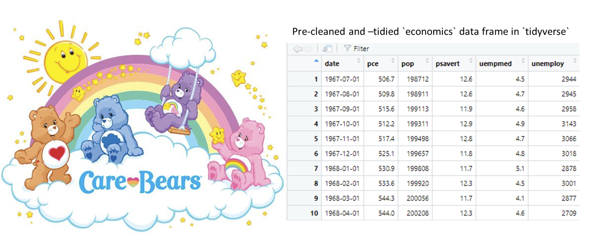
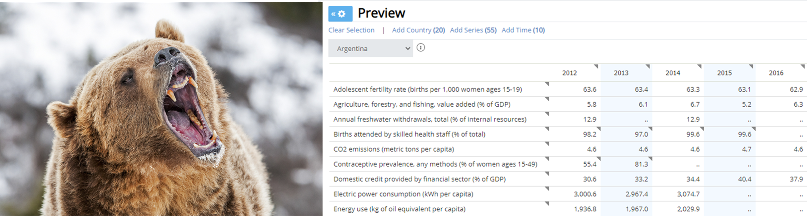
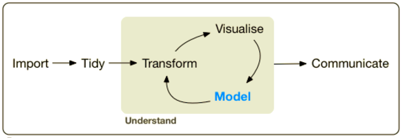

```{r hidden, include = FALSE}
pacman::p_load(learnr)

```


## Intro

I warned you, and it's time: it's time for the vegetables portion of the semester, where we'll remain for the next 8 or so classes. It's time to learn techniques for helping with what **data scientists** report they spend most of their day doing: **data cleaning**. It's most of what they do - we have to teach you, no way around it.

For what it's worth, I'm one of the weirdos who actually *loves* data cleaning. I find it to be an interesting challenge and puzzle on its own! And the sense of accomplishment I get when I produce a really clean data set for others to use - it's great! Maybe you'll be like me in that respect. I sure hope so! I'll do my best to get you there.


### Packages

As usual we need to load packages. This time we only need `tidyverse` because one of the packages it loads is `tidyr` - our main function source for the next two Tutorials. We're also going to read in a few data frames we can use later.

```{r setup, message = FALSE}
# Load (and, if necessary, first install) packages
pacman::p_load(tidyverse)

# Abortion data from CDC and Alan Guttmacher Institute (AGI) extracted from 
# http://www.johnstonsarchive.net/policy/abortion/index.html#UC
abortion <- read.csv("./datasets/ab.csv")

# Econ data from the World Bank
real_econ <- read.csv("./datasets/real_econ.csv", fileEncoding = 'UTF-8-BOM') #Required to avoid odd character on first column name
tidy_econ <- read.csv("./datasets/tidy_econ.csv")

```

## Data Cleaning

When you first encounter data in the real world it usually has lots of problems. Values are incorrect or missing, implausible, missing, corrupted, or incomplete. Random observations are inexplicably missing or duplicated. Data are improperly formatted (for example, a data is stored as a character, or categorical variables are treated as characters). It's scattered across multiple non-linked tables or other sources, or simply not in a form that lets us accomplish what we want to. **Data Cleaning** is the process of fixing all these issues. It's pre-processing the data to make sure it's correct and complete and in a form we can work with before we do cool stuff like visualizations or running statistical models. It's also what you spend a lot of time doing as a data scientist.

So far we've been working mostly with pre-cleaned data frames you've been provided. Not only that, we've been working only with **tidy** data frames, which follow some additional formatting rules that make them extremely easy to work with in the `tidyverse` and other paradigms (more on that below). 

These data frames were either included in R natively, part of packages we loaded, or found independently and cleaned by me before being provided to you. We've been giving you the friendly Care Bears:

```{r img0, echo = FALSE, out.width = "100%", fig.align = "center", fig.cap = "The friendly Care Bears and a tidy data set."}

```

But in the real world data doesn't come to you like this. It comes as a mess. Even from very professional sources like the World Bank. It's more like a fierce grizzly bear:

```{r img1, echo = FALSE, out.width = "100%", fig.align = "center", fig.cap = "A roaring grizzly bear and [messy real-world data](https://databank.worldbank.org/source/world-development-indicators/preview/on)."}

```

That data on the right from the World Bank may not *look* that hard to work with or like it requires cleaning or tidying, but think about it for a moment. What does each row represent? Is each column a different variable, like we're used to seeing? If not, what is it? Where are the variables? Could we easily `select()` certain ones we want, or manipulate them with the techniques we learned?

The answer is no.

It is worth noting this data *was* already heavily cleaned by the World Bank. We can be confident there are no incorrect or inappropriately missing values or mis-named or mis-formatted variables, for example. But it's still not **tidy**.

The rest of this Tutorial focuses on just *one aspect of* data cleaning: creating **tidy** data. Other aspects of data cleaning are to come in the next few Tutorials.

## "Tidy" Data

We've been mostly working so far with **tidy** data. We've been doing this because it fits with the `tidyverse` ecosystem - and many other data analytic ecosystems, too. Here's the `tidyverse` one as a reminder:

```{r img2, echo = FALSE, out.width = "100%", fig.align = "center", fig.cap = "Tidyverse ecosystem diagram."}

```

Notice that data transformation (for example, manipulations with `dplyr` verbs), visualization (for example, with `ggplot2` and extensions), and modeling (running statistical models, which we don't cover in these courses) all take as input and operate on **tidy** data. So what *is* tidy data, anyway?

### The 3 Tidy Criteria

**Tidy** data is data stored in a way that meets 3 key criteria (as articulated by Hadley Wickham in *R for Data Science*):

1. Each variable must have its own column
2. Each observation must have its own row
3. Each value must have its own cell

These criteria are depicted in the graphic below:

```{r img3, echo = FALSE, out.width = "100%", fig.align = "center", fig.cap = "Graphical depiction of tidy data from [Chapter 12.2 of *R for Data Science*](https://r4ds.had.co.nz/tidy-data.html#tidy-data-1)."}
knitr::include_graphics("images/tidy.png")
```

The easiest way to help you understand these abstract ideas is to look at some simple examples of tidy and un-tidy data and identify the differences. So let's do that using some made-up data about the number of cases of [INSERT YOUR FAVORITE DISEASE HERE] in various countries in two years (1999 and 2000):

```{r tidy_untidy}
# Tidy data example
table1

# Un-tidy data example
table2

# Un-tidy data example
table3

# Un-tidy data example
table4a
table4b

```
Let's start with `table1` and examine why it's tidy:

1. Each variable must have its own column - yes. The `year`, number of `cases`, and country `population` are all in separate columns.

2. Each observation must have its own row - yes. We consider each "observation" to be a specific country and year in which we gathered some data (about cases and population).

3. Each value must have its own cell - yes. There are never two pieces of data entangled or mixed in a single cell.

Now let's try and figure out why each other table isn't considered tidy.


``` {r quiz1, echo = FALSE}

quiz(
  question("Why isn't `table2` considered tidy?",
      answer("Not every variable is in a separate column", correct = TRUE),
      answer("Not every observation is in a separate row", correct = TRUE),
      answer("Not every value is in its own cell"),
      type = "learnr_checkbox",
      correct = "That's right! The variables `cases` and `population` are mixed in the one column `count`. Furthermore, each country-year observation is now split into two different rows.",
      allow_retry = TRUE),
  
   question("Why isn't `table3` considered tidy?",
      answer("Not every variable is in a separate column", correct = TRUE),
      answer("Not every observation is in a separate row"),
      answer("Not every value is in its own cell", correct = TRUE),
      type = "learnr_checkbox",
      correct = "That's right! The variables `cases` and `population` are mixed in the one column `rate`, and each `rate` cell contains two distinct values (numbers) separated by a /.",
      allow_retry = TRUE)
)
```

The data frames `table4a` and `table4b` are even worse, as they split the case and population data across two different tibbles. There's no need for that here, and it's not consistent with tidy data principles. (Note of course there are times you want to break up data across tables for efficiency, such as the relational databases we discussed in Tutorial 3.3, but that doesn't really make sense here.)

### Why Tidy Data?

In short, tidy data is a nice default format that will allow you to do a lot of different things with it in a lot of different programs and languages pretty easily.  It is also often a nice way to share data with others because of this inter-operability; most people will be able to do most analytics tasks with tidy data. Having a common, consistent, uniform structure like tidy data also makes sharing data much easier, and tidy data is arguably as good a standard as any other.

For us specifically, R and the `tidyverse` are really designed to work best with tidy data. So that's what we work with. Let me demonstrate. 

Let's compare the un-tidy way the World Bank provided us data (`real_econ` - note this data frame has still undergone some substantial cleaning before being provided to you) to one that adheres to the principles of tidy data (`tidy_econ`). These data frames both contain the same information, just in different formats.

```{r data_comp}
#Print both data frames
real_econ

tidy_econ

```

<mark>Challenge:</mark> Using techniques you already know, plot the per capita GDP for China from 2007-2018 using `tidy_econ`.

```{r chinaplot1, exercise = TRUE}
# Create a line plot of per capita GDP over time for China from 2007-2018 using tidy_econ


```

```{r chinaplot1-solution}
tidy_econ %>% 
  filter(country == "China", year >= 2007) %>% 
  ggplot(aes(x = year, y = GDPpcap)) +
  geom_line() +
  geom_point()

```
We could use `dplyr` verbs and `ggplot` with no further alterations to this tidy data set. Pretty easy, right?

<mark>Challenge:</mark> Using techniques you already know, plot the per capita GDP for China from 2007-2018 using `real_econ`. If you give up, look at the solution.

```{r chinaplot2, exercise = TRUE}
# Good luck

```

```{r chinaplot2-solution}
# One process could look like this

  # Extract the data frame row on Chinese GDP
  china_gdp <- real_econ[11,]

  # Oh dear, that has some things we don't want. Let's just get the 2007-18 GDP values
  china_gdp <- real_econ[11, 10:21]
  
  # Hm, we don't want those variable names, do we? It's unclear how we'd go from there
  # Let's try and get it just as a vector
  china_gdp <- as.double(real_econ[11, 10:21])
  
  # OK but now we just have this weird, divorced set of numbers. How do we know what year each refers to?
  # Let's create a vector of years
  yrs <- c(2007:2018)

  # Now we have two vectors of length 12. Let's meld them back together into a single tibble
  new_tibble <- tibble(china_gdp = china_gdp,
                       year = yrs)
  
  # OK. NOW we can finally make our plot as before...
  new_tibble %>% 
    ggplot(aes(x = year, y = china_gdp)) +
    geom_line() +
    geom_point()
  
```
Well that was annoying. See the value of tidy data for us yet?

## Should *All* Data Always Be Tidy?

Oh boy, time to immediately contradict myself.

NO! The key message here is that while tidy data is often an excellent default, you shouldn't get fanatical about it. Be practical and process-oriented. It's fine to use a data format that works well for what you need to do.

I tried to avoid using the pejorative term "messy" above to apply to what is better termed un-tidy data. 

Tidy data works extremely well with the `tidyverse` analytic functions we've been learning as well as many other programming languages and formats.

Tidy data principles are a great default. 

But sometimes there are good reasons to store data differently. Sometimes tidy formats aren't the easiest for data entry or the most sensible way to display data for visual inspection. If you're dealing with very high volumes of data there are more efficient ways to store it; if you've done any web scraping or work with application programming interfaces (APIs) you may have encountered data stored in very efficient **hierarchical** JSON or XML structures. These aren't "tidy" but are used for a reason - speed and efficiency. They cram a lot of data into the smallest possible format by avoiding duplication of data and other techniques.

### "Long" vs. "Wide" Data

Let's compare again the un-tidy way the World Bank provided us data (`real_econ`) to one that adheres to the principles of tidy data (`tidy_econ`). These data frames both contain the same information, just in different formats.

```{r data_comp2}
#Print both data frames
real_econ

tidy_econ

```
<mark>Challenge:</mark> Can you describe, in words the information held in both these data sets? Don't read below until you've attempted to do this, at least in your head.

<br>
<br>
<br>
<br>
<br>
<br>
<br>
<br>
<br>
<br>
<br>
<br>
<br>

It's data on 4 economic indicators (unemployment, inflation, per capita GDP, and growth in per capita GDP) measured annually from 2000-2018 for each of 3 countries (India, China, and the U.S.). Do you see how it's the same data, just stored differently in the two sets?

Now let's answer some more questions about them:

``` {r quiz2, echo = FALSE}

quiz(
  question("Which data frame has more columns?",
      answer("real_econ", correct = TRUE, message = "That's right. `real_econ` has 21 variables/columns vs. `tidy_econ`'s 6."),
      answer("tidy_econ"),
      type = "learnr_radio",
      allow_retry = TRUE),

   question("Which data frame has more rows?",
      answer("real_econ"),
      answer("tidy_econ", correct = TRUE, message = "That's right. `tidy_econ` has 57 rows vs. `real_econ`'s 21."),
      type = "learnr_radio",
      allow_retry = TRUE),
  
   question("Now a slightly tougher one that requires a little critical thinking. Which one is going to be bigger - that is, require more space to store in a computer's memory? You can figure this out with arithmetic and no outside computer science knowledge",
      answer("real_econ"),
      answer("tidy_econ", correct = TRUE, message = "That's right. `tidy_econ`'s 57 rows and 6 columns require 57*6 = 342 cells/values/spaces to encode all the data. `real_econ`'s 12 rows and 21 columns require just 12*21 = 252 cells/values/spaces to encode all the data."),
      type = "learnr_radio",
      allow_retry = TRUE)
)  
```

The `real_econ` data frame is stored in what we call **wide** format. This adds columns to save on rows. It creates a literally wider rectangular data frame when you look at it. 

The `tidy_econ` data frame is stored in what we call **long** (or sometimes **narrow**) format. This adds rows to save on columns. It creates a literally longer/taller rectangular data frame when you look at it.

**Long** data is essentially synonymous with tidy data.

But **wide** data has its uses! For example, what if you wanted to be able to easily visually scan your data in tabular format to see what happened to a given country's economic indicator over time. Is that easier in wide in long format? Note as we discussed above it also (often) takes up less space when being stored memory. In the long data we had to repeat the information on countries and years many more times than in the wide data.

While *generally* long/tidy should probably be your default despite taking up a little more space in memory due to the ease of working with it, it wouldn't be right to say one is definitively better all the time. Either one may be more efficient depending on the specific task you're trying to accomplish, model or algorithm you're trying to apply, or language you're working in.

For now all I want you to understand is the difference between the two and which more closely aligns with tidy data principles.

We'll learn in the next Tutorial how to switch between long and wide data seamlessly. This can be tricky and disorienting at first, but once you get some practice with it it will become second nature, I promise. There's really no way around that other than practice, though, so expect to struggle a little at first - that's OK!

### What Does, Like, "Tidy" Even MEAN, Man?

Un-tidy data can also sometimes be useful for plotting and analysis like we've done before. And the distinction between "tidy" and "un-tidy" can become messy and philosophical. Consider the abortion data below:

```{r is_data_tidy, exercise = TRUE}
#Print the first few observations of the abortion data
_____(abortion)

```

Does this follow the rules of tidy data?

1. Each variable has its own column - that depends. Is a "variable" the number of abortions? Then no, because we have that spread across two different columns (an estimate from the CDC and from the Alan Guttmacher Institute (AGI)).

    Or is a variable the number of abortions reported from a specific source? Then this is tidy.
    
2. Each observation has its own row - that depends again. Assuming we are treating an "observation" as a given state in a given year, then yes. 

    But what if instead we conceived of an "observation" as a state and year and data source? Then no.

3. Each value is in its own cell - we don't have multiple pieces of data in a given cell, so I'd say this is met.

The point is: you should format your data to the form you need to accomplish your goal, even if that arguably makes it "un-tidy."

Consider two different research questions. 

<mark>Challenge:</mark> First, what if we wanted to compare the number of abortions reported by CDC and AGI to see if they match up most of the time? Can you do this easily with the data in its current format? IF you can do it, it should take you less than 2 minutes to using your current knowledge. If you can't figure it out, click for the solution.

```{r scatter1, exercise = TRUE}
# Create a scatterplot comparing CDC and AGI measures of the number of abortions


```

```{r scatter1-solution}
abortion %>% 
  ggplot(aes(x = CDC, y = AGI)) +
  geom_point()

```

<mark>DOUBLE Challenge:</mark> What if I wanted to be able to quickly identify what the outliers on this plot are (for example, if they belong to a specific state)? Can you think of a way you could accomplish that using what you've learned so far? Try to actually do it for an extra challenge.

<mark>Challenge:</mark> Second, what if we wanted to plot the number of abortions over time in Georgia from both CDC and AGI (each soruce in a different color)? Can you do this easily with the data in its current format? IF you can do it, it should take you less than 2 minutes to using your current knowledge. If you can't figure it out, click for the solution.

```{r scatter2, exercise = TRUE}
# Create a plot of abortions over time in Georgia, colored by data source


```


```{r scatter2-solution}
# One solution
ab_long <- abortion %>%
  pivot_longer(cols = c(CDC, AGI), 
               names_to = "source",
               values_to = "abort_count")

ab_long %>% 
  filter(state == "GA") %>% 
  ggplot(aes(x = year, y = abort_count, color = source)) +
  geom_point()
  

```

<br>
<br>
<br>
<br>
<br>
<br>
<br>
<br>
<br>
<br>
<br>
<br>
<br>


You probably couldn't figure that one out, could you? That's because the data wasn't really in the right format. You needed a *single* column of abortion counts, with another variable that you could group and color by indicating whether each count came from CDC or AGI. To get there required some tidying and processing functions (namely, `pivot_longer()`) you don't yet know.

Try running the solution code on your own in RStudio (after also importing the `ab.csv` data that is in the `datasets` sub-folder you downloaded with this Tutorial). Do you see the new data frame it produces and how that makes plotting easier?

The point is, it's hard to say either of these data frames is inherently un-tidy. But one is appropriate for one plotting task and the other for another. Neither one is inherently bad - they're just different.

<mark>Challenge:</mark> I will note the first format is more compact and efficient than the first. If you need proof, export each and compare their file sizes. Can you figure out why? Remember what we talked about above!

While the size differences here are trivial, think about much larger data sets (say with billions of observations). See how that might make a difference in speed and efficiency?

### Tidy Data is a Good Default

Let me close this section by saying it is important to remember **tidy data is a common default for a reason**. It's a good first choice for how to share data with others. **Don't give others your data formatted weirdly for some specific analytical task you needed to accomplish.** If they need to do some weird re-formatting they can handle that on their end - but don't make them undo your weirdness first. Give them a flexible format like tidy data.

## Tidying Data Functions: `unite()` and `separate()`

I just spent a lot of time trying to convince you of the value of tidy data.

But let's say we get un-tidy data. If tidy data is so great...how do we actually tidy it? We'll start that now and then continue it in Tutorial 4.2.

### `separate()`

Let's consider one violation of tidy data principles from the disease data we worked with above:

```{r sep1}
table3

```

The `rate` column contains two pieces of data: the number of cases and the country's population, separated by a `/`. 

`separate()` can be used to fix this by...well, by separating one column into multiple.

The basic structure of a `separate()` call is:

```{r sep2, eval = FALSE}

<OLD DATA FRAME> %>%
separate(<COLUMN YOU WISH TO SEPARATE>, 
         into = c(<NAMES OF COLUMNS YOU WANT TO CREATE TO HOLD THE NEW SEPARATED VALUES, SEPARTED BY COMMAS>), 
         sep= <CONDITION OR SPOT AT WHICH YOU SEPARATE OLD COLUMN VALUES>)
```

The `sep =` argument can be one of two basic types: a character or string of characters at which you want the separation to occur (it will occur *each* time that character or string or characters is encountered), or a number of characters after which you want to create a split (for example, if you enter `5` it will split the column's values after the first 5 characters). Note the former can be extended to any **regular expression (regex)**. We'll learn what regex is a couple Tutorials later. Get...er, excited. Yeah, that's definitely the right word to use. I am not being sarcastic at all.

Anyway, here's how we'd tidy up `table3`:

```{r sep3, exercise = TRUE}
#Tidying up table3 with separate()

table3 %>%
separate(rate, # Separate rate
         into = c("cases", "population"), # Split it into two columns called cases and population 
         sep = "/", # Split the values into pieces before the / and after it
         convert = TRUE) # See if you can figure out what this does. Try this code and without it. Look carefully at the results.
```

And here is a graphical representation of what that code did:

```{r img4, echo = FALSE, out.width = "100%", fig.align = "center", fig.cap = "Graphical depiction of the separate() function from [Chapter 12.4 of *R for Data Science*](https://r4ds.had.co.nz/tidy-data.html#separating-and-uniting)."}
knitr::include_graphics("images/separate.png")
```

<mark>Challenge:</mark> Now it's time for you to practice a bit. We'll use the `economics` tibble that comes with `tidyverse` (note this is separate from the World Bank data we were working with earlier!).

```{r sep_exer, exercise = TRUE}
# Print the economics tibble
economics

# Split the `date` column into three pieces: a year, a month, and a day

# Split the `date` column into TWO pieces: a year, and the date within that year (that is, a month-day)

```

The results of the first part of the challenge should look like this: 

```{r sep_exer_soln1, echo = FALSE}
economics %>%
  separate(date, into = c("year", "month", "day"), sep = "-")

```

The results of the second part of the challenge may look like this: 

```{r sep_exer_soln2, echo = FALSE}
economics %>%
  separate(date, into = c("year", "month-day"), sep = 4)

```

Bonus points (not really, this isn't graded) if you can figure out how to get rid of that nasty hyphen at the start of our month-day column values. This is left as an exercise for the reader.

### `unite()`

Sir Isaac Newton told us that for every action there is an equal and opposite reaction. As it is in the world, so it is in R. If we can do one thing, we should also probably be able to do the opposite. Let me introduce you to `unite()`. Here's the basic structure of a `unite()` call:

```{r unite1, eval = FALSE}

<OLD DATA FRAME> %>%
separate(<NAME OF NEW COLUMN AFTER UNIFICATION>, 
         (<NAMES OF COLUMNS YOU WANT TO UNIFY, SEPARATED BY COMMAS), 
         sep = <CHARACTERS, IF ANY, YOU WANT TO INSERT BETWEEN VALUES FROM UNIFIED COLUMNS>)
```

You wouldn't normally do this because it violates tidy principles, but let's say I wanted to re-create the `rate` column from `table3` for some reason:

```{r unite2, exercise = TRUE}
#Tidying up table3 with separate()

table1 %>%
unite(rate, # Create new rate column
         cases, population, # Unite these two into `rate` 
         sep = "/") # Split the values using a "/" in the new column
```

Now it's your turn. Remember how you split the `date` in `economics` into three pieces above? Put it back together again to look like the original tibble:

```{r unite3, exercise = TRUE}
# Re-create the original economics tibble using unite()


```

What is the default value of `sep =` in `unite()`? That is, what will R by default put between the values of the columns you unite?

If you want there to be *nothing* between the values instead, simply specify `sep = ""`. R takes `""` to mean nothing. `" "` indicates a single space. And so on.

## Summary

We covered the basics and definitions of tidy data versus un-tidy data (as well as wide vs. long data) and how we can use `separate()` and `unite()` in the `tidyr` package to help us make some un-tidy data tidy (one aspect of **data cleaning**).

In our next Tutorial we'll continue learning more `tidyr` functions to deal with even more un-tidy data.
