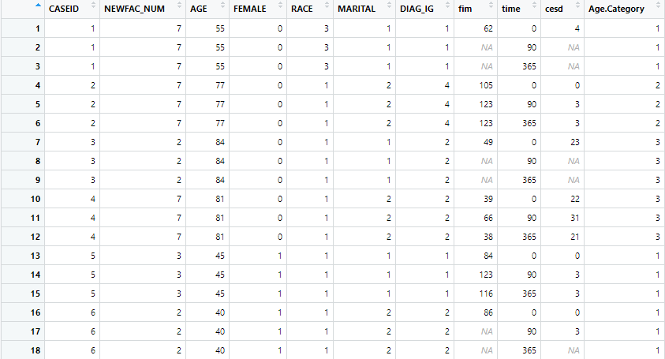
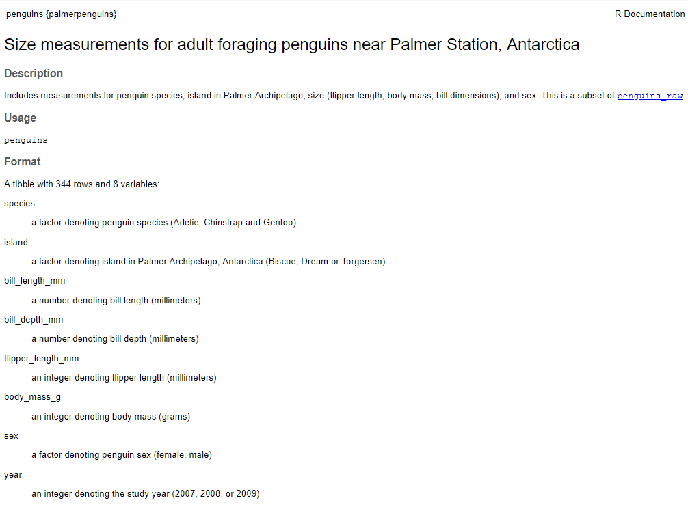

```{r hidden, include = FALSE}
pacman::p_load(learnr)

```


## Intro

This Tutorial continues our work on **data cleaning**. We've covered reshaping data to be tidy via pivoting and dealing with that data that may be split (or need to be split) across multiple columns.

Here we're going to sort of take a step back and pretend we just found a new dataset, or received one from a colleague. What should you do immediately to familiarize yourself with it and make sure it's in the proper condition for further analysis? 

We'll cover some basic, general data cleaning tasks and techniques you'll use (or at least consider using) on pretty much any dataset you encounter in the real world: fixing incorrect or missing or implausible or corrupted or incomplete values; dealing with duplicate observations; changing variable formats; fixing variable names; and so on.

A warning: this Tutorial is heavier on the text than I like, with relatively less code. I've written a lot because I hope it can serve you as a basic guide for data cleaning moving forward.

### Packages

As usual we need to load packages. This time we need `tidyverse` because we pretty much always do; and `janitor`, which provides some additional specialized but extremely useful cleaning functions. Remember you might need to install `janitor` first (but `p_load()` should take care of that automatically)! 


```{r setup, message = FALSE}

# Load (and, if necessary, first install) packages
pacman::p_load(tidyverse, janitor, palmerpenguins, fivethirtyeight)

# Stroke recovery data
stroke <- read.csv("./datasets/stroke.csv")
stroke_full_raw <- read.csv("./datasets/stroke_test.csv")


```

## First Steps With New Datasets

Let's start at the beginning. You get a dataset. Now what?

We're going to work with some data on stroke recovery from the Inter-University Consortium for Social and Political Research (ICPSR), an absolutely *massive* repository of shared data on a huge range of topics from researchers around the globe. Citation: Ostir, Glenn, Ottenbacher, Kenneth, and Kuo, Yong Fang. Stroke Recovery in Underserved Populations 2005-2006 [United States]. Ann Arbor, MI: Inter-university Consortium for Political and Social Research [distributor], 2016-05-03. https://doi.org/10.3886/ICPSR36422.v1


The data - after being trimmed down and tidied slightly by me - is stored in the data frame `stroke`. How might you explore it? Think about what your approach would be for a moment. Consider the techniques you learned way back in Tutorial 1.1. 

Then I'll give you my process for getting oriented and acclimated to a new data frame.

### Getting Oriented to New Data

Here's what I like to do. I encourage you to try all this yourself on the `stroke` data in your own script as you follow along:

* `View()` the data - though rather than typing that function I usually just click on it in the upper right hand pane of RStudio. This lets me get a basic idea of how the data is organized (for example, does it look wide or long?), what an individual observation might represent, the variables in the data frame, and so on.

* Check out the structure of the data with `str()`. This gives me a quicker overview of all variables and their formats than I get by `View()`ing it.

* Get a summary of all variables in the data frame using something like `summary()` or `skimr()`. This helps with identifying possible outliers and missing data - more on that below.


#### Getting Oriented to the `stroke` Data

Let's say I know just what I told you so far: this is some stroke recovery data from ICPSR. When I open the stroke data this is what I see:

```{r img0, echo = FALSE, out.width = "70%", fig.align = "center", fig.cap = "Result of `View(stroke)`."}

```

The first thing I notice is the first variable: `CASEID`. Stroke recovery data...what would case represent...maybe a patient? Could this be a patient identifier?

Let's see if we can confirm our guess. What do you notice about the values of `CASEID`...and other variables in the data frame? Try to answer yourself how you think the data might be organized before looking below.

<br>
<br>
<br>

The first thing I notice - after the fact that they're numbers - is that they repeat. In fact the first 6 all repeat 3 times. Do other variables that are at the level of the patient also repeat 3 times? Consider `AGE`, `FEMALE`, `RACE`, and `MARITAL` - we don't know *exactly* what these mean yet, but they probably represent a person's age, sex, race, and marital status. And they also repeat with `CASEID` - all the `CASEID`s that are 1 seem to refer to a 55-year old man with `RACE` = 3 and `MARITAL` = 1. So `CASEID` is, indeed, probably a patient identifier.

But we notice some other variables seem to *change* within a single value of `CASEID` - `fim`, `time`, and `cesd`. This cues me in to think that maybe we have multiple observations on the same stroke patient over time as they recover.

What about our other variables? Let's take a look at some:

* `NEWFAC_NUM` - some kind of number? Beyond that I don't know.

* `AGE` - this one seems pretty self-explanatory. Probably the patient's age in years. And those values make sense. Easy.

* `FEMALE` - well, OK, this is probably gender? But why are these numbers? What does `FEMALE = 0` mean? My intuition is 0 = Male and 1 = Female (0/1 is a very common No/Yes coding, and "FEMALE No" would be "Male" - with sincere apologies to our non-binary friends), but we should definitely double-check that.

* `RACE` - similar to `FEMALE`. What does `RACE = 3` mean? This one I have no intuition on at all.

* `DIAG_IG` - diagnosis of some kind? But I have no idea, really.

* `time` - maybe some measure of time since some sort of "baseline" measurement? Days seems like a sensible unit given the values of 0, 90, and 365. But this is still all guesswork!

* `Age.Category` - apparently we're also categorizing age rather than just keeping it continuous. But what does 1 mean? It's not 1 year old? We could probably figure this out by looking at what values of `AGE` map to which of `Age.Category`.

    <mark>Challenge:</mark> Can you figure out how to do that on your own?

All this is guesswork so far, and it's exhausting. Plus even the intuition I showed above is borne from *years* of working with medical data. You all probably don't have that yet. Isn't there a better way? Oh heck yes, there is.

### Data Dictionaries/Codebooks

Allow me to introduce you to the idea of **data dictionaries**, also known as **codebooks.** You've already seen these - just not by that name. Check out the help page for the `penguins` data frame: `?penguins`.

```{r img1, echo = FALSE, out.width = "70%", fig.align = "center", fig.cap = "Penguins data dictionary."}

```

This help page is basically a (brief) **data dictionary** for `penguins`! It contains:

1. A brief overall description of what the data frame contains to help orient you, under "Description"

2. A list of each variable name and enough information to ensure people can understand what the data means. This can be units, or (where necessary) clarifications of numerical or other codings.

On Canvas under the Module associated with this Tutorial there is a (once again, brief) data dictionary for the `stroke` data frame. Open it and take a look. Were our guesses above right? Do you feel like you can decipher the data better now?

Test your understanding of the data:

``` {r quiz1, echo = FALSE}

quiz(
  question("How many unmarried white females in New York rehab facilities were there?",
      answer("0", message = "You may not have used the right filters. There *are* some of these people."),
      answer("315", message = "Close! Is this the number of *people*?"),
      answer("105", correct = TRUE, message = "That's right! Nice job."),
      answer("We Don't Know"),
      type = "learnr_radio",
      allow_retry = TRUE)
)
```

#### A Real Data Dictionary/Codebook

The examples above are both simple, brief codebooks I've provided as a gentle introduction. But what if you went out and got this data in the "real world?" 

<mark>Challenge:</mark> Start by going [to this website](http://doi.org/10.3886/ICPSR36422.v1) where I actually pulled the data. Note you might have to create a (free) account, but it's worth it for access to this huge data repository. Then click on the "Data & Documentation" tab. Then click the "Download" icon. You see a bunch of options, including *just* a Codebook or the ability to download the data in a bunch of different formats set up for different programming languages.

Try downloading one and opening the .zip folder you get. Can you navigate to the **codebook**? Open it up and take a look. It's over 100 pages, with *way* more detail than what I provided earlier. Now *that's* a proper codebook, y'all. That should answer just about any question any researcher could reasonably have about what they're looking at.

### Do We Always Just Get Numbers?

The data I showed you so far had everything coded as integers. Is that always the case? Not at all. You might get something like this instead:

```{r raw_char_data, exercise = TRUE}

head(stroke_full_raw)

```

This has the benefit of being more descriptive right off the bat. But it has the drawback of being harder to process in R later. For example, you now have to deal with parsing all those strings/character data rather than having simple numbers.

The ideal solution would actually be to download the "R" version of the data from ICPSR, which is stored as a `.Rda` file. This can hold much more data than the `.csv`s we imported earlier. For example, it holds `NEWFAC_NUM` as a **factor** that is an easily-manipulated integer under the hood but *displays* as easily-readable text.

If you can do something like import an `.Rda`, I'd recommend that. But often you won't have that nice option because it requires more preparation on behalf of the person sharing the data. You're more likely to encounter a `.csv` or other file that requires some manual manipulation and re-coding on your part.

## Cleaning Variable Names

Now that we've learned some techniques for orienting ourselves to a data set, let's get into some common cleaning tasks. Take a look at the variable names in `stroke`:

```{r clean_names1, exercise = TRUE}

head(stroke)

```

Does anything annoy you about them? It's best for variable names to have a consistent style, and I see at least two things about these that are inconsistent. <mark>Challenge:</mark> See if you can spot them before reading below.

<br>
<br>
<br>

What I see is:

1. Inconsistent capitalization

2. When there are multiple words, sometimes they're separated by `_` and sometimes by `.`. 

    Even worse, sometimes you'll get data with *spaces* in variable names. Oh, that's just the worst because then you have to remember to put them in backticks ``s whenever you write them in your code.

To fix that, let me introduce you to the magical function `janitor::clean_names()`. Let's run it:

```{r clean_names2, exercise = TRUE}

stroke %>% 
  clean_names() %>% 
  head()

```

Oh heck yeah. *Way* cleaner and more consistent. Beautiful.

And rather than having to change variable names manually like back in the Dark Ages, `clean_names()` does it all automatically! Seriously, you have no idea how many hours that function will save you. By default it puts everything into `snake_case`, but if you're not a snake person you can tell it to put things in `camelCase` or some other arbitrary format if you'd like.

### The `janitor` Package

This package is magical. It has some very useful and time-saving functions for data cleaning tasks. I recommend [reviewing the vignette on `janitor` here](https://cran.r-project.org/web/packages/janitor/vignettes/janitor.html). Bookmark it and remember it's there for your future data cleaning needs. We'll use it again in this Tutorial.

It also has some very useful functions like `tabyl()` for creating "contingency tables" (like 2x2 tables) for examining the associations between two or more categorical variables. Here's a very simple example:

```{r tabyl, exercise = TRUE}

stroke %>% 
  tabyl(FEMALE, MARITAL)

```

## Cleaning Variable Values

Another important thing to check when you get your data is to look at the range (or levels) of values of all your variables. One easy way to do this is with `summary()`, but there are lots of other options like `skimr()`. Let's go back to our `penguins` data:


```{r check_vals, exercise = TRUE}

summary(penguins)

```

For categorical variables (factors) like `species` and `island`, `summary()` gives us the number of observations falling into each category. For numerical variables we get a 5-number summary. For all variables we also get the number of missing observations - more on that later.

Just looking at variable types can cue you in to problems in your data. Is there something you think should be a number or a date  or a factor but is showing as a character? Time to figure out why and correct that!

### Implausible Values

These 5-number summaries provide a nice first pass at checking for implausible values. For example, is the maximum value way way way further above the 3rd quartile than it should be based on the distribution of the rest of the data (for example, the distance between the minimum value and the 1st quartile)? Or vice versa? 

For `penguins` I don't really see any weird outlying values. Consider `flipper_length_mm`. The longest flippers are 231 mm, which is 18 mm higher than the 3rd quartile. Does that seem too high? Not when we compare it to the low end, where there's an 18 mm difference between the 1st quartile and the shortest flippers, too.

We can also just ask ourselves do these values *seem* plausible. The shortest flippers are 172 mm, and the longest 231 mm. That's about 7-9 inches, or maybe about 3-4 thumb lengths. You've all seen penguins before - does that *feel* right to you? Strikes me as OK!

But what if somebody's finger slipped during data entry?

```{r check_vals2, exercise = TRUE}

penguins_error <- penguins %>% 
  mutate(flipper_length_mm = case_when(flipper_length_mm == 231 ~ as.integer(2231),
                                       TRUE ~ flipper_length_mm))

summary(penguins_error)


```

Whoops! Look at the maximum flipper length. **That should immediately jump out to you as a problem in your data that needs to be addressed!**

#### PLOT. YOUR. DATA.

An even better way to check for implausible or incorrect values is to **plot every single variable you are interested in working with**. 

For single categorical variables, you could do simple bar graphs, or just look at a table of counts. The same can work for multiple categorical variables, just using grouped bar graphs or "contingency tables" showing the numbers of various combinations of variable values.

For single continuous variables, density plots, box plots, histograms, and [dot plots](http://www.sthda.com/english/wiki/ggplot2-dot-plot-quick-start-guide-r-software-and-data-visualization) can work well, among others like jittered scatterplots with a static y aesthetic (set to 0 or 1 or whatever you'd like). For multiple continuous variables, consider scatterplots. 

For looking at associations between continuous and categorical variables use the techniques we've learned for visualizing such relationships, like joyplots.

As an example of how plotting can help you catch impossible values, consider these two variables:

```{r plot_data1, exercise = TRUE}
# No big problems detected (though we can see we might have substantial differences by species)
penguins %>% 
  ggplot(aes(x = flipper_length_mm)) +
  geom_density()

# BIG PROBLEM
classic_rock_song_list %>% 
  ggplot(aes(x = release_year)) + # release_year is the year a "classic rock" song was released
                                  # with just a little domain knowledge, you know this should probably be roughly from 1950 and later
  geom_density()


```

That second plot, on `release_year` in `classic_rock_song_list`, should cue you in *immediately* to a problem somewhere in your data. Specifically, there appears to be one (or a few, we can't be sure yet) song(s) with a release year that is way too early. Would you have caught this if you didn't plot it? 

PLOT. YOUR. DATA. I cannot emphasize this enough.

<mark>Challenge:</mark> Try redoing the above code with a boxplot and/or a dotplot, just to see how it looks.


#### What Do You Do With Implausible Values?

The first thing is to double-check that they're actually incorrect. Sometimes you get outliers! This should always be your first instinct, and it's on you to investigate that possibility. Go back to your data. Plot the data. Ask the source. Is it *possible* this data is actually just a legitimate outlier?

If you determine it isn't, then you have to figure out what the problem was. There are usually a couple options here:

* Data entry error (typo, mis-transcribed value from paper data, or putting the value for another variable in the wrong column)

* Actually means "Missing" (999, 9999)

Once you identify what situation you have, you can figure out what to do:

* If it's actually supposed to be a missing observation, re-code it to `NA` (or however what software you're using stores missing values; SAS, for example, uses `.`)

* If it's a data entry error, can you get the correct value? Think back to HW4 in QTM 150. We had a song by Elton John that said it was released in the year 1071. You can pretty well guess based on context clues or a little bit of external research that it should actually be 1971!

    Sometimes you can ask the original source what the value *should* be.
    
    Other times you can't.
    
    + **If you can determine the correct value**: correct it
    
    + **If you can't determine the correct value**: you probably have to throw that value out. Set it to missing as discussed above.
    
### Recoding Variable Values

Often times you'll get data where variables aren't quite in the format you want. Let's talk about a couple different situations we might encounter.

#### Recode Categorical Variables Stored as Numbers to Factors

Back to our `stroke` data! We have a bunch of numbers. From the data dictionary we know some of them are actually codes for categorical variables. We want to add the information about what category each number refers to directly to our data frame. For that we can simply create a factor:

```{r recode_as_factor, exercise = TRUE}

stroke_recode <- stroke %>% 
  mutate(MARITAL = factor(MARITAL, # Change marital from its current type (integer) into a factor
                          levels = c(1, 2), # List the current values of the variable
                          labels = c("Married", "Unmarried"))) # Assign labels to those, in order

#Check our work
head(stroke_recode)
str(stroke_recode)

```

One caution here is to not miss any levels when you're creating your factor. If you do, those will be coerced to `NA`s - not good!

#### General Value Recoding

For more general recoding of certain values you can use `recode()`. Here are a couple examples:

```{r recode_general, exercise = TRUE}

#Recode time in months rather than days
stroke_recode <- stroke %>% 
  mutate(time = recode(time, 
                          "90" = 3L, # L to specify we want an integer to match type in our new column 
                          "365" = 12L)) # Even though time is an integer, we have to put each old value in quotes

#Check our work
head(stroke_recode)
str(stroke_recode)

```

```{r recode_general2, exercise = TRUE}

#Recode state abbreviations to full names using an outside vector
state_abbs <- c("IL" = "Illinois", "OH" = "Ohio", "IN" = "Indiana", "MI" = "Michigan", "WI" = "Wisconsin")


midwest_recode <- midwest %>% 
  mutate(state = recode(state, !!!state_abbs)) # If you're passing in a vector, precede it with !!!

#Check our work
head(midwest_recode) # Now the state column is the full name!

```

#### Recoding With Joins

You can also recode with joins. Here's an example, again using our `midwest` data and state abbreviations:

```{r recode_join, exercise = TRUE}

#Recode state abbreviations to full names using another data frame
state.keys <- tibble(state = state.name, ab = state.abb) %>%  # state.name and state.abb are vectors built in to R
  rename(state_name = state)
state.keys


midwest_recode <- midwest %>% 
  select(county, state, poptotal) %>% # To create smaller data frame to easily see what happens
  left_join(state.keys, by = c("state" = "ab")) %>% 
  select(-state)

#Check our work
head(midwest_recode) # Now we list states by full name!

```

<mark>Challenge:</mark> What would have happened if we *hadn't* renamed the variable `state` from `state.keys`?

#### Recode Numeric Variables Stored as Characters

What if we got a data frame like the below (surprisingly common)?

```{r char_to_num}

widgets <- tibble(
  factory   = c("Shenzhen", "Guangdong", "Shanghai", "Wuhan"),
  widgets_made    = c(837000, "1,1200,000", 1000200, "NA")
)

widgets

```

What do you notice about the variable types? 

``` {r quiz3, echo = FALSE}

quiz(
  question("The variable `widgets_made` is a ______ variable, and it should probably be a _______ variable.",
      answer("character/numeric", correct = TRUE, message = "That's right! The quantity of widgets produced is a numeric variable, but we can see at the top of the printed table it appears to be stored as a character."),
      answer("numeric/character"),
      answer("character/character"),
      answer("numeric/numeric"),
      type = "learnr_radio",
      allow_retry = TRUE)
  
)
```

This mismatch happened because someone stored one of our numbers using commas even though the others didn't have them - and because the missing value was stored as "NA" (the literal character string, an N then an A) rather than `NA` (an actual missing value). This means R will coerce the entire column (remember that term?) to the most complex data type present - in this case, a character string so it can accommodate everything that's written.

How can we make `widgets_made` a numeric variable? Let's try a very simple solution:


```{r char_to_num2, exercise = TRUE}

# Simple solution to make widgets_made numeric
widgets %>% 
  mutate(widgets_made = as.numeric(widgets_made))

```

Notice any issue? Think about it for a minute before reading below.

<br>
<br>
<br>

First look at Wuhan, which had a literal character value of "NA", is changed to `NA` since R can't figure out how to coerce it to a number. But that's exactly what we want in that case, so no problem.

Unfortunately we also lost the numeric value for Guangdong. Because it had commas, R couldn't figure out how to automatically coerce it to a number - so it just set it to missing. To fix that we have to first remove the commas. To do that we have to learn how to manipulate and change character strings. We'll cover that in much more detail in the next Tutorial, but for now here's how you could accomplish it:

```{r char_to_num3}

# Correct solution to make widgets_made numeric
widgets %>% 
  mutate(widgets_made = str_replace_all(widgets_made, #Take the string widgets_made and replace every (all)...
                                    ",", #...comma...
                                    "")) %>%  #...with nothing (no character)
  mutate(widgets_made = as.numeric(widgets_made))

```
That looks better now, doesn't it? We keep Guangdong's number. And Wuhan - which had a literal character value of "NA", is again changed to `NA` since R can't figure out how to coerce it to a number. But that's exactly what we want in that case.

## Duplicated Observations

Another issue you'll encounter is duplicated observations. 

### Identifying Duplicates

The first thing to do is identify *if* there are any duplicated observations. Once again `janitor` has an amazing function that can help here, `get_dupes()`:

```{r get_dupes, exercise = TRUE}

#Insert duplicate records
penguins_dupe <- rbind(penguins, penguins[300,], penguins[300,], penguins[13,])

#Check for duplicates
penguins_dupe %>% 
  get_dupes()

```

Uh-oh! We seem to have several fully-duplicated rows (that, uh, we also created). `get_dupes()` also creates a new variable, `dupe_count`, that tells you how many times each referenced observation is duplicated. One appears a total of 3 times, the other 2 times. This is incredibly useful in larger datasets with multiple sets of duplicated observations.

By default, `get_dupes()` checks for rows that duplicate *all* columns. But you can also check for duplicate values on a subset of columns. Be careful here, though, because it doesn't actually mean you have a duplicate entry! Observations share values in datasets all the time. So make sure you've chosen a set of columns that *should uniquely identify an observation first*.

```{r get_dupes2, exercise = TRUE}

#Remember penguins itself is a clean dataset with no duplicates

#Check for duplicates
penguins %>% 
  get_dupes(species, island, sex, bill_length_mm, flipper_length_mm)

```

Even though we know there are no duplicates in this data, this code still returns 10 penguins who are part of pairs of separate penguins who just *happen* to share all these characteristics!

Note you could just as easily have trios or quadruplets - we just didn't happen to here.

### Dealing With Duplicates

Now we need to decide what we should do with any actual duplicates we identified. If we're sure we have duplicated observations, we probably want to delete all but one copy of those duplicates. For that, I recommend `distinct()` from the `dplyr` package (part of the `tidyverse`).

```{r deal_with_dupes, exercise = TRUE}

#Insert 3 duplicate records
penguins_dupe <- rbind(penguins, penguins[300,], penguins[300,], penguins[13,])

str(penguins_dupe) # 347 total observations right now

#Remove duplicates (find them, then delete all but the first in each duplicate set)
penguins_dupe %>% 
  distinct() # Notice we're only left with 344 rows, the correct number of unique penguins

```

What does `distinct()` do? Basically it does `get_dupes()` to identify duplicate sets (pairs, trios, quadruplets, and so on); then identifies the *first* instance of each duplicated set in the data frame; then deletes all other instances in the set. That removes all duplicates and leaves you with only one record for each...wait for it... *distinct* observation.

You can also use `distinct()` for subsets of columns, but the same big flashing CAUTION I listed above about accidentally identifying non-duplicate observations applies.

```{r deal_with_dupes2, exercise = TRUE}

#Remember penguins itself is a clean dataset with no duplicates

#Remove "duplicates"
penguins %>% 
  distinct(species, island, sex, bill_length_mm, flipper_length_mm,
           .keep_all = TRUE) # Oh no! We should keep all 344 penguins from the original data frame,
                             # but we only have 339

```

This code identified the 10 penguins that are part of duplicated pairs, kept the first one from each pair, and deleted the other 5. Thus instead of the full dataset's 344 penguins we're left with 339.

There's one other thing to call your attention to: the added argument `.keep_all = TRUE`. <mark>Challenge:</mark> Can you figure out what it does? Try deleting it and comparing your output - or check the `distinct()` help page.

### Empty Rows and Columns

Yet another issue you might encounter with real world data is random empty rows or columns. This might happen if, for example, you're dealing with poorly-kept Excel workbooks that keep different months of business data in separate "blocks" in the same spreadsheet (not that I'm speaking from experience or anything).

Fortunately `janitor()` makes removing these a breeze with `remove_empty()`. Here's a simple toy example:

```{r remove_empty, exercise = TRUE}

q <- data.frame(v1 = c(1, NA, 3),
                v2 = c(NA, NA, NA),
                v3 = c("a", NA, "b"))
q

# Remove empty rows and columns
q_clean <- q %>%
  remove_empty(c("rows", "cols"))
q_clean

# Remove just the empty rows - for you to fill in for practice

# Remove just the empty columns - for you to fill in for practice


```

## Missing Data

Now we come to one of the biggest issues in all of data cleaning: missing data. This is a very common issue - so common, in fact, that I defy you to find a dataset outside of a class with *no* data missing. Missing data comes in a few flavors:

1. Missing values - that is, some rows/observations are missing data for some variables. Or some columns have some missing observations. This could also be called **explicitly missing** data because you'll see an `NA` (or other value) that tells you it's missing. 

2. Entire missing observations (may be rows or columns depending on data shape) - some rows or columns are entirely missing. These are **implicitly missing** as no `NA` or other value will tell you it's not there - you have to do some other checks to detect their absence.

Let's look at an example, with some real stock price data for Zoom in 2019 and 2020:

```{r create_data, include = FALSE}

stocks <- tibble(
  year   = c(2019, 2019, 2019, 2019, 2020, 2020, 2020),
  qtr    = c(   1,    2,    3,    4,    2,    3,    4),
  price = c(NA, 62, 91.88, 73.55, 124.51, 245.87, 492.41)
)

```

```{r missing_data_types}

# Print some data on Zoom stock prices
stocks

```

``` {r quiz2, echo = FALSE}

quiz(
  question("The data on Zoom's stock price in 2019 Q1 is...",
      answer("implicitly missing"),
      answer("explicitly missing", correct = TRUE, message = "That's right! It's in the data frame as an observation but is explicitly listed as missing with an `NA` entry. (Metaphorical) bonus points if you can figure out why."),
      type = "learnr_radio",
      allow_retry = TRUE),
  
  question("What data is implicitly missing in the above data frame?",
      answer("Q1 2019"),
      answer("Q4 2020"),
      answer("Q1 2020", correct = TRUE, message = "Excellent. Notice we have observations for 2019 Q4 and 2020 Q2. It would stand to reason there *should* be a 2020 Q1 in between. And yet there isn't. It's missing, but...implicitly. R doesn't tell you explicitly that it's missing with an `NA`. You had to notice it. Or do some detective work to find it."),
      answer("No data is implicitly missing"),
      type = "learnr_radio",
      allow_retry = TRUE)
  
)
```

### How "Missing" Values are Stored

The "proper" way to store missing data in R is as `NA`. Recall each major vector type - logical, integer, double, and character - actually have their own kind of `NA` value. Knowing this can be important when debugging your code and interpreting error messages, though in most cases R will figure out what type of `NA` you're dealing with automatically.

But when you first get your data, missing values can be represented all sorts of weird ways. Here are some examples I've seen:

* "Not Applicable" or "NA" (a literal character string rather than a proper `NA` value)

* `..`

* `.`

* ` ` (a single space)

* `` (a blank cell, no space)

* `-`

* A numerical code. One very common method is, for a binary yes/no variable, 0 = No; 1 = Yes; 9 = Not Applicable or Missing.

    If instead you have a 2-digit numerical variable, 99 might represent missing.
    
    For a 3-digit numerical variable, 999 might represent missing.
    
    And so forth.

Consult your **data dictionary** to figure out how missing values are represented in the data you receive. 

Then my recommendation would be to **recode all of those to `NA` for simplicity and consistency.**

### Explicit Missing Values

Explicit missing values are relatively simple to deal with, because you know they're there. I advise the following:

* Use `summary()` or another method to check how much data (how many observations) are missing for each variable.

    If it's a substantial amount, realize that may not be a good variable to use in any analyses. There may be some **selection** going on here. That is, the observations *with* data may be systematically different from those *without* it, which could bias your analysis. Or you may simply not have enough observations with data to draw any reliable conclusions about that variable.
    
* Check for patterns in explicitly missing data. Are they scattered randomly? Or are most missing values clustered in just a few observations? Is most of the missing data occurring in just a handful of observations that are missing many variables? 

    This could have implications for what you do next. If the problems are clustered in a small number of observations, you might consider throwing those out. If they're more scattered, that's harder.
    
* If you see a pattern, ask if there's an obvious reason why those data are missing. For example, are data points at either end of a time series missing? Maybe some observation(s) in your data didn't have values for some variables before a certain time - like Zoom not being a public company with a stock price in 2019 Q1. 
    
Also recognize you will also have to use `na.rm = TRUE` for many functions that act on any variable with *any* missing data. Those observations will be ignored for that function. Depending on the number of observations that are ignored, this may be OK or it may not be. It's a judgement call for you to make - and one that you need to be aware of at all times. That's why investigating how much data is missing and any patterns is so important.

#### DON'T USE `na.omit()`!!!

If you Google around for solutions to missing data you will see a LOT of people using `na.omit()`. Avoid these solutions like the plague.

The big problem is this will drop observations with *any* missing values for *any* variable. It's the "simplest" way to deal with missing data, and leaves you with a nice, clean, complete data frame.

But simple != good.

In fact it is BAD to throw out observations without a very, very good reason. In addition to dumping the missing values, you're also dumping a lot of useful, known, non-missing data on other variables. It's too arbitrary and sacrifices information. Not a good practice to get into. 

You could also induce massive bias if, for example, a subpopulation refused to answer (or couldn't answer, because it wasn't applicable) 1-2 questions on a survey - and you just threw out all their data entirely! 

Plus, this could substantially reduce your sample size.

#### Use `drop_na()` Cautiously

The `drop_na()` function is a somewhat better solution because it allows you to drop observations only if they are missing a certain set of values rather than just any value, but be very careful. Specifically, **always specify the columns where, if the data is missing, you want the observation dropped**. 

It will do the same thing as `na.omit()` if you don't specify which columns you want to drop if they are missing.

The same warnings as above about dropping observations because they have certain variables missing also apply.
    
#### How to Deal With Explicit Missing Values

What should we do with explicit missing values? Well you have two basic choices:

1. Leave them missing

2. Fill them in

Let's discuss some options for filling them in.

##### **Filling in With Prior Values**

Sometimes to make data entry go faster, certain fields that are repeated will be left blank, like so:

```{r fill1}

treatment <- tribble(
  ~ person,           ~ treatment, ~response,
  "Derrick Whitmore", 1,           7,
  NA,                 2,           10,
  NA,                 3,           9,
  "Katherine Burke",  1,           4
)

treatment

```

The first three rows are all data on Derrick - we just left the second and third ones blank. It's quite easy to fill them in by carrying prior values forward using the `fill()` function, also in `tidyverse`:

```{r fill2, exercise = TRUE}

treatment %>% 
  fill(person) # Specify the variable name(s) you want to fill with prior values

```

<mark>Challenge:</mark> What if I wanted to fill in the blanks with "Katherine Burke" instead? Can you figure out what minor modification you would make to the code above to do that?

Be careful with `fill()`. Before you do it, make sure simply carrying the prior value of a variable forward makes sense for *all* the missing values of that variable. R can't distinguish when it does and doesn't, so it does the same thing for all of them. Whether that's a good idea requires your judgement.

##### **Filling in With Imputed Values**

Another thing you can do is fill in `NA`s with sensible actual values of the variable in question. Options include:

* A static value that makes sense.

    For example, in the `stroke` data `fim` is a measure of functioning after stroke recovery that's sometimes missing. Maybe you talk to the original researchers and discover it's only missing when a patient died. Then maybe it would make sense to fill those in with the minimum score for `fim` (18), or even just a flat 0. You could do that a few different ways:
    
```{r impute_static, exercise = TRUE}

# Impute 0 for missing FIM using our old friend case_when()
stroke %>% 
  mutate(fim = case_when(is.na(fim) ~ as.integer(0), # To indicate FIM should stay as integers, not switch to doubles
                         TRUE ~ fim))

# Impute 0 for missing FIM using replace_na()
stroke %>% 
  replace_na(list(fim = 0)) # Must enclose your recodings as a list()

```    


I'd urge using static imputation with extreme caution. **You need a really strong belief about the proper imputed value. If you're not sure, you could really mess up your data by forcing very wrong/unrealistic values on observations.**

* You could, instead, simply impute all missings with the overall mean value of a variable (or the most common category if it's categorical). This has a similar flaw as static imputation - you could assign a very wrong value to many observations! - but it may be better if there's no particular reason for data to be missing. That is, if stroke victims were just missing `fim` data completely at random, perhaps just filling in those missings with the mean `fim` value more or less makes sense.

    Here's an easy way to do that:
    
```{r impute_mean, exercise = TRUE}

# Impute mean for missing FIM
stroke %>% 
  mutate(fim = case_when(is.na(fim) ~ mean(fim), 
                         TRUE ~ as.double(fim)))  # To allow for decimals, make fim a double rather than integer

```  

You can also impute other summary statistics easily by using, for example, `impute_median()`.

* You could replace missings with the mean of a variable *from a particular subgroup*. What if you knew `fim` depended heavily on someone's race, so you wanted to impute with the mean for their particular race? That's slightly more complicated:

```{r impute_mean_subgroup, exercise = TRUE}

# Calculate the mean fim by racial group in a separate data frame
mean_fim_race <- stroke %>% 
  group_by(RACE) %>% 
  summarize(mean_fim = mean(fim, na.rm = TRUE)) # Only use non-missing FIM for the mean calculations

mean_fim_race

# Link this data back into the main data frame
stroke %>% 
  # Link in mean data
  left_join(mean_fim_race, by = "RACE") %>% 
  #Fill in missing fim values with group means
  mutate(fim = case_when(is.na(fim) ~ mean_fim, 
                         TRUE ~ as.double(fim))) %>%  # To allow for decimals, make fim a double rather than integer
  # Drop new column
  select(-mean_fim)

```  

You could get potentially more accurate missing values by using even more fine subgroups (say by race and gender), but then you may run into small sample size problems - or even certain subgroups that don't have any data for calculating a mean value!

All of this manual imputing by means is very blunt and can result in quite inaccurate values. Once again I urge you to use it with CAUTION.

The most sophisticated (and best) methods for imputing missing data right now involve using statistical models to predict the value of a missing observation based on its other covariates - but also doing that many times in a procedure called **multiple imputation**. Each imputation will give us a somewhat different value for the missing data. Then, analyzing all those data sets together lets us account for the uncertainty in our result that arises from not knowing the true value of the missing data. But how to do that - or how to implement it in R - are far beyond the scope of this course.  

### Implicit Missing Observations

The big issue with implicit missing observations is identifying them and making them explicit so they can be dealt with properly. The best strategy I can offer you for this is the `complete()` function in the tidyverse. This function takes a sequence of variables, creates all possible combinations of them, and makes sure they all appear in your data frame. If one doesn't, it creates that combination and fills in `NA`s for all the other variables. Here's an example:


```{r complete, exercise = TRUE}

# Print some data on Zoom stock prices, with the missing quarter filled in
stocks %>% 
  complete(year, qtr)

```

This filled in 2020 Q1 because it recognized there was a Q1 for 2019, and a year 2020, yet no entry in the data frame matching these. So it created one. And then filled in `price` - the one variable that *isn't* `year` or `qtr` - with `NA`.

Choose a variable or set of variable(s) that you should have at least one observation of for every combination - like quarter and year above. Then try `complete()` on those variables to see if anything is implicitly missing.

## Script. Your. Cleaning.

One last note before we're done:

Script. Your. Cleaning.

What does that mean? **You should always keep a copy of the totally raw, uncleaned data you got straight from the source.** Then import that into an R script and do all the cleaning there. You can run your script to generate a clean data frame as often as you need. But this has two major advantages:

1. You can keep full track of all the changes you made (and, if you commented your code properly, why).

2. If you decide you need to undo something or revert to an older version, you always have the oldest raw version to work from. So then it's just a matter of commenting out or changing various parts of your cleaning script. Easy.

## Summary

In this Tutorial we covered some basic, general data cleaning tasks common to most if not all datasets you'll encounter.

In future Tutorials we'll cover more specifically how to do cleaning and manipulation of strings (using `stringr`), factors (using `forcats`), and dates (with `lubridate`). But first, to understand these methods, we'll need to spend some time talking about the fundamental data structures in R: **vectors**, **lists**, and **data frames/tibbles**. 
