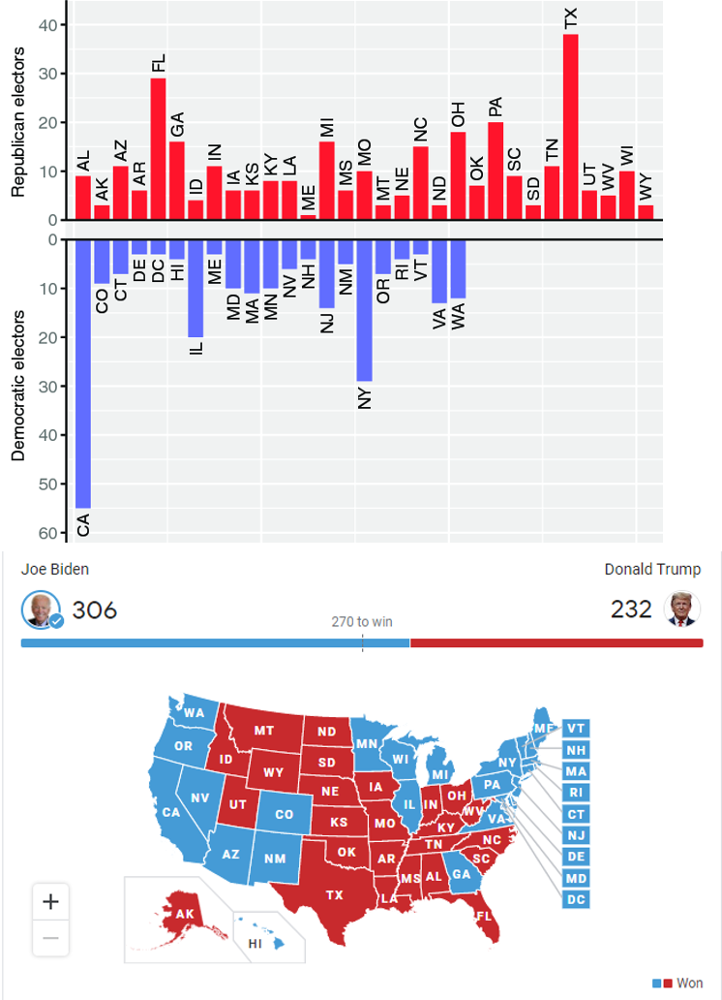
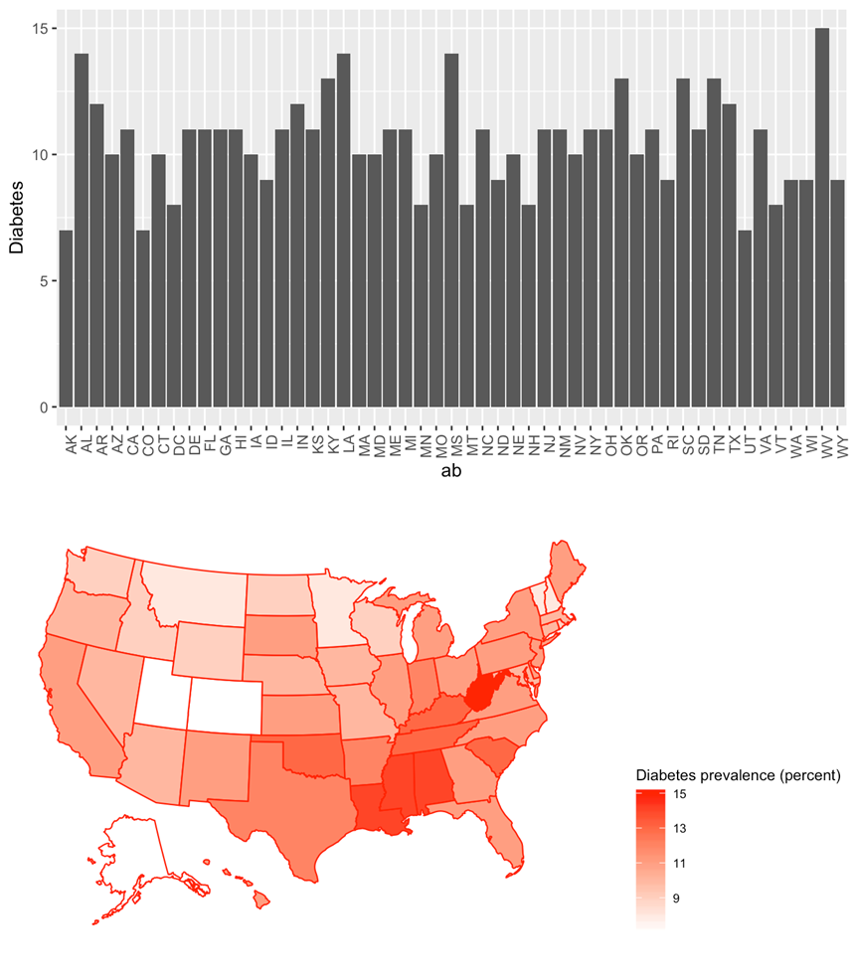

```{r hidden, include = FALSE}
pacman::p_load(learnr)

```


## Intro

Today's Tutorial is about half an introduction to handling a new type of data and half an extension of our previous work on data visualization and `ggplot2`. We're talking about how to handle geographic data to produce maps.

One thing to note before we begin: This tutorial is based heavily on [this course lecture from Eric Anderson at NOAA](http://eriqande.github.io/rep-res-web/lectures/making-maps-with-R.html). Because it was work done in his capacity as a U.S. federal government employee, it is in the public domain and distributed under a creative commons (CC0 1.0) license. This Tutorial is literally tax dollars at work!

### Packages

As usual we need to load a few packages to do our mapping. We need `tidyverse` because, among other reasons, it contains `ggplot2`, which we're still going to be using to plot maps. `RColorBrewer` and `colorRamps` give us some nice color schemes for our maps. The other packages are new ones we haven't worked with previously, which means they also need to be installed (with, remember, `pacman::p_load()` will handle automatically).

```{r setup, message = FALSE}
# Load (and, if necessary, first install) packages
pacman::p_load(tidyverse, ggmap, maps, mapdata, RColorBrewer, colorRamps)

#Prep some data for later. Ignore this code.
us_state <- map_data("state")
diabobes <- read.csv("./datasets/obesity-diabetes.csv") %>% 
  mutate(state = str_to_lower(state))
us_state_diab <- us_state %>% 
  left_join(diabobes, by = c("region" = "state"))

```

If you're following along in your own script, **remember to run this code in your own script before proceeding.**

## Why Maps?

Sometimes you have data that's better shown on maps. This could be geographic data itself, or simply data that's tied to geographical units like countries, states, or cities. In each of the following pairs of charts, which do you find more informative and clear?

```{r img0, echo = FALSE, out.width = "70%", fig.align = "center", fig.cap = "Bar chart of states' electoral votes won by Republicans or Democrats in alphabetical order vs. a colored map of states won by party."}

```

Which one of the above do you think you might see on TV?

```{r img1, echo = FALSE, out.width = "70%", fig.align = "center", fig.cap = "Unordered bar chart of diabetes prevalence by states vs. a map of these."}

```

Which one of these would you be happier to see in a textbook, presentation, or news article?

## Creating Maps

Maps, at their core, are just collections of shapes. And you (sort of) already know how to plot shapes!

### [If You Can Plot a Rectangle, You Can Plot a Map](https://www.youtube.com/watch?v=1ZXHsNqkDI4)

How would we plot a rectangle in `ggplot()`? Try this code. We introduce one new **geom** you haven't encountered before, but with you existing skills you should be able to make a good guess about what it does:

```{r squareplot, exercise = TRUE}
#Create tibble of coordinates with two columns, X and Y
wyoming <- tibble(x = c(1, 1, 3, 3),
                  y = c(1, 2, 2, 1))

#Plot the polygon defined by the coordinates
wyoming %>% 
  ggplot(aes(x = x, y = y)) +
  geom_point() +
  geom_polygon(fill = "yellow")

```
All we did here was specify a set of x and y-coordinates specifying the corners of a polygon (in this case, four coordinates for a rectangle), and then ask R to draw (and fill) that using `geom_polygon()`. `geom_polygon()` works pretty much like `geom_line()`, except it will "close" the shape by drawing a line back from the last point to the first point!

Now imagine if instead of abstract "X" and "Y" values, these coordinates represented latitudes and longitudes. 

Congratulations, you just drew a map of Wyoming (or Colorado), America's most boringly-shaped states.

Extending this to more complex shapes (like Florida, the entire United States, or China) is the same straightforward process, just with more coordinate pairs to describe the more complex polygons.

But where do we get these coordinates? Do we have to input them ourselves manually? Mercifully, no, plotting maps is a common enough task that others have taken care of much of it for you. Enter the `maps` and `map_data` packages.

### Getting and Exploring Map Shape Data

The `maps` and `map_data` packages contain outline-defining coordinate sets for many continents, countries, states/provinces, and counties. Though I can't guarantee it has *every* map you'll ever want, it should cover the most common cases.

These packages store these coordinates in various file types, including `.line` and `.gon`. These are hierarchical data files, the structure of which you don't need to know in detail at this time, so we'll skip it. They'll make much more sense to you once we render them into data frames using the `map_data()` function in `ggplot2`. Note that `maps` does have its own plotting function, but we're going to stick with `ggplot()` because it's easier.

Let's take a look at some map data. Note to make exploration easier you may want to run this code yourself in your own R script in an RStudio session.

```{r map_data_us, exercise = TRUE}
#U.S. map
usa <- map_data("usa")
head(usa, 100)

```

There are 6 columns here:

1. `long` is coordinates of longitude

2. `lat` is coordinates of latitude

3. If a map needs to be comprised of multiple shapes (for example, a mainland and an island, or multiple states), `group` defines to which shape each coordinate belongs. 

    Another way to think about `group` is it tells R when to "lift its pen." If adjacent points are in the same group they are connected. If they're in different groups, R closes the prior shape, lifts its pen to another point, and begins a new shape.
    
    If you explore the map data above, for example, you'll see there are 10 groups: the U.S. mainland, and a collection of islands such as New York's Long Island.

4. `order` is the order in which you want R to connect the coordinates to form the correct shape. This ensures that, for example, R will draw the entire northern border of a map together, rather than jumping back and forth between the north and south!

5. `region` and `subregion` provide up to two names for each `group` (shape) drawn on the map. This can be used to, for example, later color the shapes based on those names.

    Try investigating what `group`s, `region`s, and `subgregion`s there are in the whole U.S. data set using `unique(select(usa, group, region, subregion))`.
    
This will be better illustrated in the state map data below.


```{r map_data_us_states, exercise = TRUE}
#U.S. state map
us_state <- map_data("state")
head(us_state, 100)

#Take a look at all combinations of group, region, and subregion in the data
unique(select(us_state, group, region, subregion))

```
<mark>Challenge:</mark> Explore this data a bit in your own R script in RStudio. This contains data on 49 states + the District of Columbia (Alaska and Hawaii are excluded). How many `group`s are there, though? Does this surprise you? Can you figure out why? HINT: Each `group` value corresponds to a distinct shape R must draw.

``` {r rev_quiz1, echo = FALSE}

quiz(
  question("Which of the following states has more than one group?",
      answer("Michigan", correct = TRUE, message = "The state of Michigan requires two shapes to draw: the main 'south' portion and the 'north' Upper Peninsula."),
      answer("New Hampshire"),
      answer("Georgia"),
      answer("Wyoming"),
      type = "learnr_radio",
      allow_retry = TRUE),
  
  question("How many shapes do you need to draw the state of Virginia?",
      answer("1"),
      answer("2"),
      answer("3", correct = TRUE, message = "That's right. You need the mainland plus the chesapeake and chincoteague sections of the state."),
      answer("4"),
      type = "learnr_radio",
      allow_retry = TRUE),
  
  question("How many shapes do you need to draw the state of Georgia per this map?",
      answer("1", correct = TRUE, message = "Very good! We don't have any non-contiguous parts or separate islands included on this map (though in reality we do have several barrier islands offshore), so we can be drawn as a single shape."),
      answer("2"),
      answer("3"),
      answer("4"),
      type = "learnr_radio",
      allow_retry = TRUE),
  
  question("Which of the following shapes do you need to completely draw New York? Check all that apply.",
      answer("main", correct = TRUE),
      answer("manhattan", correct = TRUE),
      answer("staten island", correct = TRUE),
      answer("new jersey"),
      answer("long island", correct = TRUE),
      correct = "That's right! To draw New York you need its mainland body, plus the three islands.",
      type = "learnr_checkbox",
      allow_retry = TRUE)
)
```

At this point you should be able to look at any output of `map_data()` in R and be able to roughly read and understand it. Test your knowledge with the code below (run it in your own script to make exploration easier). Can you figure out what it shows? If not, practice a little more with the data frames above.

```{r map_data_china, exercise = TRUE}
china <- map_data("world") %>% 
  filter(region == "China")
china

unique(select(china, group, region, subregion))

```

### Plotting Maps

Now let's actually turn that latitude and longitude data into pretty pictures using our old buddy `ggplot()`. Here's a basic example using the U.S. state map:

```{r map_plot_basic, exercise = TRUE}
#U.S. state map
us_state <- map_data("state")

ggplot(us_state, aes(x = long, y = lat)) +
  geom_polygon(aes(group = group), 
               # By default there's no color and the fill is black, so you won't see the state outlines if you don't change them
               color = "black", fill = "lavender") + 
  
  # This sets a fixed aspect ratio so the graph doesn't stretch if you zoom in/out or resize
  # Here, a 1-unit change in X is the same length as a 1.3-unit change in Y
  # You may need different values at different latitudes to get "familiar"-looking maps
  coord_fixed(1.3)


```
#### Understanding `group`

To better understand how group works, let's tell `ggplot()` to ignore the grouping in our U.S. state map data.

```{r map_plot_nogroup, exercise = TRUE}
#U.S. state map...but without groups
us_state <- map_data("state")

ggplot(us_state, aes(x = long, y = lat)) +
  geom_polygon(color = "black", fill = "lavender") + 
  coord_fixed(1.3)

```
GAH! KILL IT! KILL IT WITH FIRE!

Without `group()` R tries to draw all these states as a single shape without picking up its pen, and you get a mess like the above. Consider what's happening here by looking at the bottom-most "weird" line: it starts on the right in the southwestern corner of Alabama, and extends left to the western border of the state of Arizona. This simply indicates R is moving from one row to the next in the data frame without creating a new shape. The data are organized alphabetically by state, so the last coordinate for Alabama to the first coordinate for Arizona!

If you look at the other line emanating from that same point in Arizona, you'll see another example. It extends to the southwestern corner of Arkansas, the *next* state alphabetically!

#### Understanding `order`

R, `ggplot()`, and `geom_polygon()` don't actually look for a variable called `order`. It simply plots the coordinates in the order the data frame provides it to them and then tries to enclose them as a shape/polygon. 

We have an `order` variable to make it easy to return the data to the correct order if we accidentally sort it differently. For example, what happens to our plot if we sort the data by longitude first?

```{r map_plot_badorder, exercise = TRUE}
#U.S. state map...but ordered by longitude
us_state <- map_data("state") %>% 
  arrange(desc(long))

ggplot(us_state, aes(x = long, y = lat)) +
  geom_polygon(aes(group = group), color = "black", fill = "lavender") + 
  coord_fixed(1.3)

```
Not great! Now it tries to plot and connect all the points at each longitude within each state first, rather than drawing state borders in the proper...well, `order`.

<mark>Challenge:</mark> Can you figure out how to modify the code above to undo our horrible mistake of re-sorting the data? Deleting the current `arrange()` is cheating. :)

#### Subsetting and "Zooming In"

What if you only want to plot a portion of your data, for example just a few states? With your existing knowledge of the `tidyverse` and `dplyr`, this is a breeze!

```{r map_plot_southeast, exercise = TRUE}
#U.S. southeast state map
us_state <- map_data("state")

us_state %>% 
  #Only plot certain states
  filter(region %in% c("georgia", "florida", "alabama", "tennessee", "north carolina", "south carolina")) %>% 
  ggplot(aes(x = long, y = lat)) +
    geom_polygon(aes(group = group), 
                 color = "black", fill = "red") + 
    coord_fixed(1.3)

```
Note this is the same process we used above to get the data for just China from a world map. 

<mark>Challenge:</mark>Try plotting that map of China below now for more practice!

```{r map_plot_china_practice, exercise = TRUE}
#Plot a map of just China, using coordinates from the "world" maps data frame

```

You can also Zoom in by defining a specific latitude and longitude. Let's start with a county map of Georgia:

```{r map_plot_ga_counties, exercise = TRUE}
#County map of Georgia
ga_county <- map_data("county") %>% 
  filter(region == "georgia")

ga_county %>% 
  ggplot(aes(x = long, y = lat)) +
    geom_polygon(aes(group = group), 
                 color = "black", fill = "lavender") + 
    coord_fixed(1.3)

```
What if we want to Zoom in on *just* the Metro Atlanta area, though? We could select the counties we want (and this is probably the easiest solution...), or we could do something like this:

```{r map_plot_atl, exercise = TRUE}
#County map of Atlanta
ga_county <- map_data("county") %>% 
  filter(region == "georgia")

ga_county %>% 
  ggplot(aes(x = long, y = lat)) +
    geom_polygon(aes(group = group), 
                 color = "black", fill = "lavender") + 
    coord_fixed(ratio = 1.3, xlim = c(-85, -83.8), ylim = c(33.2, 34.2)) +
    theme_nothing()

```
Note we had to specify the limits *inside* `coord_fixed()`, otherwise it would mess up our groupings by excluding some portions of some counties, leaving R confused about which coordinates to connect.

#### Understanding Aspect Ratios

<mark>Challenge:</mark> Try taking out `coord_fixed()` in the above southeast regional plot. What happens? Do you understand its importance now?

#### Removing The Background/Latitude and Longitude Grid

What if you *just* want to display your map, without the latitude and longitude grid that forms the background of the default graph? No problem. Just use `theme_nothing()`. Try adding it to the code below:

```{r map_plot_nolatlong, exercise = TRUE}
#U.S. state map
us_state <- map_data("state")

ggplot(us_state, aes(x = long, y = lat)) +
  geom_polygon(aes(group = group), 
               color = "black", fill = "lavender") + 
  coord_fixed(1.3)

```
### Knowledge Check

Correct the code below to create a better map. HINT: You should be making two changes.

```{r west_coast_needs_fix, exercise = TRUE}
#U.S. west coast map
west_coast <- map_data("state") %>% filter(region %in% c("california", "oregon", "washington"))

ggplot(data = west_coast) + 
  geom_polygon(aes(x = long, y = lat), fill = "palegreen", color = "black") 

```

## Adding Data to Maps

As we've seen, maps are just ggplots! You can do essentially anything to them you could do to other plots. We've already seen some examples of that above: setting X and Y limits, dropping backgrounds/grids, changing fills and colors, and so on.

We can also add data to maps using new layers and by mapping data to visual aesthetics, the most common being fills.

### Add Data With New Layers

Let's go back to our basic state map. But let's say we also want to add dots indicating the locations of Atlanta, Georgia and Chicago, Illinois. That's trivial now!

```{r map_plot_cities, exercise = TRUE}
#U.S. state map
us_state <- map_data("state")

# Coordinates for cities
cities <- tibble(long = c(-84.3880, -87.6298),
                 lat =  c(33.7490, 41.8781),
                 city = c("Atlanta", "Chicago"))

ggplot(us_state, aes(x = long, y = lat)) +
  geom_polygon(aes(group = group), 
               color = "black", fill = "lavender") + 
  # Add in city data as points on the map
  # Need to specify we want the dots to use a different data frame, but we still map x to "long" and y to "lat"
  geom_point(data = cities, color = "blue", size = 2) +
  coord_fixed(1.3)

```
<mark>Challenge:</mark> Look up the latitude and longitude of a city of your choice and add it to our map. Also, make the points triangles instead of circles.

### Add Data by Mapping to Aesthetics

We can also add more data to a map by mapping the aesthetics (most commonly the fill color) of its groups, regions, or subregions to different values in our data.

The most basic example would be giving every state a different color, such as by the below code:

```{r map_plot_colors, exercise = TRUE}
#U.S. state map
us_state <- map_data("state")

ggplot(us_state, aes(x = long, y = lat, 
                     # "region" corresponds to state
                     fill = region)) +
  geom_polygon(aes(group = group), 
               color = "black") + 
  coord_fixed(1.3) +
  # Removes the legend for the fill color. To see why we did this, try deleting this line!
  guides(fill = FALSE)

```
Note in the above code we use `guides()` to remove the legend for fill. This is a somewhat more compact way than you learned before, using `theme(legend.position = "none")`. It's also more flexible because it allows you to specify keeping *some* legends but not others if you find yourself creating a particularly complicated plot.

<mark>Challenge:</mark> What happens if you ask it to fill by group or subregion instead? Why is everything shades of blue with the former (HINT: what type of data is `group`)? Why is most of the map a default gray with the latter? 

#### A More Valuable Example

A much more interesting thing to do is color a map by some value of a another outside variable. What if, for example, we wanted to color our map by the prevalence of diabetes in each U.S. state? 

This is slightly more complicated, but see if you can follow the code below. First we have to read in some diabetes data, then link it to our `map_data()` data frame, then fill the plot by the values of the diabetes data. Let's do the two preparatory steps to import and link our data first:


```{r prepare_diab_print}
#U.S. state map
us_state <- map_data("state")

#Read in diabetes data
diabobes <- read.csv("./datasets/obesity-diabetes.csv")

head(diabobes)

#Link diabetes prevalence data to map data
diabobes <- diabobes %>% 
  
  #Make all state names lower case to match with map data
  mutate(state = str_to_lower(state))
  
us_state_diab <- us_state %>% 
  left_join(diabobes, by = c("region" = "state")) # Region in map data corresponds to state in diabetes data

head(us_state_diab)
```

If you need a refresher on how `left_join()` works, check out Tutorial 3.3.

Now let's plot our map:


```{r map_plot_diab, exercise = TRUE}
#Plot diabetes by state
ggplot(us_state_diab, aes(x = long, y = lat, 
                     fill = diab)) +
  geom_polygon(aes(group = group), 
               color = "black") + 
  coord_fixed(1.3)

```
Don't like the default colors? No problem! Try out a different palette from viridis in `ggplot`, the `RColorBrewer` package, or the `coloRamps` package.

```{r map_plot_diab_colors, exercise = TRUE}
#Plot diabetes by state
ggplot(us_state_diab, aes(x = long, y = lat, 
                     fill = obes)) +
  geom_polygon(aes(group = group), 
               color = "black") + 
  coord_fixed(1.3) + # Choose one of the two palettes below, or create your own
  
  # A ColorBrewer palette
  #scale_fill_distiller(palette = "YlOrRd", direction = 1) # Direction specifies if you want this palette to run Yellow-to-Red (1) or Red-to-Yellow (-1)

  # A viridis palette
  scale_fill_viridis_c(option = "A", direction = -1) # Direction works similarly here

```
Look back at Tutorial 1.3 for more information on viridis and `RColorBrewer` palettes and options.

To remove the background grid but keep the legend, you can't use `theme_nothing()`. Here's a custom theme I call `clean_map` to do this instead:

```{r map_plot_diab_nogrid, exercise = TRUE}
clean_map <- theme(
  axis.text = element_blank(),
  axis.line = element_blank(),
  axis.ticks = element_blank(),
  panel.background = element_blank(),
  panel.border = element_blank(),
  panel.grid = element_blank(),
  axis.title = element_blank()
  )

#Plot diabetes by state
ggplot(us_state_diab, aes(x = long, y = lat, 
                     fill = diab)) +
  geom_polygon(aes(group = group), 
               color = "black") + 
  coord_fixed(1.3) +
  clean_map

```

## The `ggmap` Package

There's one last thing I want to introduce to you now, briefly: the very cool `ggmap` package. One big thing it lets you do is plot data over satellite, terrain, and/or street maps from various resources such as Google Maps.

Unfortunately when crafting this Tutorial I found it pretty finicky, so we won't get into it today. Here are [some](https://www.r-graph-gallery.com/map.html) [resources](https://www.littlemissdata.com/blog/maps) if you'd like to learn more, though!

## Summary

You've learned the basics of creating maps in R! There's much more to learn, but you're well on your way to accomplishing most relatively simple mapping tasks. Check out [this course lecture from Eric Anderson at NOAA](http://eriqande.github.io/rep-res-web/lectures/making-maps-with-R.html) for more.

Next up is something very Shiny...
